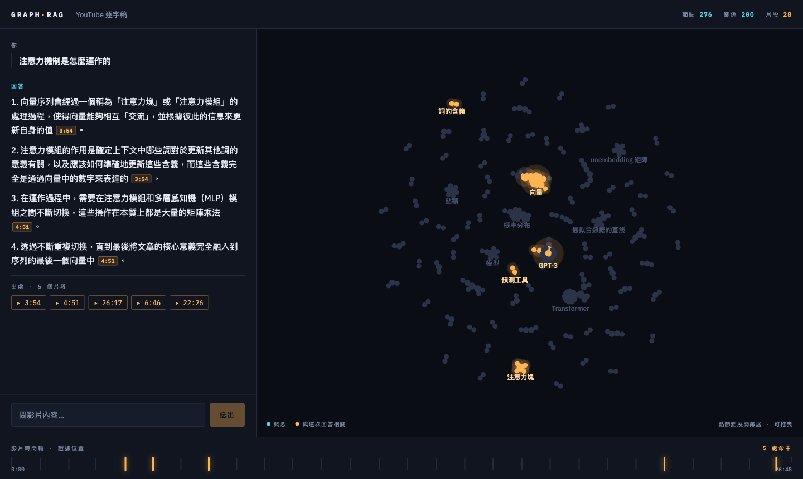

# yt-graphrag-bot (Cursor Native GraphRAG Assistant)

**丟一個 YouTube 連結（或 PDF / DOCX / 網頁），建出一個會回答內容、會附時間戳引用、還會即時高亮知識圖譜的問答機器人。**

本專案已完全包裝為 **Cursor 專屬工具與規則集合**（含 `.cursor/rules/`、`.cursor/commands/`、`.cursor/mcp.json`），同時相容 Claude Code 與 Codex。
LLM 核心走 Gemini，套件強制使用 `uv` 管理，圖資料庫採用地端 Neo4j，向量資料庫採用 ChromaDB。



三個視圖是**同一次檢索的三種投影**：對話說「答案是什麼」，圖譜說「牽涉哪些概念、怎麼連」，底部時間軸說「這些話是從影片/文件的哪幾個位置撈出來的」。

---

## 🎯 專案特色

1. **Cursor 原生整合**：
   - 內建 `.cursor/mcp.json` 自動連接地端 Neo4j MCP 與 Chroma MCP。
   - 內建 `.cursor/rules/*.mdc` 與 `.cursor/commands/*.md`（支援 `/yt-graphrag-bot`、`/ingest`、`/check-setup`、`/run-app`、`/evaluate`）。
2. **多來源統一入庫 (端到端 GraphRAG)**：
   - 🎥 **YouTube 影片**（自動抓取 CC 字幕 / ASR 自動字幕）
   - 📄 **PDF 文件**（地端 PyMuPDF / 雲端 LlamaParse OCR）
   - 📝 **Word DOCX**（自動抽取所有段落與表格數據）
   - 🌐 **網頁文章 URL**（地端 Trafilatura / 雲端 Tavily Extract）
3. **前端視覺化匯入與問答介面**：
   - 支援在前端 UI 直接點擊 **`+ 匯入新來源`** 貼上網址或拖曳上傳文件，完成後自動熱重載圖譜。
   - 上傳檔案保存於後端 `uploads/`（引用連結 `file://...#page=N` 入庫後仍可回溯）；同檔重傳以內容雜湊冪等覆蓋。
   - `/ingest` 只接受 http(s) 網址（本機檔案一律走 `/ingest/file` 上傳），並內建 SSRF 防護：拒絕解析到內網/保留位址的網址與重導向（測試環境可設 `ALLOW_PRIVATE_URLS=1` 放行）。
4. **強 RAG 檢索生成 (Hybrid GraphRAG)**：
   - Multi-Query 改寫 ➔ Chroma 向量檢索 ➔ RRF 排名融合 ➔ Neo4j 圖譜一階鄰居擴展 ➔ 附帶精確時間戳/頁碼引用的精準生成。

---

## 🚀 快速開始

### 1. 環境需求與依賴安裝
需要：Python 3.12+、[uv](https://docs.astral.sh/uv/)、Docker、Node.js 18+、一把免費的 [Google AI Studio](https://aistudio.google.com) 金鑰。

```bash
git clone git@github.com:kevin801221/agent-automatic-graphrag-chat-skill.git
cd agent-automatic-graphrag-chat-skill
uv sync
```

### 2. 設定環境變數 (`.env`)
在專案根目錄建立或編輯 `.env`：
```ini
GOOGLE_API_KEY=AIzaSy...
GEMINI_API_KEY=AIzaSy...
NEO4J_PASSWORD=teach12345
NEO4J_URI=bolt://localhost:7687
NEO4J_USER=neo4j
```

### 3. 啟動地端 Neo4j 與起飛前檢查
```bash
# 啟動 Neo4j Docker 容器
docker run -d --name neo4j-teach -p 7474:7474 -p 7687:7687 \
  -e NEO4J_AUTH=neo4j/teach12345 neo4j:5

# 執行系統檢查（沒全綠不要往下）
uv run --env-file .env python .cursor/scripts/check_setup.py
```

### 4. 啟動後端與前端服務

**啟動 FastAPI 後端 (Port 8000)：**
```bash
uv run --env-file .env uvicorn chatbot_server:app --port 8000
```

**啟動 React 前端介面 (Port 5180)：**
```bash
cd frontend
npm install
npm run dev -- --port 5180
```

打開瀏覽器存取 **[http://localhost:5180](http://localhost:5180)** 即可開始使用！

---

## ⚡ 在 Cursor 中使用

本專案已完全配置 Cursor 原生開發環境：

| 工具路徑 | 功能說明 | 使用方式 |
|---|---|---|
| **`.cursor/mcp.json`** | 自動連接 Neo4j Cypher 與 Chroma MCP | Cursor 自動偵測並啟用 MCP 工具 |
| **`.cursor/rules/*.mdc`** | GraphRAG 核心規則、Neo4j Schema、切塊標準 | 在編輯相關檔案或對話時自動生效 |
| **`.cursor/commands/*.md`** | 快速斜線指令 | 在聊天框輸入 `/yt-graphrag-bot` 或 `/ingest` |

### 常用 Slash 指令
- `/yt-graphrag-bot`：執行完整的 GraphRAG 建構指引
- `/ingest <網址或檔案>`：將 YouTube、PDF、DOCX 或網頁直接匯入系統
- `/check-setup`：執行起飛前環境檢查
- `/run-app`：啟動後端與前端服務
- `/evaluate`：執行 Baseline vs Strong GraphRAG A/B 盲評

---

## 📊 資料流架構

```
YouTube URL ─┐
PDF / DOCX ──┼─ [1] ingest_pipeline.py 統一入口
網頁 URL ────┘     每種來源都有 免費地端 / 付費雲端 兩條路線
                  → 正規化 source.json（帶可回溯 ref：時間戳 / 頁碼 / 網址）
       └─ [2] 聚合 + 切塊 → Chroma VectorDB (./chroma_db)
       └─ [3] Gemini 抽三元組 → Neo4j (Entity─REL─Entity─MENTIONED_IN─Chunk)
            └─ [4] 強 RAG：Multi-Query → 向量檢索 → RRF 融合 → 圖譜擴展 → 生成
                 └─ [5] FastAPI /chat + /graph + /chunks + /ingest
                      └─ [4.5] 方法驗證：naive vs 強 RAG 的 A/B 盲評
                      └─ [6] React 力導向圖前端 + 匯入新來源 Modal
```

---

## 📁 專案檔案結構

```
.
├── .cursor/                  # Cursor 專屬配置與全套技能包
│   ├── mcp.json              # Neo4j & Chroma MCP 配置
│   ├── rules/                # 專案規則 (yt-graphrag-bot, neo4j, ingest)
│   ├── commands/             # Slash 指令 (yt-graphrag-bot, ingest, check-setup, run-app, evaluate)
│   ├── skills/yt-graphrag-bot/ # Cursor 原生 Skill 包 (含 SKILL.md, scripts/, references/)
│   ├── scripts/              # 入庫、抽取與評測腳本
│   ├── references/           # 參考指南 (前端, MCP, 方法驗證)
│   └── SKILL.md              # 技能定義檔
├── frontend/                 # Vite + React 前端介面
│   ├── src/App.jsx           # 力導向圖譜 + 對話 + 時間軸 + 來源匯入 Modal
│   └── src/index.css         # 設計 Token 與樣式
├── ingest_pipeline.py        # 模組化端到端入庫管線
├── chatbot_server.py         # FastAPI 主服務 (含 /chat, /graph, /chunks, /ingest)
├── uploads/                  # 前端上傳檔案的持久保存區（執行時生成，git 忽略）
├── WALKTHROUGH.md            # 詳細逐步教學與實戰手冊
└── EVALUATION.md             # 實跑評估報告與改進紀錄
```

---

## 授權
MIT License
