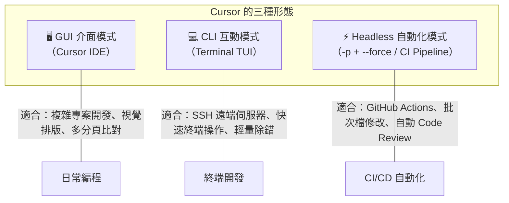
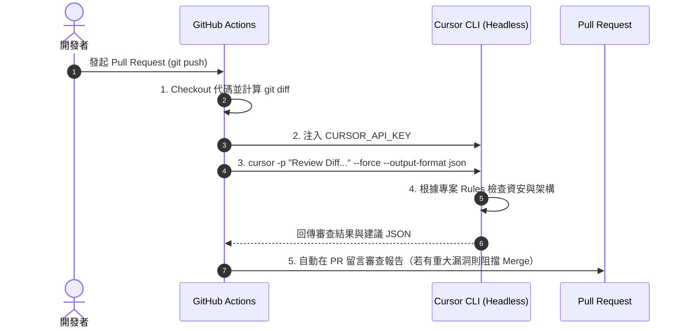

# 第 19 章：Cursor CLI 與 Headless 自動化 — 把 Agent 搬進終端機與 CI Pipeline

> **本章核心目標**：擺脫圖形介面限制，將 Cursor Agent 的強大編程與審查能力帶入命令列（CLI）與 GitHub Actions 自動化管線。  
> **一句話總結**：**在 GUI 裡 Cursor 是你的結對編程夥伴；在 CLI 與 CI 裡，Cursor 是 24 小時不睡覺的自動化 Code Reviewer 與工程守門員。**

---

## 專案規格

| 項目 | 說明 |
|---|---|
| **章節主題** | Cursor CLI、Headless 模式、CI/CD 自動化 Code Review、`cli-config.json` |
| **安裝指令** | `curl https://cursor.com/install -fsS \| bash` |
| **核心技術** | Cursor CLI、Headless (`-p`, `--force`)、GitHub Actions、`cli-config.json` |
| **預估耗時** | 45–60 分鐘 |
| **適用場景** | PR 自動審查、Nightly 測試自動修復、終端機即時除錯、自動化 Migration 驗證 |

---

## 0. 先建立心智模型：GUI vs CLI vs Headless



| 維度 | Cursor GUI (IDE) | Cursor CLI 互動模式 | Headless 自動化模式 |
|---|---|---|---|
| **啟動方式** | 開啟 Cursor 應用程式 | 終端機輸入 `cursor` 或 `cursor-agent` | `cursor -p "..." --force` |
| **人類參與度** | 100%（需即時查看 UI） | 高（終端機問答互動） | 0%（無人值守，交由指令腳本） |
| **工具執行確認** | 點擊 Accept / Reject | 終端機按 `y / n` 確認 | **必須使用 `--force` 自動核准** |
| **輸出形式** | 視覺化 Diff 與聊天泡泡 | 終端文字串流 | `text` / `json` / `stream-json` |
| **適用環境** | 本機 macOS/Windows/Linux | 本機終端機、遠端 SSH | GitHub Actions、GitLab CI、CronJob |

---

## 1. 安裝與認證配置

### 1.1 一行指令快速安裝
在 macOS 或 Linux 終端機中執行官方安裝指令：

```bash
curl https://cursor.com/install -fsS | bash
```

安裝完成後，驗證安裝是否成功：
```bash
cursor --version
# 或
cursor-agent --version
```

### 1.2 登入與 API Key 認證

在 CLI 中使用 Cursor 有兩種認證方式：

1. **互動式網頁登入（本機開發推薦）**：
   ```bash
   cursor auth login
   ```
   終端機會開啟瀏覽器授權頁面，登入後憑證自動儲存於 `~/.cursor/`。

2. **環境變數認證（CI/CD 與 Headless 必備）**：
   在 CI/CD 伺服器中設定 `CURSOR_API_KEY`：
   ```bash
   export CURSOR_API_KEY="cur_xxxx_your_api_key"
   ```

---

## 2. 互動模式與常用斜線指令 (Slash Commands)

直接在終端機輸入 `cursor` 即可進入互動式終端介面（TUI）：

```bash
cd /Users/kevinluo/cursor-class-2/cursor-cli-headless
cursor
```

### 終端互動模式高頻指令
| 指令 | 說明 | 使用時機 |
|---|---|---|
| `/clear` 或 `/reset` | 清空當前對話歷史與 Context | 切換任務或 Context 過長時 |
| `/compact` | 壓縮對話 Context，保留核心摘要 | 長時間除錯但仍需保留背景資訊 |
| `/model` | 切換底層語言模型（如 `claude-3-5-sonnet`） | 遇到難題需更高等級模型時 |
| `/help` | 列出所有可用指令與快速鍵 | 查詢功能與快捷鍵 |

---

## 3. Headless 模式四大核心參數

Headless 模式（無介面模式）是將 Cursor 整合進自動化腳本的核心。

```bash
cursor -p "<Prompt 內容>" --force --output-format json --model claude-3-5-sonnet
```

### 核心參數詳解

| 參數 | 全名 | 說明 | 必填/選填 |
|---|---|---|---|
| `-p` | `--prompt` | 傳入要執行的指令文字，例如 `"檢查目前目錄下的安全漏洞"` | **必填** |
| `--force` | `--force` / `-y` | **無條件自動允許工具執行**（讀檔、寫檔、跑指令）。在 CI 腳本中**絕對必加**！ | **CI 必填** |
| `--output-format` | `--output-format` | 指定輸出格式：`text`（純文字）、`json`（結構化物件）、`stream-json`（串流） | 選填（預設 `text`） |
| `--model` | `--model` | 指定執行的模型代號（如 `claude-3-5-sonnet` 或 `gpt-4o`） | 選填 |
| `--context` | `--context` | 指定傳入特定檔案或目錄作為上下文（如 `--context src/`） | 選填 |

### `--output-format` 三種格式用途對照

1. **`text`（純文字）**：
   - 適合人類在終端機直接閱讀，輸出乾淨排版的 Markdown / 文字。
2. **`json`（結構化 JSON）**：
   - 適合 CI/CD 腳本。輸出包含完整的 `response`、`tool_calls`、`tokens_used` 與 `exit_code`，方便 `jq` 或 Python 解析。
3. **`stream-json`（串流 JSON）**：
   - 適合後台任務監控或串接自訂 Webhook，即時推送 Agent 的思考過程與即時產出。

---

## 4. CI 自動跑 Code Review 五步驟

在 GitHub Actions 中建立無人值守的自動 Code Review 流程：



### 完整 GitHub Actions Workflow 範例 (`.github/workflows/cursor-code-review.yml`)

```yaml
name: "Cursor AI Automated Code Review"

on:
  pull_request:
    branches: [ main, master, develop ]

jobs:
  review:
    runs-on: ubuntu-latest
    permissions:
      contents: read
      pull-requests: write

    steps:
      - name: Checkout Code
        uses: actions/checkout@v4
        with:
          fetch-depth: 0

      - name: Install Cursor CLI
        run: |
          curl https://cursor.com/install -fsS | bash
          echo "$HOME/.cursor/bin" >> $GITHUB_PATH

      - name: Fetch PR Git Diff
        run: |
          git diff origin/${{ github.base_ref }}...HEAD > pr_diff.txt
          echo "DIFF_LINES=$(wc -l < pr_diff.txt)" >> $GITHUB_ENV

      - name: Run Cursor Headless Code Review
        env:
          CURSOR_API_KEY: ${{ secrets.CURSOR_API_KEY }}
        run: |
          cursor -p "請依據繁體中文審查以下 PR Git Diff。重點檢查：1. 是否有 SQL Injection / XSS 等資安漏洞 2. 是否缺少錯誤處理 3. 是否有記憶體洩漏風險。若發現重大問題，請以 [CRITICAL] 標記：$(cat pr_diff.txt)" \
            --force \
            --output-format text > review_result.md

      - name: Post Review Comment to PR
        uses: actions/github-script@v7
        with:
          github-token: ${{ secrets.GITHUB_TOKEN }}
          script: |
            const fs = require('fs');
            const review = fs.readFileSync('review_result.md', 'utf8');
            github.rest.issues.createComment({
              issue_number: context.issue.number,
              owner: context.repo.owner,
              repo: context.repo.repo,
              body: `### 🤖 Cursor AI Code Review 報告\n\n${review}`
            });
```

---

## 5. ⚠️ 忘記 `--force` 最常見的坑 (The Missing `--force` Pitfall)

這是剛接觸 Cursor Headless 最常踩到的**第一大陷阱**：

### 翻車現象
在本地終端跑 `cursor -p "重構此檔案"` 一切正常，但放到 GitHub Actions 或背景 Cron 執行時，CI 永遠轉圈圈，直到 **6 小時後逾時（Timeout）被 GitHub 強制砍掉**！

### 根本原因
- 預設情況下，Cursor Agent 呼叫任何具修改性工具（如 `Write` 寫檔、`Shell` 執行測試）時，都會在 TTY 終端機等待人類輸入 `y` 或 `Enter`。
- CI/CD 環境是 **Non-Interactive（無人值守）** 環境，沒有標準輸入裝置，行程會永久阻塞在等待輸入的狀態。

### 正確做法
在任何非互動式腳本與 CI/CD 中，**無條件加上 `--force`**：
```bash
# ❌ 錯誤：會在 CI 永久卡住等待輸入
cursor -p "幫我跑測試並修復錯誤"

# ✅ 正確：自動允許工具執行，順暢跑完並輸出
cursor -p "幫我跑測試並修復錯誤" --force
```

---

## 6. `cli-config.json` 兩層設定架構

如同 MCP 設定檔，Cursor CLI 也支援 **全域層級** 與 **專案層級** 的配置檔。

```text
優先高 ┌─────────────────────────────────────────────────────────┐
       📁 專案設定：<專案根目錄>/.cursor/cli-config.json          │
       🙋 全域設定：~/.cursor/cli-config.json                     │
優先低 └─────────────────────────────────────────────────────────┘
```

### 設定檔範例 (`.cursor/cli-config.json`)
```json
{
  "$schema": "https://cursor.com/schemas/cli-config.json",
  "defaultModel": "claude-3-5-sonnet",
  "maxTokens": 4096,
  "temperature": 0.2,
  "permissions": {
    "autoApprove": [
      "read",
      "grep",
      "git status",
      "git diff"
    ],
    "deny": [
      "rm -rf /",
      "git push --force"
    ]
  },
  "rulesPath": ".cursor/rules"
}
```

---

## 7. 案例展示：PR 自動審查成功攔截 SQL Injection

當開發者在 PR 提交了不安全的動態 SQL：
```typescript
// PR 改動內容
const query = `SELECT * FROM users WHERE email = '${req.body.email}'`;
```

Cursor Headless 在 CI 階段自動攔截並產生以下 Review：

> ### 🤖 Cursor AI Code Review 報告
> - ❌ **[CRITICAL] 發現嚴重的 SQL Injection 漏洞** (`src/routes/auth.ts:18`)
>   - **問題**：`req.body.email` 未經參數化或清理直接拼接進 SQL 語句。
>   - **攻擊風險**：攻擊者可輸入 `' OR '1'='1` 繞過身份驗證。
>   - **建議修復**：改用參數化查詢：
>     ```typescript
>     const query = 'SELECT * FROM users WHERE email = $1';
>     await db.query(query, [req.body.email]);
>     ```
> - ⚠️ **[WARNING] 缺少 Try-Catch 例外處理** (`src/routes/auth.ts:25`)
