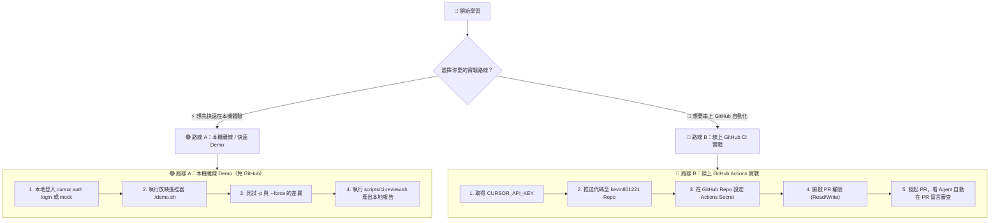

# Walkthrough：Cursor CLI 與 Headless 自動化全流程實戰教學

> 本篇教學提供 **兩大實戰路徑**，請依據你的學習情境自由選擇：
> - 🟢 **路線 A：本機離線 / 快速 Demo 路線**（無需推上 GitHub、免配置 Secrets、3 分鐘純本地端極速通關）
> - 🔵 **路線 B：線上正式 / GitHub Actions CI 實戰路線**（串接你的 GitHub Repo、配置 `CURSOR_API_KEY`、開 PR 體驗全自動 AI 留言審查）

---

## 🚦 開始前環境準備

無論走哪條路線，請先確認基礎環境：
1. **作業系統**：macOS 或 Linux（Windows 請使用 WSL2）。
2. **安裝 CLI**：
   ```bash
   curl https://cursor.com/install -fsS | bash
   ```
3. **檢查版本**：
   ```bash
   cursor --version
   ```

---



---

# 🟢 路線 A：本機離線 / 快速 Demo 路線

> 適用於：課堂放映、快速上手、沒有網路連線或不想設定 GitHub Token 時。

### Step A1：登入本地帳號（或使用離線放映機）

#### 做法 1：標準本機登入（有網路時）
```bash
cursor auth login
```
瀏覽器會自動開啟，直接用你的 Cursor 帳號登入，憑證會自動儲存在本地 `~/.cursor/`，後續跑 CLI 完全不需要手動帶 API Key。

#### 做法 2：使用專案內建的課堂放映遙控器（零憑證、全離線）
本專案已為你準備好 `demo.sh` 遙控器：
```bash
cd /Users/kevinluo/cursor-class-2/cursor-cli-headless

# 列出所有可放映幕次
./demo.sh

# 播放第 1 幕（驗證安裝）到第 6 幕（設定架構）
./demo.sh 1
./demo.sh 3
./demo.sh 4
```

---

### Step A2：實測 Headless 模式與三種輸出格式

在終端機中測試單次指令呼叫，並比對輸出差異：

#### 1. 純文字輸出 (`text`，給人類看)
```bash
cursor -p "請用繁體中文列出本專案的三大核心檔案及其用途" --force --output-format text
```

#### 2. 結構化輸出 (`json`，給程式解析)
```bash
cursor -p "檢查本專案是否包含 .github/workflows" --force --output-format json > local_result.json
cat local_result.json | jq .
```
✅ **預期看到**：JSON 內包含 `response`、`tokens_used` 與 `tool_calls`。

#### 3. 串流輸出 (`stream-json`，即時監控)
```bash
cursor -p "說明什麼是 --force 參數" --force --output-format stream-json
```

---

### Step A3：親身體驗忘記 `--force` 的致命陷阱

這個實驗會讓你親眼看到 `--force` 的關鍵性：

1. **刻意不加 `--force`**：
   ```bash
   cursor -p "請在當前目錄建立 demo_temp.txt 檔案，內容為 123"
   ```
   👀 **觀察現象**：終端機會停在 `Allow Cursor to write to demo_temp.txt? [y/n]`，等待人類敲鍵盤確認。如果在無人看守的腳本跑這行，就會永久卡住！

2. **加上 `--force` 自動核准**：
   ```bash
   cursor -p "請在當前目錄建立 demo_temp.txt 檔案，內容為 123" --force
   ```
   ✅ **觀察現象**：Agent 自動呼叫 Write 工具完成寫入並順暢結束。

3. **清理暫存檔**：
   ```bash
   rm -f demo_temp.txt
   ```

---

### Step A4：執行本地模擬 CI Review 腳本

專案中內建了 [scripts/ci-review.sh](file:///Users/kevinluo/cursor-class-2/cursor-cli-headless/scripts/ci-review.sh)，它會自動抓取本地的 Git Diff 並交給 Headless Agent 進行安全審查：

```bash
# 執行本地模擬審查
./scripts/ci-review.sh
```

✅ **預期看到**：
終端機輸出綠色打勾，並在本地產出 `review-output.md` 審查報告。

---

---

# 🔵 路線 B：線上正式 / GitHub Actions CI 實戰路線

> 適用於：將 Cursor 整合進團隊 GitHub 工作流，每當有人發起 PR 時自動進行 Code Review。

### Step B1：取得 Cursor API Key

1. 登入 [Cursor 官網 Settings / Dashboard](https://cursor.com/settings)。
2. 在 **API Keys** 或 **Tokens** 區塊，點擊 **Create New Key**。
3. 複製產生的 Key 字串（格式通常為 `cur_xxxx` 或類似金鑰）。

---

### Step B2：推送專案到你的 GitHub 儲存庫 (`kevin801221`)

1. 確認當前目錄為 `cursor-cli-headless`（或你的主要 workspace 根目錄）。
2. 將代碼提交並推送到你的 GitHub：
   ```bash
   git add .
   git commit -m "feat: add cursor-cli-headless automated review workflow"
   git push origin main
   ```

---

### Step B3：在 GitHub Repo 設定 Actions Secret

1. 在瀏覽器打開你的 GitHub 儲存庫頁面（例如 `https://github.com/kevin801221/cursor-sample-projects`）。
2. 點擊上方導航的 **Settings**。
3. 在左側選單找到 **Secrets and variables** → 展開點擊 **Actions**。
4. 點擊右上角綠色按鈕 **New repository secret**：
   - **Name**：輸入 `CURSOR_API_KEY`（請嚴格對應大小寫）
   - **Secret**：貼上剛才在 Step B1 複製的 Cursor API Key。
5. 點擊 **Add secret** 儲存。

---

### Step B4：開啟 GitHub Actions PR 留言權限（關鍵步驟 ⚠️）

GitHub 預設不允許 Actions 隨意在 PR 留言，必須開啟權限：

1. 在同一個 **Settings** 頁面中，點擊左側 **Actions** → **General**。
2. 滾動到最下方的 **Workflow permissions** 區塊。
3. 將預設的 *Read repository contents permission* 改選為：  
   👉 **Read and write permissions**
4. 勾選下方 **Allow GitHub Actions to create and approve pull requests**。
5. 點擊 **Save** 儲存。

---

### Step B5：開一個 PR 實機觸發驗收

現在我們來故意製造一段有安全問題的程式碼，發起 PR 測試 Cursor AI 能不能抓出來！

1. **建立新分支**：
   ```bash
   git checkout -b test/ai-review-demo
   ```

2. **建立一個故意含有 SQL 注入的檔案**：
   在 `src/auth.js` 寫入：
   ```javascript
   // 故意寫出不安全的字串拼接 SQL
   function loginUser(req, res) {
     const query = "SELECT * FROM users WHERE email = '" + req.body.email + "' AND pass = '" + req.body.password + "'";
     db.query(query);
   }
   ```

3. **提交並推送到 GitHub**：
   ```bash
   git add src/auth.js
   git commit -m "feat: add user login endpoint"
   git push -u origin test/ai-review-demo
   ```

4. **在 GitHub 建立 Pull Request**：
   - 到 GitHub 點擊 **Compare & pull request**，將 `test/ai-review-demo` 合併到 `main`。
   - 建立 PR 後，點擊 PR 頁面上的 **Actions** 或 Checks。
   - 你會看到名為 **`Cursor AI Automated Code Review`** 的 Workflow 正在運行！

5. **查看審查成果**：
   - 約 15–30 秒後，Workflow 顯示綠色勾勾完成。
   - 回到該 PR 的 **Conversation** 討論串，你會看到 Cursor 機器人自動留下的審查留言：

> ### 🤖 Cursor AI Code Review 報告
> - ❌ **[CRITICAL] 發現嚴重的 SQL Injection 漏洞** (`src/auth.js:3`)
>   - **問題**：`req.body.email` 與 `password` 未經參數化直接拼接進 SQL。
>   - **修復建議**：改用參數化查詢：
>     ```javascript
>     db.query('SELECT * FROM users WHERE email = ? AND pass = ?', [req.body.email, req.body.password]);
>     ```

---

## 🩺 疑難排解 (FAQ & Troubleshooting)

### Q1: 本機跑 `cursor` 指令提示 `command not found`？
**解法**：請確保已將 `~/.cursor/bin` 加入 PATH：
```bash
export PATH="$HOME/.cursor/bin:$PATH" >> ~/.zshrc
source ~/.zshrc
```

### Q2: GitHub Actions 報錯 `Resource not accessible by integration`？
**解法**：這是因為沒有開啟 Actions 留言權限。請檢查 **Step B4**，確認在 **Settings → Actions → General → Workflow permissions** 勾選了 **Read and write permissions**。

### Q3: GitHub Actions 跑了 6 小時被強制砍掉？
**解法**：檢查 Workflow 中的指令是否漏了 `--force` 參數！沒有 `--force` 會卡在等待鍵盤輸入。

---

## 🎯 驗收完成總結

恭喜你！完成本篇教學後，你已經同時掌握了：
1. **本機 CLI 模式**：能在任何伺服器或終端機快速叫出 Cursor Agent 幫你寫碼、修 bug。
2. **Headless 批次模式**：掌握 `-p`、`--force` 與三種輸出格式。
3. **線上 CI/CD Pipeline**：將 AI 自動審查無縫嵌入 GitHub PR 流程，守護團隊代碼品質！
