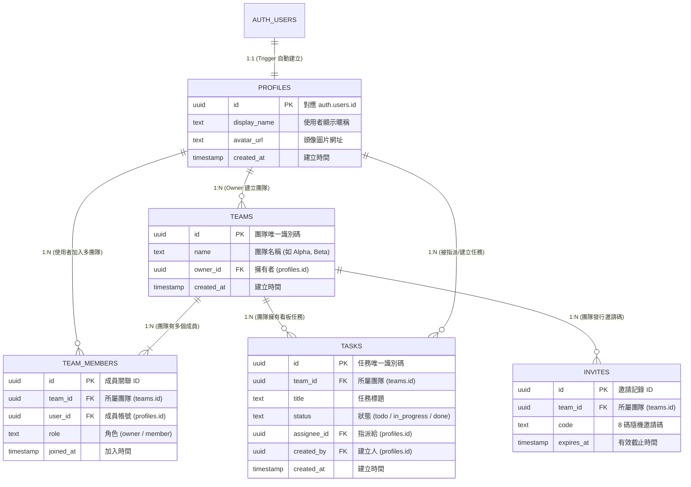

# TaskBoard — 多租戶任務管理 SaaS

> Cursor 課程 Project 2（第 22 章）：Next.js + Supabase。
> 一句話：**多租戶隔離要做在資料庫層（RLS），不是前端**——即使有人竄改前端請求，也讀不到別團隊的任務資料。

## 專案規格

| | |
|---|---|
| **最終成果** | 看板任務管理：待辦（todo）、進行中（in_progress）、完成（done）三種狀態 |
| **技術棧** | Next.js 14 App Router、Supabase、Tailwind、shadcn/ui |
| **預估時間** | 4–6 小時，分「資料庫與安全」與「CRUD」兩大階段 |
| **前置需求** | Cursor Pro、Node 20+、Supabase 免費帳號 |

## 這個 App 做什麼

- 使用者用 Email 註冊登入（Supabase Auth，登入自動建立 profile）
- 建立團隊、由 owner 加成員、或用邀請碼加入
- 每個團隊一個看板：任務增刪改、拖曳換狀態、樂觀更新、手機不跑版
- **關鍵需求**：A 團隊成員永遠看不到、也寫不進 B 團隊的資料——就算繞過前端直接打 API，資料庫層的 RLS 依然擋得住

## 三層架構

```
瀏覽器（Client）        只帶 anon key + 使用者 session cookie，看不到任何伺服器機密
    ↕ HTTP / RSC payload
Next.js 14 App Router   Server Components 讀資料、Server Actions 寫資料（部署於 Vercel）
    ↕ anon key + 使用者 JWT
Supabase                Auth 簽發 JWT；Postgres 四張表；RLS 用 auth.uid() 劃界 ← 真正的安全邊界
```

**絕對紅線**：`service_role` 金鑰能繞過所有 RLS，只能活在伺服器端環境變數——絕不加 `NEXT_PUBLIC_` 前綴、絕不出現在任何 `"use client"` 檔案。

## 資料模型與實體關聯圖（ER Diagram）



### 🛡️ 多租戶「安全邊界」解說

> 💡 **老師向同學解說口訣**：
> 1. **外鍵（FK）只是「血管」**：把 `teams` 和 `tasks` 連在一起，但無法阻止駭客直接跨團隊查詢。
> 2. **RLS 是「守門警衛」**：當使用者發出 `SELECT * FROM tasks` 時，Postgres 資料庫會自動去查 `team_members` 表——**只有當 `user_id = auth.uid()` 時才放行該團隊的任務，其餘團隊資料在資料庫層直接「隱形」！**
> 3. **絕對禁令**：若 RLS 寫成 `USING (true)`，等於警衛睡著，外鍵再完整也會瞬間發生全站資料外洩。

---

## 四階段開發流程（先鎖權限、再做功能，順序不能顛倒）

| 階段 | 做什麼 | 驗收 |
|---|---|---|
| 1. 骨架與規範 | 建 Next.js 專案、寫 `.cursor/rules` | Agent 自動遵守架構慣例 |
| 2. 資料庫與安全 | 建表並**同一個 migration 內**開 RLS | 四張表都顯示 RLS Enabled |
| 3. 認證與路由 | Email 登入、middleware 保護 | 未登入被導回 /login |
| 4. CRUD 與體驗 | 任務增刪改、樂觀更新、RWD | 看板可用，手機也不跑版 |

## 專案結構

```
taskboard/
├── .cursor/rules/
│   ├── 00-security.mdc         # 六條安全紅線，全專案唯一的 alwaysApply
│   ├── nextjs.mdc              # 架構慣例（globs 按需載入）
│   └── supabase.mdc            # Supabase 慣例（globs 按需載入）
├── supabase/migrations/
│   ├── 001_schema.sql          # 建表 + profiles trigger + 同步 enable RLS
│   ├── 002_rls.sql             # 每張表的 RLS 政策
│   └── 003_join_team_policy.sql# owner 加人 / 邀請碼加入政策
├── app/
│   ├── (auth)/login/           # 登入頁
│   ├── board/[teamId]/         # 看板（Server Components + Server Actions）
│   └── api/teams/join/route.ts # 邀請碼加入 API
├── middleware.ts               # 未登入導回 /login（matcher 記得排除 /login）
├── tests/rls.test.ts           # RLS 隔離測試
└── walkthrough.md              # 完整逐步教學
```

## 三條鐵律（本課核心）

1. **安全紅線寫成規則，Agent 會替你擋**——六條紅線寫進 `00-security.mdc`（alwaysApply），寫得夠具體，它就會在你自己都忘記的時候提醒你。
2. **先鎖權限、再做功能**——每張新表建立時，同一個 migration 內就要 `enable row level security`。
3. **先跑 RLS 測試**——新增政策一律補一個 `test:rls` 案例，證明跨團隊讀不到。

## Part 2：Stripe 金流與部署（下）

完成 Part 1 後，第 23 章加上訂閱付款與正式部署：

- **Stripe Checkout**：使用者在定價頁升級 Pro 方案
- **Webhook 驗簽**：每筆付款事件用 `constructEvent` 驗簽，沒驗簽等於任何人都能偽造訂閱事件
- **額度限制**：Pro 專屬功能在 Server Action 層強制執行，前端隱藏按鈕不算安全
- **正式上線**：測試模式與正式模式的金鑰、Price ID、webhook 完全獨立，同步切換是常見坑

Part 2 有兩條路，**課堂建議走 A**：

| 路線 | 適合 | 教學 |
|---|---|---|
| **A. Mock 金流（課堂版）**：自己寫 30 行「假銀行」發 HMAC 簽章 webhook——零註冊、零費用、可離線，驗簽／擋偽造／額度限制的核心概念一個不少，學生還能扮演駭客攻防 | 課堂、台灣學生（Stripe 註冊門檻高） | **[walkthrough-2-mock-payment.md](./walkthrough-2-mock-payment.md)**（約 2 小時） |
| **B. Stripe 測試模式（完整版）**：測試卡 4242 不會真扣款，功能最完整；門檻在帳號註冊 | 課後進階、能註冊 Stripe 的人 | **[walkthrough-2-stripe.md](./walkthrough-2-stripe.md)**（約 4–5 小時） |

兩條路的原理相同（共享密鑰 + 簽章驗證），Mock 版文末附 Stripe／綠界 ECPay 對照表，學完換真金流只是「換一家銀行」。

新增或修改的檔案：

```
app/
├── api/webhooks/stripe/route.ts    # Webhook 驗簽與訂閱同步
├── pricing/page.tsx                # 定價頁
└── actions/checkout.ts             # Checkout Session Server Action

supabase/migrations/
└── 004_stripe_columns.sql          # 加 stripe_customer_id、plan 等欄位
```

---

## 快速開始（Part 1）

```bash
npm install
npx supabase start          # 本地 Supabase（需 Docker）
npx supabase db push        # 套用 migrations
npm run dev                 # http://localhost:3000
npm run test:rls            # 驗證隔離真的擋得住
```

完整建置步驟、RLS 概念、Supabase MCP 與 rules 設定，見 **[walkthrough.md](./walkthrough.md)**。
