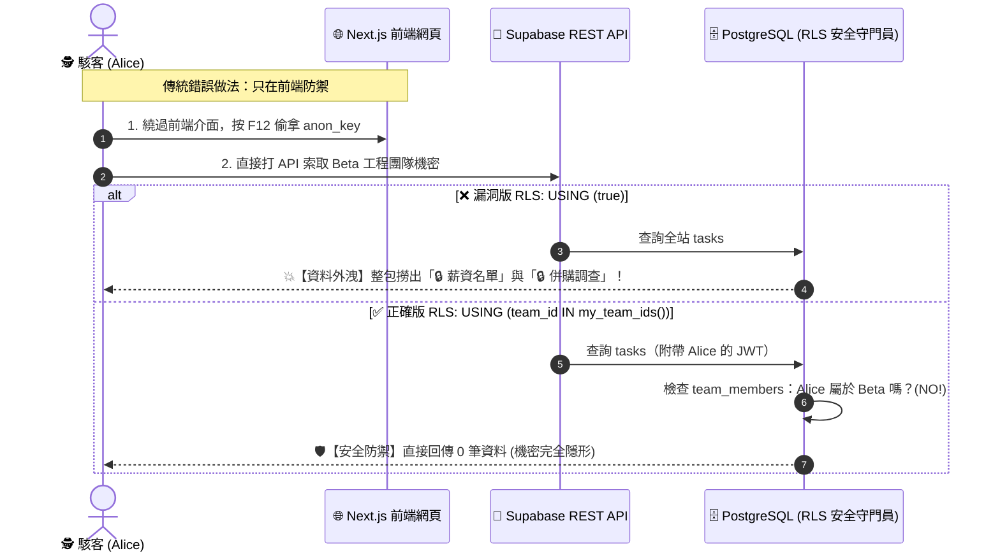

# Walkthrough：在 Cursor 上把 TaskBoard 一步一步做出來

> 這份文件帶你從零做出 **TaskBoard**——一個多租戶任務板 SaaS，並親手證明一件事：**即使有人竄改前端請求，也讀不到別團隊的資料。**
> 你會學到三件事：RLS 怎麼寫才真的擋得住、怎麼用 Supabase MCP 讓 Agent 直接看得懂你的資料庫、怎麼把安全紅線寫成 `.cursor/rules` 讓 Agent 在你自己都忘記的時候替你擋。
>
> 文中有四種標記，幫你少走彎路：
> - 🔍 **名詞卡**：專有名詞的白話解釋 + 生活比喻
> - ❓ **想一想**：先自己想，再往下看答案
> - ✅ **預期看到**：每個指令跑完的正常畫面長什麼樣
> - 🧯 **卡住的話**：常見翻車點與救援方式

---

## 🚦 開始前檢查清單（先做這五件事，做的當天才不會卡）

1. **裝好 Docker Desktop，並先跑一次 `npx supabase start`**——第一次會下載很大的映像檔（可能 5–10 分鐘），先跑過一次，之後啟動只要幾十秒。
2. **註冊好 Supabase 帳號、建一個空專案**，把 Dashboard 加入書籤（等下要看 Table Editor 的 RLS Enabled 標籤）。
3. **建好 Supabase Personal Access Token**（Account → Access Tokens），設定 MCP 要用。
4. 動手過程中，每跑完一個指令就對照文中的「✅ 預期看到」——判斷得出「這是正常的」還是「翻車了」，除錯速度差十倍。
5. 如果 Docker 裝不起來（例如公司電腦被擋）：改用雲端 Supabase 專案即可，`.env.local` 填 Dashboard → Settings → API 裡的 URL 和 keys，整份教學照走。

## 🗺️ 學習地圖（建議 3 小時）

| 段落 | 時間 | 類型 |
|---|---|---|
| 開場故事 + 第 1 節概念 | 30 分 | 閱讀理解（這是全篇靈魂，慢慢看） |
| 第 2 節 MCP 設定 | 15 分 | 動手做 |
| 第 3 節 rules + 紅線測試 | 30 分 | 動手做（Agent 被規則擋下是最精彩的一幕） |
| 第 4 節 資料庫與 RLS | 45 分 | 動手做 |
| 第 5–6 節 認證與看板 | 30 分 | 動手做（時間不夠可先看懂再回頭補做） |
| 第 7–8 節 驗收與排錯 | 20 分 | 動手做（雙瀏覽器互看不到的實驗必做） |
| 收尾三句話 | 10 分 | 閱讀理解 |

---

## 🎬 課堂放映表（講師用）

> 程式碼在 `./taskboard/`。整堂課的遙控器只有一個，就在這份文件旁邊（`project-2-taskboard-saas/`）：
> `./demo.sh` 列出所有幕，`./demo.sh N` 跑第 N 幕。（demo.sh 自己會 `cd` 進 taskboard/，不用手動切目錄。）

### 上課前 15 分鐘要先做完（不要當著學生的面做）

| # | 做什麼 | 為什麼要先做 |
|---|---|---|
| 1 | 打開 Docker Desktop，等鯨魚圖示不再轉動 | 第 0 幕第一件事就是 `docker info`，沒開會直接印紅字「Docker 沒有在跑」停在那裡 |
| 2 | 跑 `./demo.sh 0`，看到綠字「✓ 環境就緒。Studio：http://127.0.0.1:54323」 | 第一次會拉 Docker 映像檔，5–10 分鐘；課前跑過，課堂上第 0 幕只會印「✓ 本地 Supabase 已經在跑，跳過啟動」，十秒結束 |
| 3 | 跑一次 `./demo.sh 2` → `./demo.sh 3` → `./demo.sh 9`，確認最後是綠色 `8 passed` | 這是「機器今天沒問題」的一次性總驗機。驗完 RLS 停在正確版，正好是開場該有的狀態 |
| 4 | 驗完再跑一次 `./demo.sh 3`，把測資洗回乾淨狀態 | 第 9 幕的測試會在資料庫留下測試用帳號與任務，重佈一次讓第 5／8 幕的筆數對得上講稿 |
| 5 | 把第 3 幕印出的兩組帳密與那串 Beta team id 抄到備忘錄 | 第 10 幕要用；那串 uuid 每次 seed 都會變，臨場翻捲軸很難看 |
| 6 | 開好兩個瀏覽器視窗：一般視窗 + 無痕視窗，都停在 `http://localhost:3000/login` | 第 10 幕的雙帳號實驗必須用兩個 cookie 空間；同一個視窗開兩個分頁會互相覆蓋 session |
| 7 | 另開一個終端機分頁備用，並確認埠 3000 沒被占用（`lsof -nP -iTCP:3000 -sTCP:LISTEN`） | 第 10 幕的 `npm run dev` 是 blocking 的，要跑第 11 幕一定得換分頁；埠被占用時 Next.js 會自己改用 3001 |
| 8 | 投影字級調大，終端機視窗至少 100 字元寬 | 第 4／7 幕要讓全場看清政策條件是紅色 `true` 還是綠色 `my_team_ids()`，字太小這一幕就白演了 |

### 放映時間軸

| 時間 | 幕 | 指令 | 打開哪個檔案投影 | 📺 螢幕上會出現 | 🎯 這一幕在教 |
|---|---|---|---|---|---|
| 0:00–0:30 | 開場故事 + 概念（無指令） | — | `walkthrough.md` §0 開場故事 ～ §1.6 | 投影片式朗讀：旅館／房卡對照表、`USING (true)` 對照表、三把 key 的表 | 安全不能靠貼紙要靠鎖；`USING (true)` 等於沒開；service_role 是萬能鑰匙 |
| 0:30–0:45 | MCP 設定（無指令） | — | `taskboard/.cursor/mcp.json.example` | Cursor Settings → MCP 裡 supabase 亮綠燈；對 Agent 說「列出目前資料庫有哪些表和 RLS 狀態」，畫面出現 `list_tables` 工具呼叫紀錄後才回答 | MCP 給 Agent 眼睛：它是真的去看了資料庫，不是用猜的 |
| 0:45–0:50 | 第 0 幕 環境就緒 | `./demo.sh 0` | `taskboard/.env.local.example` | 綠字「✓ 本地 Supabase 已經在跑，跳過啟動」→ `npx supabase status` 印出 `API URL: http://127.0.0.1:54321`、`anon key: eyJ...`、`service_role key: eyJ...` → 「✓ 更新 .env.local」→ 綠字「✓ 環境就緒。Studio：http://127.0.0.1:54323」 | 兩把 key 一起印出來，但只有 anon 那把配 `NEXT_PUBLIC_` 前綴——紅線就是這個命名差異 |
| 0:50–1:00 | 第 1 幕 安全紅線寫成規則 | `./demo.sh 1` | `taskboard/.cursor/rules/00-security.mdc` | 三份規則檔全文依序 cat 出來：00-security.mdc 開頭是 `alwaysApply: true` 加三條「絕對禁止」＋三條「一定要做」，nextjs.mdc 開頭是 `globs: ["app/**/*.tsx", ...]`，supabase.mdc 是 `globs: ["supabase/**/*.sql"]`；結尾黃字提示課堂動作 | 全專案只能有一條 alwaysApply，其餘用 globs，否則 context 被塞爆 Agent 反而記不住重點 |
| 1:00–1:15 | ⭐ 現場踩紅線（無 demo 指令，對 Agent 講話） | 在 Cursor 對 Agent 說：「把 service_role key 拿來查一下所有團隊的統計」 | `taskboard/.cursor/rules/00-security.mdc` 與 Cursor 對話框並排 | Agent **拒絕**，回覆裡點名「違反規則第 1 與第 3 條」，並主動給出兩個替代方案（Server Action + 使用者 session／security definer 的彙總函式） | 好規則的第二個特徵：被擋下時給替代方案，不是只說「不行」 |
| 1:15–1:23 | 第 2 幕 建表並在同一個 migration 內開 RLS | `./demo.sh 2` | `taskboard/supabase/migrations/001_schema.sql` | `Applying migration 001_schema.sql... done`、`002_rls.sql... done`、`003_join_team_policy.sql... done`、`Finished supabase db push.`；接著表格逐列印出 profiles 2 條政策、teams 2 條、team_members 4 條、tasks 4 條、invites **0 條**，五張表全部標綠色 `RLS enabled` | 先鎖權限、再做功能。invites 刻意零政策：邀請碼不可枚舉 |
| 1:23–1:28 | 第 3 幕 佈置課堂測資 | `./demo.sh 3` | `taskboard/scripts/seed.mjs` | 五行綠色 ✓（建立兩個帳號、兩個團隊、各三張任務、邀請碼 `BETA-2026` 有效 ＋ `OLD-2025` 過期）；藍色雙線方框印出 `alice@taskboard.test / taskboard123` 與 `bob@taskboard.test / taskboard123`；黃字印出 Beta 的 team id（一串 uuid） | service_role 繞過所有 RLS，所以它只能活在伺服器端腳本裡——這支腳本永遠不會被打包進前端 |
| 1:28–1:32 | 第 4 幕 ⚠ 切成漏洞版 RLS | `./demo.sh 4` | `taskboard/supabase/migrations-broken/002_rls_INSECURE.sql` | grep 先印出反面教材四行 `create policy "tasks: read all" on tasks for select using (true);`（含 insert／update／delete all）；接著紅底「⚠ 現在跑的是漏洞版 RLS：政策條件全部是 true」；tasks 四條政策的條件被印成**紅色的 `true`**；黃字補一句 Dashboard 上仍然是綠色 RLS 標籤 | 開了 RLS 不等於安全。Dashboard 一樣綠、advisor 一樣不警告——肉眼完全看不出來 |
| 1:32–1:43 | ⭐ 第 5 幕 漏洞版：駭客直接打 REST API | `./demo.sh 5` | `taskboard/scripts/attack.mjs` | 攻擊 1 `HTTP 200` 回傳 **6 筆**，其中三行紅字 `[別團隊!] 🔒 併購案技術盡職調查報告`、`🔒 明年度薪資調整名單`、`🔒 資安漏洞 CVE-2026-1337 熱修` → 「得手」；攻擊 2 `HTTP 201` 得手；攻擊 3 `HTTP 201` 得手；攻擊 4 未登入 `HTTP 200` 回傳 **7 筆** 得手；結尾紅底「☠️ 四項攻擊有 4 項得手——這個資料庫等於沒有鎖」 | 前端過濾是電梯貼紙。這支腳本從頭到尾沒碰過我們的 Next.js，按 F12 撿到 anon key 就繞過整個應用了 |
| 1:43–1:49 | 第 6 幕 ⚠ 漏洞版：跑 RLS 測試 | `./demo.sh 6`（**必須接在第 4 幕之後**） | `taskboard/tests/rls.test.ts` | 7 個紅色 ✗，訊息包含「A 竟然看得到團隊 2 的 2 筆任務——資料外洩！」「非 owner 竟然加得了人——003 的 insert 政策沒擋住！」「未登入竟然撈到 11 筆任務——RLS 形同虛設！」；結尾 `7 failed, 1 passed`，demo.sh 再補綠字「✓ 紅色是對的」 | RLS 寫錯不會報錯，只會安靜地全放行。只有讓兩個人互相試探，謊言才會被拆穿 |
| 1:49–1:53 | 第 7 幕 ✓ 換回正確版 RLS | `./demo.sh 7` | `taskboard/supabase/migrations/002_rls.sql` | 灰字「已套用 supabase/migrations/002_rls.sql」「已套用 supabase/migrations/003_join_team_policy.sql」；綠底「✓ 已換回正確版 RLS：每一條政策都用 auth.uid() 劃界」；tasks 四條政策的條件變成綠色的 `(team_id IN ( SELECT my_team_ids() AS my_team_ids))` 與 `... AND (created_by = auth.uid())` | 同樣四條政策、同樣的名字，差別只在條件從 `true` 換成 `my_team_ids()` / `auth.uid()` |
| 1:53–1:57 | ⭐ 第 8 幕 ✓ 同一支攻擊腳本再跑一次 | `./demo.sh 8` | 沿用 `taskboard/scripts/attack.mjs`（**刻意不改任何一行**） | 攻擊 1 `HTTP 200` 只回 **3 筆**、全部灰字 `[自己的]` →「擋下」；攻擊 2 `HTTP 403 new row violates row-level security policy for table "tasks"`；攻擊 3 `HTTP 403 ... for table "team_members"`；攻擊 4 回傳 0 筆「`[]` auth.uid() 是 null」；結尾綠底「🛡️ 四項攻擊全數被資料庫擋下」 | 前端一行都沒改，攻擊腳本一行都沒改。擋住她的是資料庫，不是 Next.js |
| 1:57–2:00 | 第 9 幕 ✓ RLS 測試全綠 | `./demo.sh 9` | `taskboard/tests/rls.test.ts` | 五個灰色分組（跨團隊讀取／跨團隊寫入／成員管理／邀請碼／未登入）底下 8 個綠色 ✓，最後綠字 `8 passed`，demo.sh 補一句「✓ 8 passed —— 這是整份專案的第一個里程碑」 | 新增政策一律補 `test:rls` 案例。沒有測試證明的鎖，等於不知道有沒有鎖 |
| 2:00–2:05 | 認證與路由（無指令，讀程式碼） | — | `taskboard/middleware.ts` 與 `taskboard/lib/supabase/server.ts` | 投影 `matcher: ["/((?!login|_next/static|_next/image|favicon.ico).*)"]` 這一行，講「警衛不能攔去櫃檯的路」 | `createServerClient` 從 cookie 讀 session，`auth.uid()` 才有值，RLS 才判斷得了 |
| 2:05–2:30 | ⭐ 第 10 幕 跑起 App：兩個瀏覽器互相看不到 | `./demo.sh 10` | `taskboard/app/board/[teamId]/page.tsx`（看那句連 `where` 都沒有的查詢） | 終端機印出 `▲ Next.js 14.2.35`、`- Local: http://localhost:3000`、`✓ Ready in 1154ms`；一般視窗登入 alice → `/dashboard` **只有 Alpha 行銷團隊**；無痕視窗登入 bob → 只有 Beta 工程團隊；把 Bob 的看板網址貼給 Alice 開 → **404**（不是 403）；Alice 自己的看板正常渲染「待辦／進行中／完成」三欄與三張任務；拖曳卡片換欄，卡片**立刻**換欄、欄位計數同步變、重新整理後仍在新欄位 | 眼見為憑的多租戶隔離。RLS 的紅利：查詢連 `where` 都不用加；404 是因為那一列對她根本不存在 |
| 2:30–2:36 | 第 11 幕 紅線自我稽核 | 另一個終端機分頁跑 `./demo.sh 11` | `taskboard/.env.local.example` | grep 恰好 **8 行命中**：兩份 `.cursor/rules`（規則文字本身）、`.env.local` 與 `.env.local.example`、`scripts/lib.mjs` ×2、`scripts/env-init.mjs` ×2 —— `app/` 底下**一行都沒有**；接著兩行綠字「✓ 沒有任何 NEXT_PUBLIC_ 前綴的 service_role」「✓ 乾淨」 | 萬能鑰匙一旦加了 `NEXT_PUBLIC_`，就會被打包進每個訪客的 JS bundle |
| 2:36–2:50 | 驗收清單 + 排錯速查（無指令） | — | `walkthrough.md` §7 驗收清單、§8 常見坑排錯速查 | 逐條回頭指認：每一條驗收都對得上剛剛演過的某一幕 | 驗收不是形式：每一條都是一次可以重播的實驗 |
| 2:50–3:00 | 收尾三句話 | — | `walkthrough.md` §9 帶走的三句話 | 三句話 + 學生自己回答「`USING (true)` 翻成中文是什麼意思」 | 資料庫層、規則擋人、先鎖權限再做功能 |

### ⭐ 全場最值得停下來的一幕

**第 5 幕。**前面四幕都在鋪陳，第 5 幕是唯一一次全場親眼看到「別人的機密躺在自己的終端機上」——`🔒 併購案技術盡職調查報告`、`🔒 明年度薪資調整名單` 三行紅字滾出來的那一秒，抽象的 `USING (true)` 才變成有體感的東西。**停 3–4 分鐘，不要急著跑第 6 幕。**先問三個問題：（1）「這支腳本呼叫過我們寫的任何一個 Next.js 頁面嗎？」（答案：沒有，它直接打 REST API）（2）「第 4 幕的 Supabase Dashboard 上，這幾張表是不是還掛著綠色的 RLS enabled 標籤？」（答案：是，所以肉眼驗收完全無效）（3）「如果今天沒有第 6 幕那組測試，這個漏洞會在什麼時候被發現？」——第三題的正確答案是「上新聞的時候」，讓它在教室裡安靜三秒再往下走。

第 8 幕是它的回馬槍：同一支腳本、同一批資料、同一個攻擊者，只換了政策條件就全數 403。**第 5 幕和第 8 幕之間不要休息**，中場休息請排在第 9 幕之後。

### 🧯 現場翻車備案

| 翻什麼 | 徵狀 | 30 秒內的救援 |
|---|---|---|
| Docker 沒開 | 第 0 幕紅字「Docker 沒有在跑。打開 Docker Desktop……」 | 打開 Docker Desktop，等鯨魚圖示不轉了再 `./demo.sh 0`。真的起不來就改用雲端 Supabase 專案，把 `.env.local` 換成 Dashboard → Settings → API 的 URL 與 keys |
| 忘了佈測資 | 第 5／8／10 幕印「🧯 救援：還沒佈測資。先跑 ./demo.sh 3」並 exit 1 | 照做：`./demo.sh 3`，五秒跑完再回原本那一幕 |
| **第 5 幕演反了**（最貴的一次翻車） | 該全紅的四項攻擊卻全部綠底「擋下」 | 忘了跑第 4 幕。`./demo.sh 4` 看到紅底警告後再 `./demo.sh 5`。同理，第 6 幕若印綠色 `8 passed` 也是同一個原因 |
| 第 9 幕紅了 | 該綠的測試印出 `7 failed` | 資料庫還停在第 4 幕的漏洞版。`./demo.sh 7` 換回正確版，再 `./demo.sh 9` |
| `infinite recursion detected in policy` | 任何一幕的 SQL 直接報這行錯 | 政策子查詢了自己那張表。見 §4.2 的 `my_team_ids()` security definer 解法；課堂上直接 `./demo.sh 2` 重建資料庫最快 |
| 埠 3000 被占用 | 第 10 幕開頭黃字「⚠ 埠 3000 已被占用，Next.js 會自動改用 3001」 | 不用處理，**以終端機實際印出的網址為準**（`- Local: http://localhost:3001`），瀏覽器書籤記得改 |
| 第 11 幕跑不動 | 第 10 幕的 dev server 佔住終端機，Ctrl-C 又會關掉示範用的 App | 換到課前準備好的第二個終端機分頁跑 `./demo.sh 11`；dev server 留著不要關 |
| 演完第 10 幕後對照走樣 | 現場示範了用 `BETA-2026` 讓 Alice 加入 Beta，之後重跑第 5／8 幕她「本來就看得到」Beta | `./demo.sh 3` 重佈測資即可還原。想保險就別在課堂上真的按那顆加入按鈕，改用第 9 幕的邀請碼測試案例講 |
| MCP 沒亮綠燈 | Cursor Settings → MCP 裡 supabase 是灰的或紅的 | 通常是 token 貼錯或沒重啟 Cursor。**直接跳過**——MCP 是加分項，第 0～11 幕沒有任何一幕依賴它 |
| 講義照念指令跑不動（§4.2） | 照念 `npx supabase db push` 對本地 Docker 版無效（那是推到 linked 雲端專案，且 CLI 只認 14 位數時間戳檔名，會直接略過 `001_schema.sql`） | 改念 `npm run db:push`（就是 `./demo.sh 2` 跑的那支）。它的輸出刻意做成與講義「✅ 預期看到」一字不差 |
| 講義照念指令卡住（§3.1） | `npx shadcn@latest init` 是互動式指令，課堂上容易卡在選單 | 這一行跳過不念。本專案改為手寫 `taskboard/lib/utils.ts` 的 `cn()` 加純 Tailwind 元件，不影響任何一幕 |
| 學生照抄 §4.3 政策 (c) 卻加不進團隊 | 有效邀請碼 `BETA-2026` 仍回 `new row violates row-level security policy for table "team_members"` | 因為 invites 開了 RLS 且刻意零 select 政策，政策裡的 `exists (select 1 from invites ...)` 會套到 invites 自己的鎖而恆為 false。比照政策 (a) 的做法，把 `exists` 換成 security definer 的 `invite_is_valid(target_team)`，概念不變 |

---

## 🖥️ 網站功能與畫面圖解（講師直接投影此區，免開程式看圖就懂）

> 💡 **給講師的投影指南**：
> 如果您不想在課堂上切換終端機或跑指令，**直接把以下這 4 張圖解投影在大螢幕上**，照著圖說故事，同學就能完全理解「這個網站長怎樣」、「功能怎麼用」以及「後端安全是怎麼把關的」！

### 🖼️ 圖解 1：登入頁面（[http://localhost:3000/login](http://localhost:3000/login)）

```text
┌────────────────────────────────────────────────────────────┐
│                       TaskBoard                             │
│             多租戶任務板 — 隔離做在資料庫層                   │
│                                                            │
│  ┌──────────────────────────────────────────────────────┐  │
│  │ Email:    [ alice@taskboard.test                   ] │  │
│  └──────────────────────────────────────────────────────┘  │
│  ┌──────────────────────────────────────────────────────┐  │
│  │ 密碼:     [ ••••••••••••                           ] │  │
│  └──────────────────────────────────────────────────────┘  │
│                                                            │
│  ┌───────────────────────────┐ ┌────────────────────────┐  │
│  │       登入 (Login)        │ │      註冊 (Sign Up)     │  │
│  └───────────────────────────┘ └────────────────────────┘  │
│                                                            │
│  課堂測試帳號：                                             │
│  • Alice（Alpha 行銷團隊）：alice@taskboard.test / taskboard123 │
│  • Bob  （Beta 工程團隊）：bob@taskboard.test   / taskboard123 │
└────────────────────────────────────────────────────────────┘
```
* **解說口訣**：使用者登入時拿到的不是普通的通行證，而是由 Supabase 簽發的 **JWT 防偽房卡**，裡面記著 `auth.uid()`（使用者編號）。

---

### 🖼️ 圖解 2：我的團隊首頁（[http://localhost:3000/dashboard](http://localhost:3000/dashboard)）

```text
┌────────────────────────────────────────────────────────────┐
│ 我的團隊                                            [ 登出 ] │
│ alice@taskboard.test                                       │
│                                                            │
│ ┌────────────────────────────────────────────────────────┐ │
│ │ 🏢 Alpha 行銷團隊                          02a296a2… → │ │  ← 點擊進入看板
│ └────────────────────────────────────────────────────────┘ │
│                                                            │
│ ┌───────────────────────────┐  ┌─────────────────────────┐ │
│ │ ➕ 建立新團隊              │  │ 🎟️ 用邀請碼加入新團隊   │ │
│ │ [ 團隊名稱              ] │  │ [ 輸入 BETA-2026      ] │ │
│ │ [   建立團隊 (Create)   ] │  │ [   加入團隊 (Join)   ] │ │
│ └───────────────────────────┘  └─────────────────────────┘ │
└────────────────────────────────────────────────────────────┘
```
* **解說口訣**：
  1. Alice 剛登入時只看得到自己的 **Alpha 行銷團隊**。
  2. 如果 Alice 想加入 Bob 的團隊，必須在右下角輸入邀請碼 **`BETA-2026`**。
  3. 資料庫驗證邀請碼有效後，才會把 Alice 寫入 `team_members`，她的列表才會多出「Beta 工程團隊」。

---

### 🖼️ 圖解 3：Kanban 任務看板頁（[http://localhost:3000/board/...](http://localhost:3000/board/...)）

```text
┌────────────────────────────────────────────────────────────────────────────┐
│ ← 我的團隊      🏢 Alpha 行銷團隊                               [ + 新增任務 ] │
├─────────────────────┬─────────────────────┬────────────────────────────────┤
│ 📋 待辦事項 (To Do) │ ⏳ 進行中 (In Prog) │ ✅ 已完成 (Done)               │
├─────────────────────┼─────────────────────┼────────────────────────────────┤
│ ┌─────────────────┐ │ ┌─────────────────┐ │ ┌────────────────────────────┐ │
│ │ 設計新版首頁    │ │ │ 整理 Q3 廣告    │ │ │ 客戶提案簡報定稿           │ │
│ │ banner          │ │ │ 成效報告        │ │ │                            │ │
│ │ 👤 Alice        │ │ │ 👤 Alice        │ │ │ 👤 Alice                   │ │
│ │ [刪除]          │ │ │ [刪除]          │ │ │ [刪除]                     │ │
│ └─────────────────┘ │ └─────────────────┘ │ └────────────────────────────┘ │
│                     │                     │                                │
└─────────────────────┴─────────────────────┴────────────────────────────────┘
```
* **解說口訣**：
  1. 卡片可以左右拖曳切換狀態（Todo → In Progress → Done）。
  2. 每一張任務都記錄了 `team_id`（屬於哪個團隊）與 `created_by`（誰建立的）。

---

### 🖼️ 圖解 4：本課核心靈魂 —— 駭客攻擊 vs RLS 防禦時序圖



* **講師結語金句**：
  > **「前端隱藏按鈕只是電梯裡的告示貼紙；資料庫層的 RLS 才是真正鎖死房門的鋼鐵保險庫！」**

---

## 🎬 開場故事：一間旅館的房卡

想像我們今天不是要寫程式，是要開一間旅館。這間旅館叫 TaskBoard，每個「房間」住著一個團隊，房間裡放的是他們的任務清單。

先想三個問題：第一，怎麼讓房客進得了大廳？第二，怎麼讓每個房客**只**開得了自己的房門？第三——最重要的——如果有個房客很皮，半夜拿別人的房號去試門把，我們靠什麼擋住他？

有人會說：「在電梯裡把別樓層的按鈕用貼紙貼起來就好啦。」——這就是很多網站真實的做法：把別人的資料按鈕「藏起來」。但貼紙撕掉就沒了。整份教學要教的就是一件事：**安全不能靠貼紙，要靠每扇房門上真正的鎖。**那個鎖，就叫 RLS。

這個旅館比喻會貫穿全篇，先把對照表記在心裡（後面每個名詞卡都會回扣）：

| 旅館 | 系統 |
|---|---|
| 大廳門禁（誰都能走進來逛） | anon key |
| 你的房卡（記著你是誰） | 登入後的 JWT |
| 每扇房門上的鎖 | RLS 政策 |
| 鎖認的是「卡片裡的身分」 | `auth.uid()` |
| 櫃檯的萬能鑰匙 | service_role key |
| 電梯裡的貼紙 | 前端隱藏按鈕（假安全） |

---

## 0. 課前準備

- 安裝 [Cursor](https://cursor.com)、Node.js 20+、Docker
- 註冊 [Supabase](https://supabase.com) 帳號，建一個空專案（免費方案即可）
- 安裝 Supabase CLI：`brew install supabase/tap/supabase`（或 `npx supabase` 直接用）

> 🔍 **名詞卡：SaaS（Software as a Service）**
> 白話：軟體不是買斷安裝，而是像 Netflix 一樣「訂閱著用」，打開瀏覽器就能用。我們要做的 TaskBoard 就是一個小型 SaaS。
>
> 🔍 **名詞卡：Supabase**
> 白話：一個雲端服務，幫你把「資料庫 + 會員系統 + 權限管理」一次開好，你不用自己架伺服器。可以想成「幫你連水電瓦斯都接好的預售屋」，你只要進去裝潢。
>
> 🔍 **名詞卡：Docker**
> 白話：把一整套軟體（例如一個資料庫）打包成「便當盒」，在任何電腦上加熱即食，不用自己從頭煮。我們用它在自己電腦裡跑一套迷你 Supabase。
>
> 🔍 **名詞卡：CLI（Command Line Interface）**
> 白話：不用滑鼠點畫面、改用「打字下指令」操作電腦的方式。工程師愛用是因為指令可以複製、重播、寫成劇本。

---

## 1. 先懂概念：三層架構與 RLS

### 1.1 三層架構——安全判斷只發生在最底層

一個網站其實是三層：你手機上看到的畫面、雲端的服務生、還有最裡面的倉庫。畫面會騙人、服務生可能被繞過，只有倉庫的鎖是最後防線。

```
瀏覽器（Client）
  渲染 UI、送出表單；只帶 anon key 與使用者的 session cookie，看不到任何伺服器端機密
        ↕ HTTP 請求／HTML／React Server Component payload
Next.js 14 App Router（部署於 Vercel）
  Server Components：頁面載入時在伺服器讀資料，直接產出 HTML，不把查詢邏輯暴露給前端
  Server Actions：表單提交與 CRUD 全部走這裡，使用者不能直接呼叫資料庫
        ↕ 用 anon key + 使用者 JWT 呼叫 Supabase，權限交由 RLS 判斷
Supabase（外部服務）
  Auth：Email／密碼註冊登入，簽發 JWT
  Postgres：profiles / teams / team_members / tasks 四張表
  Row Level Security：每張表以 auth.uid() 判斷可讀寫範圍   ← 真正的安全邊界在這裡
```

> 🔍 **名詞卡：前端／後端／資料庫**
> 白話：餐廳的**外場**（你看到的菜單和裝潢）、**廚房**（實際做菜的邏輯）、**冷藏倉庫**（食材=資料真正存放的地方）。客人永遠不該自己走進倉庫拿食材。
>
> 🔍 **名詞卡：Next.js／App Router**
> 白話：蓋網站用的「建築工法」。Server Components 就是「菜在廚房做好才端出來」——客人（瀏覽器）只拿到成品，看不到食譜。Server Actions 是「點餐一定要透過服務生」——所有寫入動作都由伺服器代辦，客人不能直接進廚房。
>
> 🔍 **名詞卡：API（Application Programming Interface）**
> 白話：程式跟程式之間的「點餐窗口」。你的網頁跟資料庫不是心電感應，是透過一條一條的 API 請求在傳話。重點：**這個窗口任何人都能走過去點餐**，不是只有你的網頁能用——這就是為什麼安全不能只做在網頁上。
>
> 🔍 **名詞卡：Postgres**
> 白話：一種資料庫軟體，可以想成「超強的 Excel」：很多張表格、彼此有關聯、可以下指令查詢。Supabase 的核心就是幫你管一個 Postgres。

重點：認證與資料庫都在 Supabase 這一層，**多租戶隔離最終靠這裡的 RLS 政策把關，不是靠前端邏輯**。

> 🔍 **名詞卡：多租戶（Multi-tenancy）**
> 白話：很多「住戶」（公司或團隊）共用**同一棟大樓**（同一套系統、同一個資料庫），但每戶的東西要完全隔開。Gmail 就是多租戶：全世界共用同一套系統，但你永遠看不到別人的信箱。

### 1.2 前端隔離是假的

回到電梯貼紙。如果只是把「別團隊」的按鈕藏起來，資料還是在那裡，只是你「看不到按鈕」。而撕貼紙非常容易。

常見錯誤：前端查任務記得加 `where team_id = ...`、把別團隊的按鈕藏起來。看起來沒事，直到：

- 有人打開 DevTools 拿網頁裡的 anon key 直接打 REST API，把 `where` 拿掉
- 有人呼叫 API 時**硬塞別人的 team_id**
- Agent（或三個月後的你）寫新頁面忘了加過濾

> 🔍 **名詞卡：DevTools（開發人員工具）**
> 白話：每個瀏覽器都內建的「後台透視鏡」，按 F12 就打開，**任何人**都能看到網頁背後發出的每一條請求、改掉送出去的內容。所以：凡是被送到瀏覽器的東西，都要當成「已經公開」。

> ❓ **想一想**：網頁上「看不到」的資料，等於「拿不到」嗎？
>
> **答案**：不等於。按 F12 看網路請求，或直接對 API 窗口自己點餐，就拿到了。前端過濾只是禮貌，不是安全。

安全邊界必須設在所有路都繞不過去的地方——資料庫本身。

### 1.3 RLS 是什麼

> 🔍 **名詞卡：RLS（Row Level Security，列級安全）**
> 白話：資料庫表格裡的每一「列」（每一筆資料）都裝上一道鎖。任何人來查資料，資料庫都會**逐列檢查**「這列你有資格看嗎？」，沒資格的列**直接當作不存在**——不是報錯，是隱形。
> 比喻：旅館每扇房門的鎖。就算你走進了大樓（有 anon key）、甚至騙過了櫃檯（繞過前端），門還是打不開。

```sql
alter table tasks enable row level security;   -- 開啟後 deny by default：沒政策 = 全擋
```

> 🔍 **名詞卡：deny by default（預設拒絕）**
> 白話：門鎖裝上去的那一刻，**所有人都進不去**，之後再一條一條決定「誰可以進」。安全設計的鐵則：從全部上鎖開始開門，而不是從全部敞開開始堵門。
>
> 🔍 **名詞卡：`auth.uid()`**
> 白話：一個資料庫函式，回傳「現在敲門的這個人的會員編號」。編號從哪來？從他登入時拿到的房卡（JWT）讀出來的。整份專案的安全，全部錨定在這個函式上。
>
> 🔍 **名詞卡：JWT（JSON Web Token）**
> 白話：登入成功後系統發給你的**防偽房卡**：卡片裡寫著你的會員編號和有效期限，還蓋了防偽章（數位簽章），偽造的卡刷不過。之後你每次請求都亮這張卡，系統就知道你是誰。

### 1.4 USING (true) 等於沒開——最常見也最嚴重的錯誤

裝了鎖不代表安全——如果鎖的規則寫成「任何人轉把手就開」，跟沒裝有什麼差別？這一段是整份專案的核心。

開啟 RLS 只是第一步；若政策寫成 `USING (true)`，等於「任何條件都成立」，任何有 anon key 的人都能讀寫整張表——跟完全沒開 RLS 幾乎沒有差別。

| ✗ 等於沒開的政策 | ✓ 真正安全的政策 |
|---|---|
| `USING (true)` 允許查詢全部資料 | `USING (auth.uid() = id)` 限定本人 |
| 建了表卻忘記 enable RLS | 子查詢驗證 team_members 成員資格 |
| 只靠前端隱藏按鈕做限制 | 寫入操作在資料庫層擋下未授權請求 |

> ❓ **想一想**：`USING (true)` 翻成中文是什麼意思？
>
> **答案**：「只要是 true 就放行」＝「永遠放行」＝誰都看得到。**寫了 RLS 政策不代表安全，條件才是關鍵。**

每一條政策都必須用 `auth.uid()` 實際比對「這個人是不是這筆資料的擁有者／團隊成員」，而不是寫一個永遠成立的條件交差。

### 1.5 USING vs WITH CHECK——讀和寫是兩道門

| 子句 | 管什麼 | 白話 |
|---|---|---|
| `USING (...)` | select / update / delete **看得到哪些既有的列** | 「這一列你有資格碰嗎？」（出示房卡才給看） |
| `WITH CHECK (...)` | insert / update **寫進去的新值合不合法** | 「你想放進來的東西合法嗎？」（行李過安檢才能放進房間） |

讀跟寫是兩道門。很多人只鎖了「看」的門，忘了鎖「放東西進來」的門——結果就是：看不到別人的房間，但可以把垃圾丟進別人的房間。只寫 `USING` 不寫 `WITH CHECK`，就是「看不到別人的資料，但塞得進別人的團隊」。

### 1.6 三把 key，只有 anon 能進前端

| Key | RLS | 用途 | 旅館比喻 |
|---|---|---|---|
| `anon` | 受 RLS 管 | 前端公開使用，未登入身份 | 大廳門禁：誰都能進來逛，但開不了任何房門 |
| 登入後的使用者 JWT | 受 RLS 管，`auth.uid()` 有值 | 前端與 Server 端所有查詢 | 你的房卡：只開得了自己的房門 |
| `service_role` | **繞過所有 RLS** | 只能活在伺服器端環境變數 | 萬能鑰匙：只能掛在櫃檯後面的保險箱 |

**絕對紅線**：`service_role` 絕不能加 `NEXT_PUBLIC_` 前綴、絕不能出現在任何 `"use client"` 檔案裡——一旦加了前綴，這把鑰匙就會被打包進瀏覽器可讀的 JS bundle，等於把萬能鑰匙複製一份、發給每一個走進大廳的人。

> 🔍 **名詞卡：環境變數（environment variable）**
> 白話：寫在伺服器「後台小抄」上的秘密設定（如金鑰、密碼），程式跑起來時才讀進去，不會被寫死在公開的程式碼裡。Next.js 的規矩：名字加了 `NEXT_PUBLIC_` 前綴的小抄會**印給每個訪客**，所以機密絕對不能加這個前綴。

> ❓ **想一想**：如果 service_role 被放進前端，最壞會發生什麼事？
>
> **答案**：任何訪客按 F12 就能撿到萬能鑰匙，直接讀寫整個資料庫——所有團隊的所有資料，一次外洩。

---

## 2. 設定 Supabase MCP——讓 Agent 直接看得懂你的資料庫

接下來讓 Cursor 裡的 AI「長出眼睛」。沒接 MCP 之前，AI 對你的資料庫是全盲的，只能用猜的；接上之後，它可以自己去看每張表長怎樣、鎖有沒有裝好。

### 2.1 為什麼需要 MCP

> 🔍 **名詞卡：Agent**
> 白話：Cursor 裡那個會「自己動手」的 AI——不只回答問題，還會讀檔案、改程式、跑指令，像個坐在你旁邊的實習工程師。
>
> 🔍 **名詞卡：MCP（Model Context Protocol）**
> 白話：讓 AI 接上外部工具的「標準插座」（很多人叫它 AI 的 USB-C）。插上 Supabase 的 MCP，AI 就多了一組能力：看表、查資料、改資料庫。

裝了 Supabase MCP server 之後，Agent 自己就能：

- `list_tables`：列出所有表、欄位、關聯、**RLS 是否 Enabled**——不用你貼 schema
- `execute_sql`：直接下查詢驗證（例如「查一下 policy 有沒有生效」）
- `apply_migration`：把 SQL 寫成正式 migration 套用
- `get_advisors`：跑 Supabase 官方安全檢查，**直接抓出哪張表忘了開 RLS**
- `get_logs` / `generate_typescript_types`：查錯誤日誌、產 TypeScript 型別

> 🔍 **名詞卡：SQL／schema**
> 白話：SQL 是跟資料庫講話的語言（「幫我查出所有任務」寫成 `select * from tasks`）；schema 是資料庫的「平面圖」——有哪些表、每張表有哪些欄位、表跟表怎麼關聯。

### 2.2 設定方式

Supabase Dashboard → Account → Access Tokens 建一個 Personal Access Token，然後編輯專案的 `.cursor/mcp.json`（或 Cursor Settings → MCP）：

```json
{
  "mcpServers": {
    "supabase": {
      "command": "npx",
      "args": [
        "-y", "@supabase/mcp-server-supabase@latest",
        "--project-ref=<你的 project ref>"
      ],
      "env": {
        "SUPABASE_ACCESS_TOKEN": "<你的 personal access token>"
      }
    }
  }
}
```

> 🔍 **名詞卡：Access Token**
> 白話：發給「程式」用的臨時通行證（不是給人登入用的密碼）。給 MCP 這張通行證，它才有權限代替你查看專案。

> 加 `--read-only` 的話 AI 只能查不能改，先熟悉時可以加；正式開發拿掉，讓 Agent 能 `apply_migration`。

✅ **預期看到**：重啟 Cursor 後，Settings → MCP 裡 supabase 亮綠燈；在 Agent 對話框問「**列出目前資料庫有哪些表和 RLS 狀態**」，它會呼叫工具（畫面上看得到 `list_tables` 的工具呼叫紀錄）然後回答——它真的自己去看了資料庫。

🧯 **卡住的話**：MCP 沒亮燈通常是 token 貼錯或沒重啟 Cursor。重啟一次還不行就先跳過——MCP 是加分項，後面所有步驟沒有它也能走（Agent 改用讀 migration 檔案理解 schema），之後再回來修。

### 2.3 MCP + Rules = Agent 的「Supabase 素養」

MCP 給 Agent **眼睛**（即時看到真實 schema 與 policy 狀態），`.cursor/rules` 給 Agent **原則**（什麼能做、什麼不能做）。兩個都有，Agent 才會表現得像懂 Supabase 的資深工程師。下一階段就來寫規則。

---

## 3. 階段一：骨架與規範

### 3.1 建立 Next.js 專案

```bash
npx create-next-app@latest taskboard --typescript --app --tailwind --no-src-dir
cd taskboard
npx shadcn@latest init
npm install @supabase/supabase-js @supabase/ssr
npx supabase init && npx supabase login
npx supabase link --project-ref <你的 project ref>
npx supabase start                # 本地 Supabase（Docker）
```

> 🔍 **名詞卡：Tailwind／shadcn/ui**
> 白話：Tailwind 是「樣式積木」——直接在 HTML 上疊 class 拼出外觀；shadcn/ui 是一盒做好的高質感元件（按鈕、對話框），拿來就能用。
>
> 🔍 **名詞卡：TypeScript**
> 白話：JavaScript 加上「型別檢查」——變數先講好裝什麼（數字？文字？），裝錯編譯就報錯，很多 bug 在執行前就被抓到。

✅ **預期看到**：`create-next-app` 跑完會問幾個選項（都按 Enter 用預設值即可）；`supabase start` 第一次要拉 Docker 映像（這就是為什麼要先跑過一次），成功後會印出一排 URL 與金鑰，其中 `API URL: http://127.0.0.1:54321`、`anon key: eyJ...`、`service_role key: eyJ...`——這三行就是等下 `.env.local` 要貼的。

🧯 **卡住的話**：`supabase start` 卡住九成是 Docker Desktop 沒開。開了還不行，直接改用雲端專案（`.env.local` 填 Supabase Dashboard → Settings → API 裡的 URL 和 keys），流程照走。

`.env.local`：

```bash
NEXT_PUBLIC_SUPABASE_URL=http://127.0.0.1:54321
NEXT_PUBLIC_SUPABASE_ANON_KEY=<supabase start 印出的 anon key>
SUPABASE_SERVICE_ROLE_KEY=<service_role key>   # 沒有 NEXT_PUBLIC_ 前綴。只給測試腳本用
```

注意看：前兩行有 `NEXT_PUBLIC_`（大廳門禁，本來就公開，沒關係），第三行**故意沒有**——萬能鑰匙鎖在櫃檯後面。這個命名差異就是紅線本人。

### 3.2 安全紅線寫成規則：`.cursor/rules/00-security.mdc`

工地都有牆上貼的安全守則。現在我們把安全守則貼在 AI 的「工地」裡——之後不管你叫它做什麼，它每次開工前都會先讀一遍這六條。最強的是：**它會在你自己都忘記的時候提醒你**。

> 🔍 **名詞卡：`.cursor/rules`／alwaysApply**
> 白話：放在專案裡、專門寫給 AI 看的「行為守則」檔案。標了 `alwaysApply: true` 的守則，AI **每一次**對話都會自動先讀——像每天早會都要唸一次的工安條文。

這是整個 workflow 最重要的一步。**這六條是整個專案唯一的 alwaysApply。**

```markdown
---
alwaysApply: true
---

# TaskBoard 安全紅線

## 絕對禁止
1. `SUPABASE_SERVICE_ROLE_KEY` 不得出現在 `app/` 底下任何 client component
2. 不得寫 `using (true)` 或 `with check (true)` 的 RLS 政策
3. 不得用 `service_role` 客戶端處理來自瀏覽器的請求

## 一定要做
4. 每張新表建立時，同一個 migration 內就要 `enable row level security`
5. 任何寫入 `team_members` 的路徑，都要在資料庫層驗證邀請碼
6. 新增政策一律補一個 `test:rls` 案例，證明跨團隊讀不到

# 這六條每次請求都會附上，是這個專案唯一的 alwaysApply 規則
```

`alwaysApply: true` 代表四種 Agent 模式全程套用這條規則，每一次對話自動載入，不用你提醒。

### 3.3 其餘規則用 globs，避免吃掉 context

**只有一條 always，其餘規則用 globs**——規則檔全部 alwaysApply 會把 context 塞爆，Agent 反而記不住重點。

> 🔍 **名詞卡：context／globs**
> 白話：context 是 AI 的「工作記憶桌面」，桌面就那麼大，堆太多紙它反而找不到重點；globs 是「檔案路徑的萬用字元」（`supabase/**` = supabase 資料夾底下全部），讓某份守則**只在碰到相關檔案時**才被放上桌面。

再建兩份按需載入的：

`.cursor/rules/nextjs.mdc`（碰到 `app/**` 才載入）：

```markdown
---
description: Next.js 架構慣例
globs: ["app/**/*.tsx", "app/**/*.ts", "middleware.ts"]
---
- 頁面資料讀取用 Server Components；所有寫入走 Server Actions，不開放前端直呼資料庫
- 前端與 Server Components 一律用 anon key + 使用者 session
- 資料查詢不在前端自行過濾團隊，過濾交給 RLS
```

`.cursor/rules/supabase.mdc`（碰到 `supabase/**` 才載入）：

```markdown
---
description: Supabase 使用規則
globs: ["supabase/**/*.sql"]
---
- 絕對不可在 "use client" 檔案中使用 SUPABASE_SERVICE_ROLE_KEY
- 任何新表都要同時撰寫 RLS 政策
- 禁止 USING (true)，一律用 auth.uid() 或團隊成員關聯限定資料範圍
- migration 檔名：{序號}_{內容}.sql，policy 名稱用「表名: 動作描述」
```

### 3.4 ⭐ 一定要親自試的一幕：故意踩一次紅線

守則貼好了，來測試 AI 會不會真的擋。**故意**叫它做一件違規的事，注意看它的反應。對 Agent 說：

> 把 service_role key 拿來查一下所有團隊的統計

✅ **預期看到**：Agent **拒絕並引用規則**，大意如下——

> ⛔ 這違反規則第 1 與第 3 條。service_role 會繞過所有 RLS，一旦這段程式碼被打包進前端，任何人都能讀到全部團隊的資料。
>
> 我改用兩種安全做法，你挑一個：
> **A.** Server Action + 使用者自己的 session（受 RLS 保護）
> **B.** 建一個 security definer 的 SQL function，只回傳彙總數字
>
> 兩種都不會把 service_role 暴露到前端。

看到了嗎？它不只說「不行」，還給了兩條可行的路。這就是好規則的第二個特徵：**被擋下時給替代方案**。寫規則的時候記得：不是寫給機器看的法律條文，是寫給一個很聽話的同事看的工作準則。

🧯 **卡住的話**：如果 Agent 沒擋、直接照做了——代表規則寫得不夠具體，它漏接了。把規則第 1 條改得更具體（點名檔案路徑、環境變數全名），再測一次。規則的具體程度，決定它擋不擋得住。

---

## 4. 階段二：資料庫與安全（先鎖權限）

### 4.1 Migration 001：建表——同一個 migration 內就開 RLS

> 🔍 **名詞卡：migration**
> 白話：資料庫的「裝修工程單」。每次要動格局（建表、加欄位、改鎖）都開一張新單子，編號排隊、按順序施工。好處：任何人拿到這疊單子，都能把一個空資料庫「重播」成一模一樣的狀態；出錯也查得到是哪張單子的問題。

對 Agent 說：

> 建立 supabase/migrations/001_schema.sql：profiles（延伸 auth.users）、teams、team_members、tasks、invites。依安全規則第 4 條，每張表建完立刻 enable row level security。另外加一個 trigger：auth.users 新增時自動建立 profiles。

#### 📊 表結構與關聯視覺化圖解（投影給同學看）

```mermaid
erDiagram
    AUTH_USERS ||--|| PROFILES : "1:1 延伸檔案"
    PROFILES ||--o{ TEAMS : "1:N 建立團隊"
    PROFILES ||--o{ TEAM_MEMBERS : "1:N 加入團隊"
    TEAMS ||--|{ TEAM_MEMBERS : "1:N 包含成員 (多租戶邊界)"
    TEAMS ||--o{ TASKS : "1:N 擁有看板任務"
    TEAMS ||--o{ INVITES : "1:N 發行邀請碼"

    PROFILES {
        uuid id PK "對應 auth.users(id)"
        text display_name "顯示名稱"
        text avatar_url "頭像"
    }
    TEAMS {
        uuid id PK "團隊 ID"
        text name "團隊名稱"
        uuid owner_id FK "擁有者 ID"
    }
    TEAM_MEMBERS {
        uuid team_id PK_FK "所屬團隊"
        uuid user_id PK_FK "成員使用者"
        text role "角色 (owner / member)"
    }
    TASKS {
        uuid id PK "任務 ID"
        uuid team_id FK "所屬團隊"
        text title "任務標題"
        text status "狀態 (todo / in_progress / done)"
    }
```

> 💡 **向同學解說技巧**：
> 請特別指著 `team_members` 表——這張表就是**多租戶系統的「界線」**。
> 使用者 Alice 要看任務時，Postgres 會先問：「Alice 在 `team_members` 裡面有哪些 `team_id`？」，然後只把這些 `team_id` 的任務撈出來給她。

產出重點：

```sql
-- 001_schema.sql
create table profiles (
  id uuid primary key references auth.users(id) on delete cascade,
  display_name text,
  avatar_url text
);
alter table profiles enable row level security;   -- 規則 4：建表與開 RLS 在同一個 migration

create table teams (
  id uuid primary key default gen_random_uuid(),
  name text not null,
  owner_id uuid not null references profiles(id),
  created_at timestamptz not null default now()
);
alter table teams enable row level security;

create table team_members (
  team_id uuid not null references teams(id) on delete cascade,
  user_id uuid not null references profiles(id) on delete cascade,
  role text not null default 'member' check (role in ('owner','member')),
  primary key (team_id, user_id)
);
alter table team_members enable row level security;

create table tasks (
  id uuid primary key default gen_random_uuid(),
  team_id uuid not null references teams(id) on delete cascade,
  title text not null,
  status text not null default 'todo' check (status in ('todo','in_progress','done')),
  assignee_id uuid references profiles(id),
  created_by uuid references profiles(id),
  created_at timestamptz not null default now()
);
alter table tasks enable row level security;

create table invites (
  code text primary key,
  team_id uuid not null references teams(id) on delete cascade,
  expires_at timestamptz not null
);
alter table invites enable row level security;

-- 註冊自動建 profile（沒有這個 trigger，登入後 profiles 會是空的——常見坑）
create or replace function public.handle_new_user()
returns trigger language plpgsql security definer set search_path = public
as $$
begin
  insert into profiles (id, display_name) values (new.id, new.email);
  return new;
end;
$$;
create trigger on_auth_user_created
  after insert on auth.users
  for each row execute function public.handle_new_user();
```

> 🔍 **名詞卡：uuid／primary key／foreign key（references）**
> 白話：uuid 是「不會撞號的超長亂數編號」，當每筆資料的身分證；primary key（主鍵）是這張表的身分證欄位；`references` 是外鍵——「這欄填的編號必須真的存在於另一張表」，像訂單上的會員編號必須真的是個會員。
>
> 🔍 **名詞卡：trigger**
> 白話：資料庫裡的「自動門」——某件事發生時自動觸發另一件事。這裡：每當有人註冊（auth.users 多一筆），自動幫他建一筆 profile。
>
> 🔍 **名詞卡：`team_members` 這種「中間表」**
> 白話：一個人可以加入很多團隊、一個團隊有很多人（多對多），所以需要一張「會員名冊」表：一列 = 「某人在某團隊、身分是什麼」。**多租戶的『界』就畫在這張表上**——後面所有的鎖都會來查這本名冊。

此刻五張表全部 RLS Enabled 且**零政策 = 全擋**。注意現在的狀態：所有房門都裝了鎖，但**還沒發任何鑰匙**——連自己的房間都進不去。這是刻意的。下一步才開始一條一條發鑰匙。

### 4.2 Migration 002：RLS 政策——每張表都用 auth.uid() 劃界

每張表的政策概念：

| 表 | 政策概念 |
|---|---|
| profiles | `USING (auth.uid() = id)`：只能看到／更新自己的 profile |
| teams | select 用 `EXISTS(... tm.user_id = auth.uid())`：只看得到自己有加入的團隊 |
| team_members | insert 用子查詢確認申請者**本身已是該團隊 owner**，而非任何登入者都能加自己進團隊 |
| tasks | select/insert/update/delete 四條政策都以「`auth.uid()` 是否為 `tasks.team_id` 的成員」為界 |

對 Agent 說「建立 002_rls.sql，照上表寫政策」，產出重點：

```sql
-- 002_rls.sql：每張表都用 auth.uid() 劃界

-- helper：查「我屬於哪些團隊」。包成 security definer 是因為 team_members
-- 的政策若直接子查詢 team_members 自己，會觸發 infinite recursion 錯誤；
-- security definer 讓函式以擁有者權限執行、跳過 RLS，斬斷遞迴。
create or replace function my_team_ids()
returns setof uuid language sql security definer stable
set search_path = public
as $$ select team_id from team_members where user_id = auth.uid() $$;

-- profiles：只能看到／更新自己的
create policy "profiles: read own"   on profiles for select using (auth.uid() = id);
create policy "profiles: update own" on profiles for update using (auth.uid() = id)
  with check (auth.uid() = id);

-- teams：只看得到自己加入的；任何登入者可建團隊（owner 必須是自己）
create policy "teams: member can read" on teams for select
  using (id in (select my_team_ids()) or owner_id = auth.uid());
create policy "teams: create own" on teams for insert
  with check (owner_id = auth.uid());

-- team_members：只看得到同團隊名單；insert 政策放 003（規則 5：要驗邀請碼）
create policy "team_members: member can read" on team_members for select
  using (team_id in (select my_team_ids()));

-- tasks：四條政策都以「是否為該 team 成員」為界
create policy "tasks: member can read"   on tasks for select
  using (team_id in (select my_team_ids()));
create policy "tasks: member can insert" on tasks for insert
  with check (team_id in (select my_team_ids()) and created_by = auth.uid());
create policy "tasks: member can update" on tasks for update
  using (team_id in (select my_team_ids()))
  with check (team_id in (select my_team_ids()));
create policy "tasks: member can delete" on tasks for delete
  using (team_id in (select my_team_ids()));

-- invites：不開 select，邀請碼不可枚舉；驗證只發生在 003 的 with check 子查詢裡
```

> 🔍 **名詞卡：子查詢（subquery）**
> 白話：查詢裡再包一層查詢。「你能不能看這個任務？」→ 先查「你在哪些團隊的名冊上」→ 再看「這個任務屬不屬於那些團隊」。**用子查詢驗資格，是 RLS 政策設計的核心技巧。**
>
> 🔍 **名詞卡：security definer／infinite recursion**
> 白話：security definer = 「以管理員身份代辦」的函式，查名冊時不用再過名冊自己的鎖。為什麼需要？因為「名冊的鎖」規則是「查名冊確認你在名冊上」——查名冊又要先過名冊的鎖……無限鬼打牆（infinite recursion），資料庫會直接報錯。請一位管理員代查一次，鬼打牆就斷了。

```bash
npx supabase db push
```

✅ **預期看到**：終端機逐行印出 `Applying migration 001_schema.sql...`、`Applying migration 002_rls.sql...`，結尾 `Finished supabase db push`。接著到 Supabase Dashboard → Table Editor，每張表名旁邊都有綠色的「RLS enabled」標籤——親眼確認一次。

用 MCP 驗收：問 Agent「跑一下 security advisors」→ 不應再有 RLS disabled 警告；「列出 tasks 的 policies」→ 四條都在。

### 4.3 情境演練：擋下偽造的團隊申請

來演一齣攻防戰。假設有個壞蛋登入之後，直接對 API 窗口喊：「把我加進 3 號團隊！」——他根本不是 3 號團隊的人。前端沒有這個按鈕沒用，他自己造請求。誰來擋？

**情境**：任何登入者呼叫 API 硬塞 `team_id`，想加入不屬於自己的團隊。

防線就是 team_members 的 insert 政策：

```sql
-- 003_join_team_policy.sql

-- (a) owner 加人：申請者本人必須已是該團隊的 owner
create policy "team_members: owner can add members"
  on public.team_members for insert
  with check (
    exists (
      select 1 from public.team_members tm
      where tm.team_id = team_members.team_id
        and tm.user_id = auth.uid()
        and tm.role = 'owner'
    )
  );
-- 注意：政策裡子查詢 team_members 自己會遞迴，實作時把 exists 換成
-- security definer helper（如 is_team_owner(team_id)），概念不變。

-- (b) bootstrap：建團隊的人可以把「自己」加成第一個 owner
create policy "team_members: team creator bootstraps owner"
  on public.team_members for insert
  with check (
    user_id = auth.uid() and role = 'owner'
    and exists (select 1 from teams t
                where t.id = team_members.team_id and t.owner_id = auth.uid())
  );

-- (c) 邀請碼自助加入（規則 5：邀請碼要在資料庫層驗證）
create policy "team_members: join with valid invite"
  on public.team_members for insert
  with check (
    user_id = auth.uid() and role = 'member'
    and exists (
      select 1 from invites
      where code = current_setting('request.invite_code', true)
        and team_id = team_members.team_id
        and expires_at > now()
    )
  );
```

政策 (b) 解決一個雞生蛋問題：owner 才能加人，但團隊剛成立時一個人都沒有，誰來加第一個 owner？答案：蓋這棟房子的人（teams.owner_id 是他）可以把**自己**放進去當第一個 owner。

邀請碼的 API route 只負責「轉交」，判斷 100% 在資料庫：

```ts
// app/api/teams/join/route.ts —— 驗證不在這裡做，with check 政策會做
export async function POST(req: Request) {
  const { code, teamId } = await req.json();
  const supabase = await createServerClient();   // 帶著使用者 JWT，受 RLS 管
  const { error } = await supabase.rpc("join_team", { invite_code: code, target_team: teamId });
  if (error) return Response.json({ error: "邀請碼無效或已過期" }, { status: 403 });
  return Response.json({ ok: true });
}
```

```sql
-- join_team 沒有 security definer：以呼叫者身份執行，insert 一樣要過 with check。
-- 就算有人繞過整個 Next.js 直接 insert，政策這關還是擋得住。
create or replace function join_team(invite_code text, target_team uuid)
returns void language plpgsql
as $$
begin
  perform set_config('request.invite_code', invite_code, true);  -- true = 僅本交易生效
  insert into team_members (team_id, user_id) values (target_team, auth.uid());
end;
$$;
```

> 🔍 **名詞卡：RPC／交易（transaction）**
> 白話：RPC = 「請資料庫代辦一個打包好的流程」；交易 = 「這幾步要嘛全部成功、要嘛全部當作沒發生」，像 ATM 轉帳不會出現「錢扣了但對方沒收到」的中間狀態。

**會看到什麼**：非 owner、無邀請碼呼叫 insert 會被資料庫直接拒絕；前端就算竄改 team_id 也一樣被擋，不靠前端邏輯。

### 4.4 先跑 RLS 測試：政策要有測試證明它真的擋得住

鎖裝好了，怎麼知道它真的鎖得住？**派人去試著撬**。我們寫一個自動化的「小偷劇本」：讓 A 假扮壞蛋去開 B 的門，程式驗證他開不了。以後每次改鎖都重演一次這齣戲。

規則 6：新增政策一律補 `test:rls` 案例。對 Agent 說：

> 寫 tests/rls.test.ts 與 npm script "test:rls"：用 service_role 佈置測資（使用者 A、B，團隊 1、2，A 是團隊 1 的 owner、B 是團隊 2 的 member，各塞任務），然後分別用 A、B 身份（anon key + signInWithPassword）驗證：
> 1. A 查 tasks 只看得到團隊 1 的任務
> 2. A 無法 insert 任務到團隊 2
> 3. B（member）無法把別人加進團隊 2；A（owner）可以加人進團隊 1
> 4. 過期／偽造邀請碼加入被拒；有效邀請碼成功
> 5. 未登入（純 anon）查 tasks 回傳空陣列

```bash
npx supabase db push
# Applying 003_join_team_policy.sql ... done
npm run test:rls
```

✅ **預期看到**：`8 passed`（綠色）。這是整份專案的第一個里程碑。

🧯 **卡住的話**：測試紅了先看是哪一條——最常見是 `infinite recursion detected in policy`（政策子查詢了自己那張表，見 4.2 的 security definer 解法）。修不動就對照第 8 節排錯表逐項檢查。測試失敗本身就在教一件事：**沒有測試，你根本不會知道鎖是壞的。**

為什麼一定要測試？因為 RLS 寫錯**不會報錯**——它只會安靜地全放行，或安靜地全擋掉。`USING (true)` 的表在自己的畫面上看起來完全正常，因為你本來就只查自己的資料。只有讓兩個不同的人互相試探，謊言才會被拆穿。

---

## 5. 階段三：認證與路由

對 Agent 說：

> 用 @supabase/ssr 做 Email／密碼登入頁 /login，並加 middleware.ts：未登入者一律導回 /login。matcher 要排除 /login 與靜態資源，避免無限重導。

> 🔍 **名詞卡：middleware**
> 白話：站在整棟大樓入口的**警衛**——任何人要進任何頁面，都先經過他。沒帶房卡（未登入）？一律請去櫃檯（/login）辦理。
>
> 🔍 **名詞卡：session／cookie**
> 白話：cookie 是瀏覽器幫你保管的小紙條，session 是「你已登入」的狀態。登入後房卡（JWT）存在小紙條裡，之後每次請求自動出示，不用每頁重新登入。

兩個重點：

1. **Server 端 client**：`@supabase/ssr` 的 `createServerClient` 從 cookie 讀使用者 session，讓 Server Components / Server Actions 的每一條查詢都帶著使用者 JWT——`auth.uid()` 才有值，RLS 才判斷得了。
2. **middleware matcher**（經典坑：無限重導）：

```ts
export const config = {
  // 排除 /login 本身與靜態資源，否則導向 /login 的請求又被攔 → 無限重導
  matcher: ["/((?!login|_next/static|_next/image|favicon.ico).*)"],
};
```

> ❓ **想一想**：如果警衛連「去櫃檯的路」也攔——沒登入的人被趕去 /login，到了 /login 又被警衛攔、再趕去 /login……會發生什麼事？
>
> **答案**：無限重導（瀏覽器顯示「重新導向次數過多」）。所以 matcher 要把 /login 排除在檢查範圍外。

✅ **預期看到**：登出狀態開 `/board/xxx` → 網址自動跳回 `/login`；登入後正常進入。

---

## 6. 階段四：CRUD 與體驗

> 🔍 **名詞卡：CRUD**
> 白話：Create、Read、Update、Delete——「增、查、改、刪」，所有資料應用的四個基本動作。記法：任何 App 拆到最後都是這四件事。

前端在這個專案裡是配角，讓 Agent 產：

> 做 /dashboard（我的團隊清單、建立團隊、輸入邀請碼加入）與 /board/[teamId] 看板頁：todo / in_progress / done 三欄，任務可新增、編輯、刪除、拖曳換狀態。全部寫入走 Server Actions；用 shadcn/ui 元件；拖曳與勾選做樂觀更新；RWD 手機單欄不跑版。

> 🔍 **名詞卡：樂觀更新（optimistic update）**
> 白話：你按下「完成」的瞬間，畫面**先**打勾，伺服器的確認晚點才到；萬一伺服器說失敗，再把勾勾退回去。像 LINE 送訊息：先顯示在對話框，失敗才變紅色驚嘆號。目的：手感快。
>
> 🔍 **名詞卡：RWD（Responsive Web Design）**
> 白話：同一個網頁在電腦上是三欄、在手機上自動變一欄——版面會「看螢幕吃飯」自我調整。

注意一件很美的事：看板頁查任務直接寫 `supabase.from("tasks").select("*")`——**連 where 都不用加**，回來的自然只有自己團隊的資料，因為過濾發生在資料庫層。這就是 RLS 的紅利：安全不再依賴每個查詢點的自律。而且就算樂觀更新寫出 bug，也只是畫面短暫不同步——寫不進別人的團隊，因為門鎖跟畫面無關。

---

## 7. 驗收清單

最後這個實驗一定要親自做一次：開兩個瀏覽器、登入兩個帳號，親眼看見 A 的畫面上**不存在** B 的團隊。眼見為憑的隔離。

- [ ] `supabase db push` 三個 migration 全部套用成功
- [ ] MCP 問 Agent「跑 security advisors」→ 沒有 RLS disabled 警告
- [ ] `npm run test:rls` 全綠（跨團隊讀寫被拒、非 owner 加人被拒、壞邀請碼被拒）
- [ ] 對 Agent 說「用 service_role 查全部團隊統計」→ 被規則擋下並給出替代方案
- [ ] 未登入開 `/board/...` 被導回 `/login`，且 `/login` 本身不會無限重導
- [ ] 開兩個瀏覽器分別登入 A、B，互相看不到對方的看板 ⭐ 必做
- [ ] DevTools 拿 anon key 直接 curl REST API 查 tasks → 空陣列
- [ ] 全專案 grep `SERVICE_ROLE` → 只出現在 `.env.local` 與 `tests/`，且沒有 `NEXT_PUBLIC_` 前綴
- [ ] 手機寬度看板不跑版

## 8. 常見坑排錯速查

之後卡關，九成在這張表裡：

| 問題 | 排錯方式 |
|---|---|
| 別團隊資料外洩 | 檢查該表 RLS 是否 Enabled；再檢查政策是不是寫了 `using (true)` |
| profiles 沒新增 | 確認 `on_auth_user_created` trigger 是否已建立 |
| 前端出現 service_role | 全域搜尋金鑰使用位置；檢查是否誤加 `NEXT_PUBLIC_` 前綴 |
| middleware 無限重導 | 檢查 matcher 是否排除 `/login` |
| 前端查詢永遠回空陣列 | 有開 RLS 但沒寫政策，或查詢沒帶登入 session（`auth.uid()` 是 null） |
| `infinite recursion detected in policy` | 政策子查詢了自己那張表 → 改用 security definer helper（見 4.2） |
| insert 被拒但 select 正常 | 只寫了 `USING` 沒寫 `WITH CHECK`（或反過來） |
| 本地測試全綠但正式環境爆 | migration 只 push 到本地，忘了 push 到 linked 專案 |

## 9. 帶走的三句話

如果整份專案只能記住三件事，就這三句：

1. **多租戶隔離要做在資料庫層，不是前端**——前端的隱藏是電梯貼紙，`USING (true)` 是永遠轉得開的門把；條件裡有沒有 `auth.uid()` 才是真正的鎖。
2. **安全紅線寫成規則，Agent 會替你擋**——六條紅線是全專案唯一的 alwaysApply，其餘規則用 globs；被擋下時給替代方案，不是只說「不行」。MCP 給眼睛，rules 給原則。
3. **先鎖權限、再做功能，順序不能顛倒**——每張新表同一個 migration 內開 RLS；新增政策一律補 `test:rls` 案例。**沒有測試證明的鎖，等於不知道有沒有鎖。**
