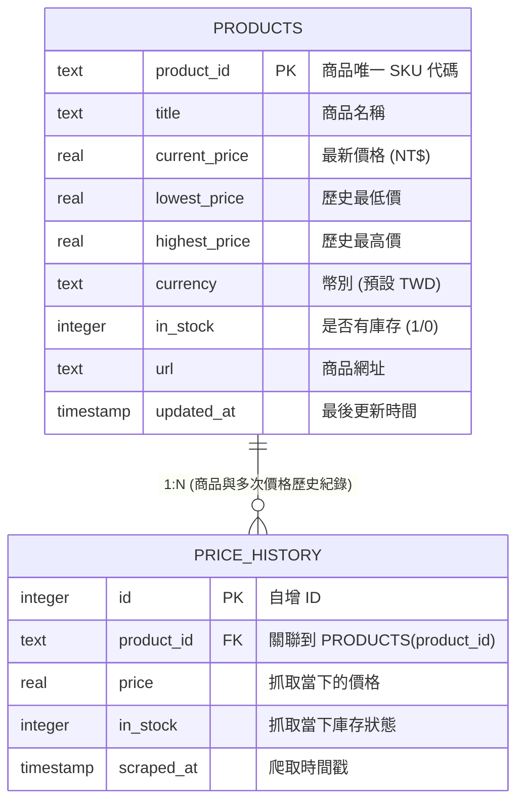

# Walkthrough：在 Cursor 上把 PriceBot 爬蟲一步一步做出來

> 這份文件帶你從零做出 **PriceBot**——一個定期爬取商品價格、寫入 SQLite、偵測變動時發送 Telegram 通知的機器人。
> 你會學到四件事：爬蟲資料怎麼驗證才安全、合法合規怎麼在程式碼裡實現、Cursor Rules 怎麼強制倫理檢查、怎麼用 loguru 取代 print() 讓排程可追蹤。
>
> 文中有四種標記，幫你少走彎路：
> - 🔍 **名詞卡**：專有名詞的白話解釋 + 生活比喻
> - ❓ **想一想**：先自己想，再往下看答案
> - ✅ **預期看到**：每個指令跑完的正常畫面長什麼樣
> - 🧯 **卡住的話**：常見翻車點與救援方式

---

## 🚦 開始前檢查清單（先做這五件事，動手才不會卡）

1. **確認 books.toscrape.com 當天還能爬**——在瀏覽器開過一次，看看網站有沒有改版，selector 還對不對。
2. **存一份離線 HTML 備援**——用 `curl -o books_product.html https://books.toscrape.com/catalogue/page-1.html` 先存下來，網站掛了或改版時直接用備份檔演示 selector 的概念。
3. **裝好 uv（或最新 Python 3.10+）**——不要一開始才發現 pip 和 poetry 的問題，`uv init` 必須能跑。
4. **申請好 Telegram Bot Token 與 Chat ID**——在 @BotFather 建一個測試 bot（或用現有的），取 token；問 @getidsbot 拿自己的 chat_id。
5. 動手過程中，每跑完一個指令就對照文中的「✅ 預期看到」——判斷得出「這是正常的」還是「翻車了」，除錯速度差十倍。

## 🗺️ 學習地圖（建議 3 小時）

| 段落 | 時間 | 類型 |
|---|---|---|
| 開場故事 + 第 1 節概念 | 30 分 | 閱讀理解（這是全篇靈魂，慢慢看） |
| 第 2 節環境 & 規則 | 20 分 | 動手做（`uv init` 與 `.cursor/rules` 很快） |
| 第 3 節資料與爬蟲 | 40 分 | 動手做（pydantic 驗證 + selector 抓取，是一定要親自試的一幕） |
| 第 4 節儲存與通知 | 30 分 | 動手做（upsert 與比對邏輯） |
| 第 5 節排程 | 20 分 | 閱讀理解 + 動手做（排程設置） |
| 第 6–7 節情境與測試 | 15 分 | 動手做 |
| 收尾三句話 | 5 分 | 閱讀理解 |

---

## 🎬 課堂放映表（講師用）

> 程式碼在 `./pricebot/`，遙控器是 `./demo.sh`（位於 `project-7-price-monitor-scraper/` 根目錄）。
> 整堂課只有一個指令：`./demo.sh` 列出所有幕，`./demo.sh N` 跑第 N 幕。
> 內建離線 Mock 商城與 SQLite 歷史庫，全 5 幕 100% 離線可跑，不需要外部網路與爬取配額。

### 上課前 15 分鐘要先做完（不要當著學生的面做）

| # | 做什麼 | 為什麼要先做 |
|---|---|---|
| 1 | `cd project-7-price-monitor-scraper/pricebot && uv sync --extra dev` | 第一次同步 uv 虛擬環境與下載依賴。課前做完後，課堂上全離線秒開 |
| 2 | 跑一次 `./demo.sh 4`（測試全綠） | 執行 pytest 確認 3 passed（robots.txt 合規、Pydantic 模型、降價偵測）全綠 |
| 3 | 跑一次 `./demo.sh 2`（初始爬取） | 建立初始 4 款商品之價格歷史記錄 |
| 4 | 確認 8501 埠沒有殘留行程 | 第 5 幕 Streamlit 價格監控儀表板需要此埠 |

### 放映時間軸

時間軸切成 6 段，對應上方學習地圖（合計 180 分鐘），全長 **3 小時**。

| 時間 | 幕 | 指令 | 打開哪個檔案投影 | 📺 螢幕上會出現 | 🎯 這一幕在教 |
|---|---|---|---|---|---|
| 0:00–0:30 | 開場故事 + 概念 | — | `walkthrough.md` §開場故事 ～ §1 | 便利商店抄價格比喻、合法爬蟲五要件、robots.txt 原理 | 爬蟲合規與道德法律底線 |
| 0:30–0:50 | 第 1 幕：倫理規則檔 | `./demo.sh 1` | `pricebot/.cursor/rules/crawler-ethics.mdc` | 規則檔三大條款：robots.txt 查核、Rate Limit 禮貌間隔、不爬個資 | 用 Cursor Rules 讓 AI 從源頭拒絕撰寫流氓爬蟲 |
| 0:50–1:30 | 第 2 幕：執行常規爬取 | `./demo.sh 2` | `pricebot/src/crawler.py` | robots.txt 通過、BeautifulSoup 抽取、Pydantic 驗證並寫入 SQLite | 爬蟲資料管線標準流程 |
| 1:30–2:00 | 第 3 幕：價格跳水與告警 ⭐ | `./demo.sh 3` | `pricebot/src/notifier.py` | 鍵盤特價 -20%（4980→3980），終端機即時彈出 Telegram 告警卡片 | 歷史價格比對與即時推播派發 |
| 2:00–2:15 | 第 4 幕：pytest 測試全綠 | `./demo.sh 4` | `pricebot/tests/test_pricebot.py` | 3 passed 全綠色通過 | 用可執行的測試證明爬蟲安全與商業邏輯正確 |
| 2:15–3:00 | 第 5 幕：啟動 Streamlit 儀表板 ⭐ | `./demo.sh 5` | `pricebot/app.py` | 瀏覽器展示價格監控儀表板、歷史價格折線圖與手動觸發按鈕 | 完整可視化端到端監控體驗 |

### ⭐ 全場最值得停下來的一幕

**第 3 幕的降價告警與第 5 幕的價格折線圖。**
在第 3 幕執行降價模擬時，終端機瞬間跳出高亮綠字的 Telegram 模擬推播訊息，清楚標註原價、特價與降幅百分比；接著在第 5 幕 Streamlit 儀表板切換商品，折線圖精準呈現價格隨時間下降的趨勢曲線！

### 🧯 現場翻車備案

| 翻什麼 | 徵狀 | 30 秒內的救援 |
|---|---|---|
| Streamlit 埠被占用 | 提示 port 8501 被占用 | Streamlit 會自動切換為 8502 埠，請以終端機印出的網址為準 |
| 資料庫被多次爬取弄髒 | 想重置歷史資料 | 刪除 `pricebot/data/pricebot.db` 即可，下次執行時自動重建乾淨資料庫 |

---

## 🎬 開場故事：派機器人每天去便利商店抄飲料價格

想像一個場景：你是一家連鎖便利商店的老闆，想知道全台每家店的飲料價格怎麼變。你有點子：派一個機器人每天去各家店抄一遍價格，拍照存檔，送回總部。聽起來很棒——但問題來了。

第一個問題：**能不能進去抄？** 店門口貼著『禁止攝影』，這就叫 robots.txt。

第二個問題：**怎麼抄？** 機器人走進門，站在咖啡區一秒按 100 次快門，整個貨架都被拍得模糊，別的客人沒辦法逛了——這就叫『禮貌間隔』（rate limit）。

第三個問題：**抄什麼？** 飲料價格可以抄，旁邊有收據紙掉了印著別人的信用卡後四碼，你會順手抄嗎？這就叫個資。

第四個問題：**抄完怎麼用？** 你把全部價格整本拿去賣給連鎖對手，對方拿你的數據打價格戰。店員會和你說『我們服務條款禁止這樣』，這就叫 ToS。

今天要學的就是這四件事：**看告示、不搗亂、不抄個資、尊重規則**。技術其實簡單，難的是在沒人監督的時候，還要按照無形的禮儀和法律動作。爬蟲寫得再聰明，違法違規就是廢品。

這個便利商店比喻會貫穿全課，先把對照表記在心裡（後面每個名詞卡都會回扣）：

| 便利商店 | 爬蟲系統 |
|---|---|
| 店門口的『禁止拍照』告示 | robots.txt |
| 走進門抄價格的動作 | HTTP GET 請求 |
| 一秒按 100 次快門 vs 每 1 秒按一次 | 併發數與延遲（rate limit） |
| 店員要求「你是誰」 | User-Agent（告訴網站你是什麼程式） |
| 別的客人的個資 | 個人資料（GDPR / 個資法） |
| 服務條款「禁止商業抄錄」 | Terms of Service（ToS） |
| 每天同一時間自動派機器人去 | 排程（cron / APScheduler） |

---

## 0. 課前準備

- Python 3.10+、uv（套件管理）、curl（驗證 robots.txt）
- Telegram Bot Token（自己的機器人）與 Chat ID
  - 在 Telegram 找 @BotFather，建一個 bot 取 token
  - 自己的 chat_id：傳訊息給 bot，再問 @getidsbot
- books.toscrape.com 在瀏覽器開過一次（確認網站有效）

> 🔍 **名詞卡：爬蟲（Web Scraper）**
> 白話：一個自動化的機器人，走進網站，按照你的指令自動抄資訊、存檔。不是人工逐頁抄，而是「寫程式叫機器人去抄」，快到幾秒鐘能掃完一百個頁面。
> 比喻：便利商店員工不是靠人一個個記價格，而是拿機器掃條碼。掃蟲就是那臺機器。
>
> 🔍 **名詞卡：HTTP 請求**
> 白話：你在瀏覽器網址列打 google.com 然後按 Enter，就是送出一個 HTTP 請求；Google 伺服器收到後，回傳給你一個網頁（HTML）。爬蟲也是這樣做，只是用程式代替手動。
>
> 🔍 **名詞卡：HTML / CSS selector**
> 白話：網頁原始碼有數千行，要從裡面抄出你要的「飲料名字」和「價格」。selector 就是尺子——標記出「那兩個欄位在哪一行」，程式用尺子一量就知道去哪裡找。
> 用 Browser DevTools（按 F12）的 Element Inspector，一點一點找 selector，像拿放大鏡找座位號。

---

## 1. 先懂概念：驗證、日誌、合規紅線

### 1.1 爬蟲的難題不是「抓」，是「抓錯了怎麼辦」

沒有驗證的髒資料直接進資料庫，之後很難排查。常見的爛資料：

| ✗ 沒有驗證 | ✓ pydantic 驗證 |
|---|---|
| 直接 insert 原始 dict 到 SQLite | `Product(**data)` 驗證失敗立即拋例外 |
| 價格字串殘留貨幣符號沒清乾淨（"£9.99" → 被當成文字，不是數字） | `field_validator` 擋下不合理的價格 |
| selector 抓不到就整支程式崩潰 | 抓不到元素先 log 警告再回傳 None |
| print() 滿地跑，排程執行找不到錯 | loguru logger 寫到檔案，搜尋無痛 |

想像一個倉庫管理員，每次收到快遞都直接往架上扔，連驗貨都不驗。到了下單時才發現『咦，這瓶飲料倒是玻璃瓶？怎麼直接掉地上碎了』。資料驗證就是倉庫的『驗貨部門』——東西進庫前先檢查，不合格的當場退回，合格的才上架。

**核心是一個順序**：拿到原始 HTML → selector 抓欄位 → 清理字串 → pydantic 驗證 → SQLite 寫入。驗證不在最後，在倒數第二步。

### 1.2 Cursor Rules 把合規檢查自動化

把爬蟲工程的合規要求寫成規則（`.cursor/rules/00-scraper.mdc` 的 `alwaysApply: true`），讓 Agent 自動擋違規需求：

```markdown
---
alwaysApply: true
---

# PriceBot 爬蟲工程規則

## 絕對禁止

1. 不得硬編碼 API 金鑰或密感字串；一律從環境變數讀
   - `TELEGRAM_BOT_TOKEN`、`TELEGRAM_CHAT_ID` 一律放 `.env`
   - `SCRAPE_DELAY_SECONDS`、`SCRAPE_CONCURRENCY` 等設定也一樣

2. 不得寫 `if True: return data` 或 `else: pass` 等假驗證
   - 所有資料驗證必須用 pydantic model 與 field_validator
   - 驗證失敗自動拋 ValidationError，程式立即停止該筆資料

3. 不得寫 print()；所有日誌走 loguru
   - `from loguru import logger`
   - `logger.info()`, `logger.warning()`, `logger.error()`
   - 排程執行時日誌寫到檔案，開發時看 stdout

## 一定要做

4. 爬取前自動檢查 robots.txt，違反自動拒絕
   - 新爬蟲函式第一步：`check_robots_txt(domain)` 回傳允許 / 禁止
   - 返回 False 時立即 `raise SkipScraperError(f"{domain} forbids in robots.txt")`

5. 抓不到元素時先 log 警告，再回傳 None，不要程式崩潰
   ```python
   price_elem = soup.select_one(".price")
   if not price_elem:
       logger.warning(f"SKU {sku}: price selector not found")
       return None
   ```

6. 每個 pydantic 模型都要補 field_validator，檢查業務規則
   - price > 0 and price < 100000（合理價格範圍）
   - sku 和 name 不得為空

# 這六條每次請求都會附上，是整個專案唯一的 alwaysApply 規則
```

> 🔍 **名詞卡：pydantic**
> 白話：一個驗證工具，像「資料收銀機」——商品進來時掃一下條碼，確認「這個價格符不符合正常範圍」、「商品名有沒有被打成亂碼」。符合才讓通過；不符合立刻拒絕並告訴你哪裡出錯。
>
> 🔍 **名詞卡：loguru**
> 白話：比 print() 聰明的日誌工具。print() 的字會在終端機閃過即逝；loguru 會把所有日誌存到檔案裡。排程半夜 3 點跑的時候你睡著了，早上開檔案才知道「昨晚崩潰在哪裡」。

Agent 看到這個規則，下次你要求「直接 print 調試」，它就會提醒你用 logger。規則越具體，Agent 的自律性越高。

### 1.3 合規五件事（踩到任何一項都得下線）

技術本身中性，合不合規看爬什麼、怎麼爬、怎麼用。動手前必須檢查這五件事，它們不是技術決定，是法律與倫理決定。任何一個『不確定』或『不行』，就得換網站——寫得再好都廢品。

#### 1. robots.txt

檢查該網站的 `/robots.txt`，看「爬蟲能不能碰」。爬取前自動 GET `https://books.toscrape.com/robots.txt`。

books.toscrape.com 的範例：
```
User-agent: *
Disallow:
```
完全允許，直接爬。但若看到 `Disallow: /`, `/product/` 等就要停止。

> 🔍 **名詞卡：robots.txt**
> 白話：網站貼在門口的「營業規則」。就像便利商店門口貼「禁止拍照」或「開放拍照」，爬蟲要先讀這份告示，決定「能不能進門」。不讀就亂爬，等同闖入禁地。

#### 2. 服務條款（ToS）

官網有沒有禁止自動爬取？讀 `/terms` 或 `/policies`，看有沒有「不得自動化」或「爬蟲禁入」字眼。已有多起違反 ToS 的爬蟲業者被提告。

> 🔍 **名詞卡：ToS（Terms of Service，服務條款）**
> 白話：像「購物合約」——進場前要同意。某些網站寫著「禁止機器自動抓」，你還是派機器去，就違約了。

#### 3. 個人資料（GDPR / 個資法）

有沒有爬個人隱私資訊？books.toscrape.com 是虛擬書籍網站，沒有真人資料，安全；但換成真實電商就要小心。即使資訊公開可見，收集個資仍受法規範。

#### 4. 合理速率

別把對方當壓力測試。預設 1 併發、間隔 1 秒；若被反爬蟲攔截，改用官方 API 或聯絡網站管理員。用環境變數 `SCRAPE_DELAY_SECONDS=1`、`SCRAPE_CONCURRENCY=1` 控制（命令列參數可調）。

> 🔍 **名詞卡：rate limit（禮貌間隔）**
> 白話：每次請求後停頓一下（例如 1 秒），別一次連射 100 個請求。像排隊進便利商店——一個人一個人進，不是全班衝進去。超市會擠爆，伺服器也會當掉。

#### 5. 登入內容

絕對不要繞過登入擷取資料。程式碼顯式禁止爬需登入的頁面，例外拋出。繞過登入 = 無授權存取 = 違法。

> ❓ **想一想**：如果一個網站的 robots.txt 說『禁止爬蟲』，但你發現用瀏覽器還是能看到那些頁面，這代表什麼？
>
> **答案**：代表網站**允許**人類瀏覽，但**禁止自動化程式**。尊重 robots.txt 就是成熟爬蟲的基本禮儀。違反 robots.txt 就像無視門口的『禁止進入』標誌。

---

## 2. 階段一：環境建置與規則

### 2.1 建立 uv 專案

```bash
# 初始化
uv init priceboard
cd priceboard

# 新增依賴
uv add httpx              # 網路請求
uv add beautifulsoup4     # 解析 HTML
uv add pydantic[email]    # 資料驗證
uv add python-dotenv      # 環境變數
uv add loguru             # 日誌
uv add tenacity           # 重試機制
uv add apscheduler        # 排程
uv add -d pytest pytest-mock  # 開發工具
```

> 🔍 **名詞卡：uv**
> 白話：Python 的套件管理員。像「便利商店進貨系統」——告訴系統「我要 httpx 和 pydantic」，它自動下載並鎖定版本，確保今天、明天、一年後用的版本都一樣，避免「我的電腦能跑、別人的壞掉」。

✅ **預期看到**：`uv init` 建完後會出現 `pyproject.toml` 和 `src/main.py`；`uv add` 每跑一次都會更新 `pyproject.toml` 和 `uv.lock`。最後 `uv lock` 那行會列出所有依賴的精確版本號。

🧯 **卡住的話**：
- 「找不到 uv 命令」→ 檢查有沒有裝 (macOS: `brew install uv`；Linux: 用官方 install.sh)
- 「uv add 卡住」→ 檢查網路連線或用 `uv add --no-editable` 跳過本地 editable 安裝

### 2.2 寫爬蟲工程規則：`.cursor/rules/00-scraper.mdc`

建立 `.cursor/rules` 資料夾，放入上面提到的六條規則檔（見 1.2）。

現在來測試 Agent 會不會真的擋。**故意**叫它做一件違規的事，注意看它的反應：

> 我想用 print() 印出爬到的所有價格，方便調試

✅ **預期看到**：Agent **拒絕並引用規則**，大意如下——

> ⛔ 這違反規則第 3 條。print() 的輸出在排程執行時會丟失，無法排查問題。
>
> 我改用 loguru：
> ```python
> from loguru import logger
> logger.info(f"Scraped price: {price}")
> ```
> 日誌會存到檔案，排程半夜 3 點跑也能查。

🧯 **卡住的話**：如果 Agent 沒擋、直接照做了——代表規則寫得不夠具體它就會漏接。把規則第 3 條改得更具體、再測一次。失敗本身就在教一件事：**規則的具體程度，決定它擋不擋得住。**

---

## 3. 階段二：資料與爬蟲

### 3.1 寫 pydantic 模型：`src/models.py`

對 Agent 說：

> 建 `src/models.py`：
>
> - `Product` 模型：sku（唯一鍵）、name、price、in_stock（布林）、rating、url、last_scraped_at
> - 所有欄位都必須用 `field_validator` 檢查合理值：
>   - `price` 必須 > 0 且 < 100000（書籍上限）
>   - `sku` 與 `name` 不得為空或全空白
>   - `rating` 若有值，必須在 0–5 之間
> - 驗證失敗拋 `ValidationError`，不要沉默過去

✅ **預期看到**：
- `src/models.py` 有一個 `Product` class，帶著 `@field_validator` 裝飾
- 跑 `uv run` 進 Python REPL，試試 `Product(sku="b-1", name="", price=10, ...)` 會拋 `ValidationError`（因為 name 為空）

🧯 **卡住的話**：
- 「ValidationError 說 'rating must be between 0 and 5'，但我輸入的是 4.5」→ 檢查 validator 有沒有寫成 `0 <= v <= 5`（包含等號）
- 「price 驗證沒檔到負數」→ 檢查條件有沒有寫 `v > 0` 而不是 `v >= 0`

### 3.2 寫爬蟲函式：`src/scraper.py`

對 Agent 說：

> 建 `src/scraper.py`：
>
> 1. 先寫 `check_robots_txt(domain: str) -> bool`：GET `/robots.txt`，檢查 `Disallow:` 有沒有 `/`，如果有就回傳 False
> 2. 寫 `fetch_product_list_page(page: int) -> BeautifulSoup`：GET books.toscrape.com 的第 N 頁，回傳 BeautifulSoup 物件
> 3. 寫 `parse_product_list(soup: BeautifulSoup) -> list[Product]`：用 selector `article.product_pod` 抓所有商品卡片，每張卡片提取：
>    - SKU 與名字（selector：`.product-thumb h3 a`, 取 `data-product_slug`、title）
>    - 價格（selector：`.price_color`，清掉 `£` 符號，轉 float）
>    - 庫存（selector：`.instock` 或 `.outofstock`，判斷有沒有 .instock 類名）
>    - 評分（selector：`.star-rating`，轉 0–5 數字）
>    - 詳情頁連結（selector：`.product-thumb a`, 取 href）
> 4. 每張卡片都用 `Product(**data)` 驗證，驗證失敗 log 警告並跳過該筆
> 5. 加上 `time.sleep(SCRAPE_DELAY_SECONDS)` 延遲

> 🔍 **名詞卡：BeautifulSoup**
> 白話：把 HTML 原始碼變成「可搜尋的樹」。你告訴它「幫我找 CSS class 叫 price_color 的東西」，它就在千行程式碼裡翻出那一行。不用 BeautifulSoup 的話，你得手動 grep 或正則表達式，容易出錯。
>
> 🔍 **名詞卡：selector（CSS selector）**
> 白話：告訴 BeautifulSoup「東西在哪」的地址。`.price_color` 代表「class 名叫 price_color 的元素」；`article.product_pod` 代表「article 標籤裡 class 叫 product_pod 的」。像用座標尋寶。

✅ **預期看到**：
- `uv run src/scraper.py`（或 `pytest tests/test_scraper.py`）跑完，終端印出類似：
  ```
  Parsed 20 products
  Product(sku='b-1', name='Clean Code', price=9.99, in_stock=True, rating=5, ...)
  Product(sku='b-2', name='The Pragmatic Programmer', price=8.99, in_stock=False, rating=4, ...)
  ```

🧯 **卡住的話**：
- 「selector 抓不到東西」→ 打開瀏覽器 DevTools (F12)，用 Element Inspector 指一下商品卡片，看 HTML 標籤和 class 名有沒有變；可能網站改版了，需要更新 selector
- 「ValueError: could not convert string to float: '£9.99'」→ 清理字串時忘了去掉 `£` 符號，改成 `price_str[1:]` 再轉
- 「RateLimitError 或 HTTP 429」→ 網站反爬蟲了；增加 `SCRAPE_DELAY_SECONDS`（例如從 1 秒改成 3 秒）或用事先存好的離線 HTML 檔演示

### 3.3 ⭐ 一定要親自試的一幕：查 robots.txt

整個爬蟲流程最重要的第一步不是抓資料、不是驗證，是『先問能不能進門』。

打開終端機查詢：

```bash
# 查 books.toscrape.com 的 robots.txt
curl https://books.toscrape.com/robots.txt
```

預期輸出：
```
User-agent: *
Disallow:
```

看到了嗎？`Disallow:` 後面是空的，代表『沒有禁止』。這就叫『有禮貌』。現在換你的爬蟲程式也做同一件事——在抓價格之前，先讀一遍這份告示，確認『系統說可以』以後才動手。

對 Agent 說：
> 執行 `check_robots_txt("books.toscrape.com")`，印出檢查結果

✅ **預期看到**：
```
logger.info: Checking robots.txt for books.toscrape.com...
logger.info: robots.txt allows scraping
```

視覺上「動手前先問」的禮儀被具體執行出來——這是最難忘的學習。

---

## 4. 階段三：儲存與通知

### 4.1 SQLite 設計與 upsert：`src/storage.py`

對 Agent 說：

> 建 `src/storage.py` 和 `src/schema.sql`：
>
> 1. SQL 建表：products（sku 主鍵）、price_history（記錄每次抓取的價格與庫存）
> 2. 寫 `init_db()` 建表，`upsert_product(product: Product) -> tuple[float|None, bool|None]`
>    - upsert 前先查舊價格與舊庫存（SELECT）
>    - 寫入新值（INSERT OR REPLACE）
>    - 回傳 `(old_price, old_in_stock)`，供通知層判斷是否變動
> 3. 寫 `query_history(sku: str, days: int | None = None) -> list`，查詢價格歷史

#### 📊 價格監控資料庫表格關聯圖（投影給同學看）



> 💡 **向同學解說技巧**：
> 1. `PRODUCTS` 表只保留「當前最新狀態」與「歷史最高/最低價」。
> 2. 每次爬蟲抓到新價格時，都會在 `PRICE_HISTORY` 插入一筆新資料，這樣才能在 Streamlit 折線圖畫出價格隨時間變化的走勢！
> 3. 當比對到 `old_price > new_price`（降幅 >= 5%）時，立即觸發 Telegram 降價告警。

> 🔍 **名詞卡：upsert（UPDATE or INSERT）**
> 白話：「有就改、沒有就新增」。書店庫存系統：進了一本《Clean Code》，先查有沒有舊紀錄，有的話改數量，沒有的話新增一筆。不用先判斷「有沒有」再分開寫兩行 SQL，一行 upsert 搞定。

✅ **預期看到**：
- `uv run -m pytest tests/test_storage.py` 全綠
- 手動執行 `uv run -c "from src.storage import init_db; init_db()"` 後，會出現 `priceboard.db` 檔案

### 4.2 Telegram 通知：`src/notification.py`

對 Agent 說：

> 寫 `src/notification.py` 的 `notify_price_change(sku, name, old_price, new_price, old_in_stock, new_in_stock)`：
>
> 1. 如果 `old_price is None`（第一次執行），不發通知
> 2. 如果 `old_price != new_price`，發「[Price Alert] 商品名 ￥舊價 → ￥新價 ↓↑」
> 3. 如果 `old_in_stock != new_in_stock`，發「[Stock Alert] 商品名 補貨 / 缺貨」
> 4. 用 `httpx.post()` 呼叫 Telegram Bot API

✅ **預期看到**：
- 第一次執行爬蟲（`uv run src/main.py --run-once`）：不發任何 Telegram 訊息（因為沒有舊資料可比）
- 手動修改 `priceboard.db` 裡某筆商品的 price（例如 10.99 → 8.99），再跑一次
- Telegram 收到訊息：「[Price Alert] Clean Code ￥10.99 → ￥8.99 ↓ 降價！」

🧯 **卡住的話**：
- 「Telegram 訊息沒送出」→ 檢查 TOKEN 和 CHAT_ID 有沒有貼對；用 `curl` 手測一次 API
- 「收到 403 Unauthorized」→ Token 過期或貼錯了；重新問 @BotFather 拿新 token

---

## 5. 階段四：排程與部署

### 5.1 主程式與排程：`src/main.py`

對 Agent 說：

> 建 `src/main.py`：
>
> 1. 寫 `async def run_scrape_once()` 函式，依序：
>    - 檢查 robots.txt
>    - 爬清單頁（分頁循環）
>    - 每筆商品 upsert 並判斷是否變動
>    - 變動時發通知
> 2. 用 APScheduler 排程，每 6 小時執行一次
> 3. 支援命令列參數：`--run-once`（只執行一次）、`--init-db`（建表）

> 🔍 **名詞卡：APScheduler**
> 白話：背景排程工具。不用 cron（命令列排程語法硬到不行），用 Python 寫「6 小時執行一次」，清楚又好管。
>
> 🔍 **名詞卡：cron**
> 白話：Unix / Linux 的排程語言。`0 */6 * * *` 代表「每 6 小時」，像數學公式一樣難懂。本章用 APScheduler 避免背這套語法。

✅ **預期看到**：
```bash
# 初始化資料庫
uv run src/main.py --init-db
# 輸出：Database initialized

# 執行一次
uv run src/main.py --run-once
# 輸出：
# 2024-08-20 14:30:00 | INFO | Starting scrape job
# 2024-08-20 14:30:01 | INFO | Checking robots.txt for books.toscrape.com
# 2024-08-20 14:30:02 | INFO | Parsed 20 products
# 2024-08-20 14:30:02 | INFO | Scrape job completed

# 排程模式（背景執行）
uv run src/main.py
# 輸出：Scheduler started, running every 6 hours
# （按 Ctrl+C 停止）
```

🧯 **卡住的話**：
- 「ImportError: No module named 'apscheduler'」→ 忘了 `uv add apscheduler`
- 「RuntimeError: There is no current event loop」→ 用 `asyncio.run(main())` 而不是直接 `await`

### 5.2 cron 排程：背景每 6 小時自動執行

> 🔍 **名詞卡：cron**（已提到，強化記憶）
> 白話：伺服器上的「鬧鐘系統」。設定好時間，伺服器會自動在那個時刻執行指令，你睡著也沒關係。本章用 cron 讓爬蟲每 6 小時自動跑一次，不用手動觸發。

編輯 `crontab -e`：

```bash
0 */6 * * * cd /path/to/priceboard && /usr/local/bin/uv run src/main.py >> logs/scrape.log 2>&1
```

✅ **預期看到**：
```bash
# 檢查 crontab 有沒有成功寫入
crontab -l
# 輸出應該看得到那行排程

# 檢查日誌
tail -f logs/scrape.log
# 每 6 小時會出現一次新的「Scrape job completed」
```

> ❓ **想一想**：為什麼要把日誌寫到檔案（`>> logs/scrape.log`）而不是只印在終端機？
>
> **答案**：因為排程執行時沒有終端機在看——程式是後台自動跑的。日誌存到檔案，你隔天才能查「昨晚有沒有成功」。print() 等於沒有日誌。

---

## 6. 情境演練：偵測到價格下跌

**情境**：排程重新抓取後，某商品價格比上次記錄的低。

**會看到什麼**：

| 步驟 | 預期行為 |
|---|---|
| upsert_product 先查舊價格再寫入新價格 | SKU 從 $10.99 變成 $8.99 |
| 比對新舊價格，不同就回傳舊價格 | `old_price=10.99, new_price=8.99` |
| notify_price_change 透過 Telegram Bot API 發訊息 | ✓ Telegram 收到「[Price Alert] Clean Code ￥10.99 → ￥8.99 ↓ 降價！」 |
| 第一次執行因沒有舊資料，一律回傳 None | ✓ 首次執行，沒有舊資料，不誤發任何通知 |
| 同樣的模式也適用於庫存、評論數等欄位 | ✓ 補貨 / 缺貨也能偵測 |

---

## 7. 驗收清單

- [ ] `uv run src/main.py --init-db` 成功，資料庫建立
- [ ] `uv run src/main.py --run-once` 首次執行無誤（檢查日誌 `logger.info("Scrape job completed")`）
- [ ] 開 Telegram，首次執行不誤發任何通知（因為沒有舊資料）
- [ ] 資料庫手動修改一筆商品的 price，重跑 `--run-once`，應收到 Telegram 通知
- [ ] `uv run pytest tests/` 全綠
  - `test_models.py`：pydantic 驗證正確
  - `test_scraper.py`：parse_product_list 抓對欄位
  - `test_storage.py`：upsert 回傳正確的舊值
- [ ] `.env` 包含 `TELEGRAM_BOT_TOKEN`、`TELEGRAM_CHAT_ID`、`SCRAPE_DELAY_SECONDS`、`SCRAPE_CONCURRENCY`
- [ ] 全專案 grep `TELEGRAM_BOT_TOKEN` → 只出現在 `.env` 與 `.env.example`，沒有硬編碼
- [ ] 排程 cron 設置成功，確認每 6 小時自動執行（檢查日誌）
- [ ] 對 Agent 說「直接 print 價格」→ 被規則擋下並建議用 logger

---

## 8. 常見坑排錯速查

多數爬取失敗都能在這張表快速定位原因：

| 問題 | 排錯方式 |
|---|---|
| **Selector 失效** | 改版所致，重新截圖比對 selector（用瀏覽器 DevTools 的 Element Inspector） |
| **反爬蟲攔截**（403、429） | 降速率（增加 SCRAPE_DELAY_SECONDS）、換 User-Agent、優先用官方 API |
| **IP 被封** | 拉長延遲、降低併發數；考慮用代理池 |
| **資料庫鎖定** | 確保同時只有一個程序寫入（檢查 cron 有沒有重複觸發） |
| **pydantic 驗證拋例外** | 檢查原始資料是否符合欄位定義；加 logger 印出被拒的資料 |
| **Telegram 訊息沒收到** | 確認 TOKEN、CHAT_ID 正確；用 curl 測試 API |
| **排程沒執行** | 檢查 cron 語法（`crontab -l`）；查系統日誌（`journalctl -u priceboard`） |
| **SQLite 查詢為空** | 檢查 `last_scraped_at` 是否被寫入；確認 upsert 真的執行了 |
| **環境變數讀不到** | 確認 `.env` 在工作目錄；用 `echo $TELEGRAM_BOT_TOKEN` 驗證 shell 能讀到 |
| **BeautifulSoup 抓空值** | 用瀏覽器 DevTools 驗證 selector，可能是類名或屬性改了 |

最常踩的坑就在這張表。卡關時別猜——直接對照『我的症狀在哪一行』，按照救法一項一項檢查。五分鐘內沒解決，直接用備援 HTML 檔演示概念。

---

## 9. 動手練習

### 練習 1：加上庫存變動通知功能

**難度**：入門 | **時間**：約 25 分

**目標**：沿用價格變動的同一套模式，補貨或缺貨時也發通知。

**怎麼做**
1. 在 upsert 前先讀出舊的 in_stock 值 → 拿得到上一次的狀態
2. 寫入後比較新舊值，不同就回傳舊值 → 與價格用同一種寫法
3. 組成庫存變動的 Telegram 訊息 → 訊息看得懂是補貨還是缺貨
4. 手動改資料庫的 in_stock 再重跑一次 → 收到對應方向的通知

**完成標準**
- ✓ 補貨與缺貨都會通知
- ✓ 第一次執行不誤發
- ✓ 訊息看得出變動方向

### 練習 2：把併發數與延遲改成命令列參數

**難度**：中級 | **時間**：約 25 分

**目標**：把寫死的設定變成可調參數，而且要有像樣的 `--help`。

**怎麼做**
1. 用 `argparse` 或 `typer` 定義兩個參數 → `--concurrency` 與 `--delay`
2. 參數優先、環境變數次之、預設值墊底 → 三層優先順序清楚
3. 把值傳進 Semaphore 與請求間隔 → 真的會影響爬取速度
4. 跑 `--help` 與兩種不同速率各測一次 → 說明清楚、速度確實不同

**完成標準**
- ✓ `--help` 有清楚說明
- ✓ 不改 `.env` 也能調速率
- ✓ 預設值仍然安全

### 練習 3：寫一支查詢腳本，印出商品的歷史價格

**難度**：入門 | **時間**：約 25 分

**目標**：資料抓進來只是第一步，能查得出來才算完成一個工具。

**怎麼做**
1. 設計 CLI：輸入 sku，可選日期區間 → 介面先想清楚再寫
2. 寫 SQL 依時間由舊到新排序取出 → 查詢邏輯集中一處
3. 輸出成對齊的表格，含漲跌標示 → 看得出價格走向
4. 對抓過兩次以上的商品實測 → 至少印出兩筆紀錄

**完成標準**
- ✓ 能依 sku 查詢
- ✓ 由舊到新排序
- ✓ 至少看到兩筆紀錄

---

## 10. 帶走的三句話

如果整份專案只能記住三件事，就這三句：

1. **驗證不在最後，在倒數第二步**——資料進 SQLite 前必須 pydantic 驗證，否則髒資料進庫後很難排查。別信任任何來自網頁的資料，selector 今天對明天可能失效。

2. **合法合規比技術難度更重要**——爬蟲的難題不是「抓」，是「抓錯了怎麼辦」。robots.txt、ToS、個資、速率、登入內容五項缺一不可。寫得再好都得下線。動手前先查五件事。

3. **Cursor Rules 把合規檢查自動化**——六條紅線寫進 `.cursor/rules`（alwaysApply），Agent 就會在你自己都忘記的時候提醒你。規則越具體，自律性越高。hardcode API key、寫 `print()`、驗證邏輯偷懶都會被擋。

---

爬蟲技術本身不難，難的是『在沒人監督的時候，還要遵守看不見的規則』。便利商店員工能裝作沒看到『禁止拍照』的告示衝進去偷拍，但尊重規則的爬蟲工程師不會。法律和倫理不是程式設計課的內容，但卻是每個工程師必須內化的修養。這份文件最值得記住的，不是怎麼用 BeautifulSoup，而是『我搬動 Enter 鍵之前，要先問自己：我真的應該這樣做嗎？』
