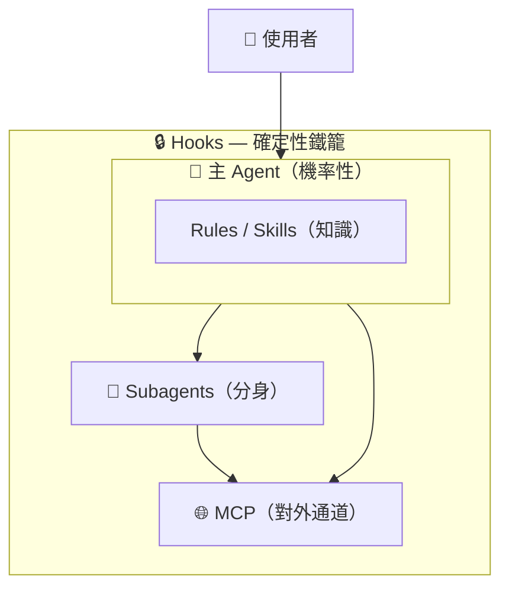

# Subagent + Hooks 實戰 — 用確定性護欄與專業分工交付生產級 API

> Cursor 核心機制實戰篇：Subagents × Hooks × Skills × MCP。
> 一句話：**Subagent 決定「誰來做這件事」，Hook 決定「什麼一定會發生、什麼絕對不准發生」**
> ——兩者協同，Agent 產出的程式碼才能真正安全進 Production。

---

## 專案規格

| | |
|---|---|
| **最終成果** | 為 Node/TypeScript API 專案安全新增「使用者自助刪除帳號（`DELETE /api/account`）」功能，完整走過規劃（Planner）、稽核（Security Auditor）、驗證（Verifier）、文件查證（Docs Researcher）與 7 大自動化 Hooks 護欄 |
| **技術棧** | TypeScript、Node.js 22.18+、Cursor Subagents、Cursor Hooks（POSIX Shell / jq）、Cursor Skills、MCP（context7） |
| **預估時間** | 60–90 分鐘 |
| **前置需求** | Cursor 2.4+（巢狀／背景 subagent 需 2.5+）、Node 22.18+（原生執行 `.ts` 測試所需）、jq（`brew install jq`） |

---

## 0. 先建立心智模型

新手最常見的誤解是「Subagent 和 Hooks 都是拿來擴充 Cursor 的，二選一就好」。不是。
它們解決的是兩種完全不同的問題：

| 維度 | Subagent（次代理人） | Hook（鉤子程式） |
|---|---|---|
| **本質** | 另一個 LLM 實例 | 一個被 spawn 的確定性程序（bash / python / node） |
| **行為** | 機率性 —— 你用 prompt 拜託它 | 確定性 —— 它**一定會執行** |
| **拿來做** | 分工、隔離 Context、平行處理 | 護欄、自動化、留痕 |
| **失敗模式** | 忘記、跳過、自我感覺良好 | 腳本寫錯、regex 沒對到 |

> 💡 **核心金句**：
> **寫在 Subagent prompt 裡的「記得跑 formatter」「不要碰 .env」是祈求；寫在 Hook 裡的同一件事是事實。**



（圖為設計推定：hooks 對 subagent 的**spawn** 把關是官方明載的；subagent **內部**
工具呼叫是否逐一觸發各 hook，官方文件未載明——詳見 docs/01 §1.1 與 docs/03 卡③。）

完整的五機制全景與決策樹 → **[docs/01-big-picture.md](./docs/01-big-picture.md)**

---

## 📖 文件地圖（建議閱讀順序）

| 順序 | 文件 | 內容 | 讀完你會 |
|---|---|---|---|
| 1 | **[docs/01-big-picture.md](./docs/01-big-picture.md)** | Rules / Skills / Subagents / Hooks / MCP 全景心智模型 + 決策樹 | 三秒判斷「這需求該用哪個機制」 |
| 2 | **[walkthrough.md](./walkthrough.md)** | 跟著做的主線：四個 subagent、一個 skill、七個 hook、三輪流程 | 親手搭出整套護欄 |
| 3 | **[docs/02-subagents-deep-dive.md](./docs/02-subagents-deep-dive.md)** | Subagent 生命週期、context 隔離、frontmatter 五欄位、巢狀／背景、×MCP／×Skills | 自己設計出可靠的 subagent |
| 4 | **[docs/03-hooks-lifecycle.md](./docs/03-hooks-lifecycle.md)** | ⭐ 21 個 hook 事件全圖鑑、生命週期時間線、payload 解剖、failClosed／loop_limit | 精確預測任何時刻哪個 hook 會醒來 |

---

## 專案結構

```text
project-subagent-hooks/
├── docs/
│   ├── 01-big-picture.md         ← 五機制全景心智模型 + 決策樹
│   ├── 02-subagents-deep-dive.md ← Subagent 深度解剖（生命週期、隔離、巢狀）
│   └── 03-hooks-lifecycle.md     ← ⭐ Hooks 21 事件全圖鑑 + 時間線
├── .cursor/
│   ├── agents/                   ← Subagent 定義（誰來做）
│   │   ├── planner.md            ← 唯讀，先規劃再動手（示範巢狀開 Explore + MCP 查文件）
│   │   ├── security-auditor.md   ← 唯讀、背景執行（示範讀 skill 清單；輸出格式固定給 Hook 讀）
│   │   ├── verifier.md           ← 懷疑論驗證，實際跑測試
│   │   └── docs-researcher.md    ← 唯讀、背景執行（示範 subagent 調用 MCP）
│   ├── skills/
│   │   └── security-review-checklist/
│   │       └── SKILL.md          ← 六大安全檢查清單（主 agent 與 auditor 共用的單一事實來源）
│   ├── mcp.json                  ← MCP server 設定（context7：查官方文件的通道）
│   ├── hooks.json                ← Hook 設定（什麼一定會發生）
│   ├── hooks/
│   │   ├── guard-secrets.sh      ← 擋 secrets 進入任何 context (beforeReadFile)
│   │   ├── guard-shell.sh        ← 擋破壞性指令 (beforeShellExecution)
│   │   ├── guard-mcp.sh          ← MCP 出境海關：擋 secrets 外送 (beforeMCPExecution)
│   │   ├── guard-subagent.sh     ← spawn 前把關 + 留痕 (subagentStart)
│   │   ├── format-edit.sh        ← 每次改檔自動格式化 (afterFileEdit)
│   │   ├── subagent-report.sh    ← 每個 subagent 的報告落檔 + Critical 閉環 (subagentStop)
│   │   ├── session-wrap.sh       ← 收尾檢查未驗證就催一次 (stop)
│   │   └── log-payload.sh        ← 除錯用 X 光，dump 任何事件的 payload
│   ├── reports/                  ← 產出的稽核／驗證報告（.gitignore）
│   └── state/                    ← Hook 的跨呼叫狀態（.gitignore）
├── src/
│   ├── index.ts                  ← API 進入點
│   ├── db.ts                     ← 記憶體資料庫與稽核日誌
│   └── routes/account.ts         ← DELETE /api/account 自助刪帳號實作
├── tests/
│   └── account.test.mjs          ← 原生測試案例（正常刪除、越權防禦、二次確認）
├── demo.sh                       ← 課堂放映遙控器
└── walkthrough.md                ← Step-by-Step 實作指引
```

---

## 🎬 課堂放映與快速體驗

本專案附帶 8 幕課堂放映遙控器：

```bash
# 查看放映幕次清單
./demo.sh

# 播放特定幕次（例如第 3 幕測試 secrets 護欄，第 7 幕看 MCP 海關）
./demo.sh 3
./demo.sh 7
```

完整逐步實作指引請參閱 **[walkthrough.md](./walkthrough.md)**。
