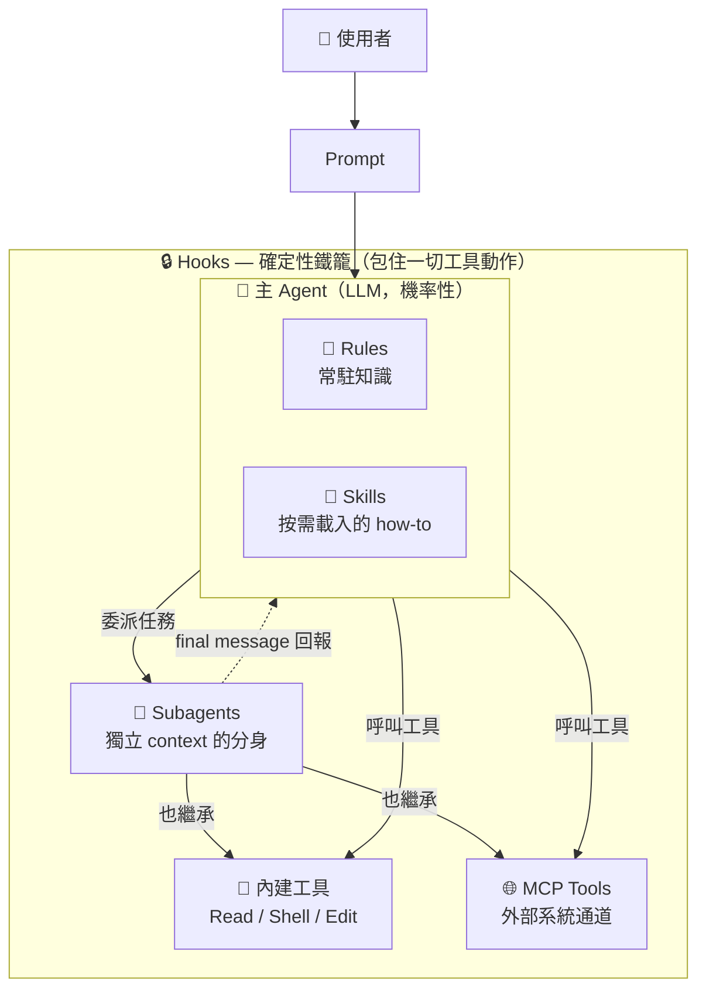
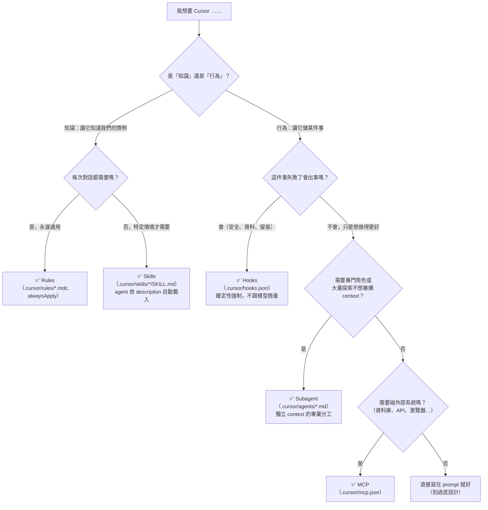
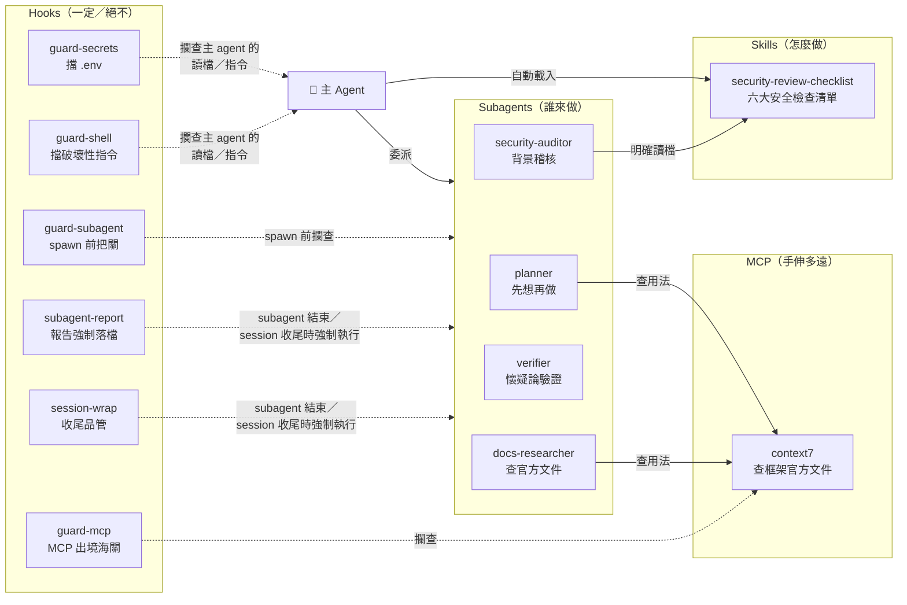

# 01. 全景心智模型 — Rules、Skills、Subagents、Hooks、MCP 到底誰管什麼？

> 讀這篇的目標：以後聽到任何需求，你能在三秒內說出「這該用哪個機制」。

Cursor 有五種擴充機制。新手最大的困惑不是「怎麼設定」，而是「這五個東西為什麼同時存在」。
答案：它們分別回答**五個不同的問題**。

| 機制 | 回答的問題 | 一句話 |
|---|---|---|
| **Rules** | Agent 該「一直知道」什麼？ | 常駐的宣告式知識（風格、慣例） |
| **Skills** | Agent 該「怎麼做」某類事？ | 按需載入的程序性 how-to |
| **Subagents** | 這件事該由「誰」來做？ | 另一個 LLM 分身，獨立 context |
| **MCP** | Agent 的手能伸到「哪裡」？ | 對外部系統的工具通道 |
| **Hooks** | 什麼「一定會／絕不准」發生？ | 包在外面的確定性鐵籠 |

---

## 1.1 一張圖看懂五者的位置

前四個（Rules / Skills / Subagents / MCP）都在「幫 LLM 做得更好」——它們是**機率性**的，
你給的是建議與能力。只有 Hooks 站在 LLM 的**外面**——它是**確定性**的程式碼，不跟模型商量。



看懂三件事：

1. **Rules 與 Skills 在大腦裡面**——它們改變 LLM「知道什麼」，但 LLM 仍可能忘記或忽略。
2. **Subagent 是另一顆大腦**——它繼承主 agent 的全部工具（包括 MCP tools），但 context 是乾淨的。
3. **Hooks 把「動作」包住**——主 agent 只要動手（讀檔、跑指令、呼叫 MCP、spawn 分身），
   都要過 hooks 這一關，這是唯一 LLM 無法「決定不遵守」的機制。官方另外明載：
   hooks 可以在 spawn 前擋下 subagent（`subagentStart`）。
   ⚠️ 但「subagent **內部**的工具呼叫是否逐一觸發各 tool hook」**官方文件未載明**
   （2026-08 查證）——本圖依合理推定繪製；安全設計上請當作「可能不會觸發」來佈防，
   並用 `log-payload.sh` 實測你的版本的行為（見 docs/03 §3.9）。

---

## 1.2 機率性 vs 確定性 — 本專案最重要的一條線

```text
 機率性（拜託它）                                    確定性（強制它）
 ◄──────────────────────────────────────────────────────────────►
 Rules          Skills         Subagent prompt          Hooks
 「請遵守」      「需要時參考」   「你的職責是……」          「執行 / 阻擋」

 失敗模式：      失敗模式：      失敗模式：               失敗模式：
 忘記、忽略      沒被觸發        自我感覺良好             腳本寫錯、regex 沒對到
```

（MCP 不在這條光譜上——它給的是「能力」不是「指令」：手伸得到哪裡是 MCP 決定的，
但拜託或強制「怎麼用這隻手」的對象仍是 agent 與 hooks。）

> 💡 **核心金句**：寫在 prompt 裡的「記得跑 formatter」「不要碰 .env」是**祈求**；
> 寫在 hook 裡的同一件事是**事實**。

所以分工原則是：

- **希望** agent 做得好 → Rules / Skills / Subagent prompt（左半邊）
- **必須**發生或**絕不准**發生 → Hooks（右半邊）
- 判斷標準：「如果 LLM 沒照做，會不會出事？」會出事的，一律放右邊。

---

## 1.3 決策樹：「我想要 X」該用哪個機制？



實際案例對照：

| 需求 | 機制 | 為什麼 |
|---|---|---|
| 「我們專案都用 4 空格縮排」 | Rules | 常駐宣告式知識 |
| 「審查安全時照這六大清單走」 | Skills | 程序性 how-to，需要時才載入 |
| 「規劃、稽核、驗證要分開角色做」 | Subagents | 分工 + context 隔離 |
| 「查最新的官方文件」 | MCP（context7） | 手要伸到外部 |
| 「絕不准讀 .env」 | Hooks | 不出事不行 → 確定性 |
| 「每次改檔一定要格式化」 | Hooks | 「一定」= 確定性 |
| 「稽核報告一定要落檔留痕」 | Hooks | 「一定」= 確定性 |

---

## 1.4 五者在本專案中的實際互動

本專案的任務——「安全地新增 `DELETE /api/account`」——把五個機制全部串起來：



每一條線在後面兩篇會展開：

- Subagents 的細節（frontmatter、觸發、context 隔離、巢狀）→ **[02-subagents-deep-dive.md](./02-subagents-deep-dive.md)**
- Hooks 的完整生命週期（21 個事件、payload、時間線）→ **[03-hooks-lifecycle.md](./03-hooks-lifecycle.md)**

---

## 1.5 版本備忘（本教材的事實基準）

本教材所有機制描述均對照 Cursor 官方文件（2026-08 當下版本）查證：

| 功能 | 引入版本 | 官方文件 |
|---|---|---|
| Subagents | 2.4（2026-01） | <https://cursor.com/docs/subagents> |
| Subagent 非同步（背景）＋巢狀 | 2.5（2026-02） | <https://cursor.com/changelog/2-5> |
| Agent Skills | 2.4 | <https://cursor.com/docs/skills> |
| Hooks（現行 21 事件） | 逐版擴充 | <https://cursor.com/docs/hooks> |
| MCP lazy loading | 2.4 | <https://cursor.com/docs/mcp> |

> ⚠️ 官方文件沒寫的，教材會明確標註「**文件未載明**」，不腦補。這些地方通常也是版本間最容易變動的。
