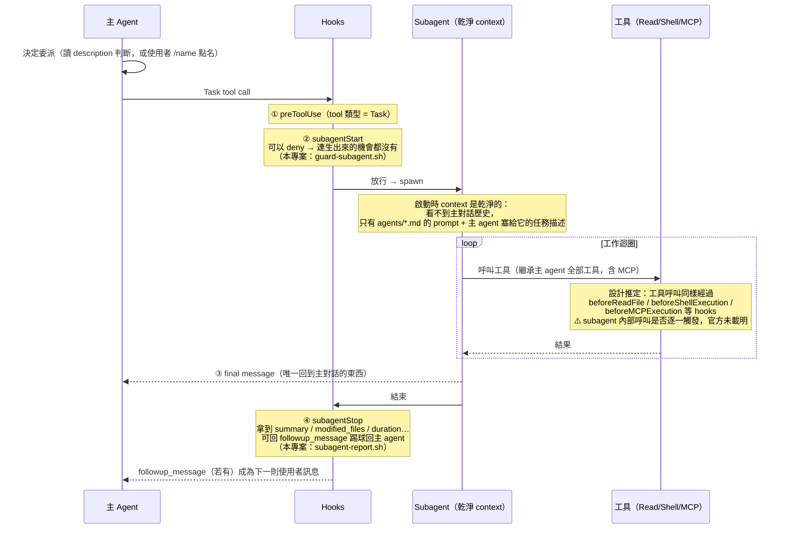
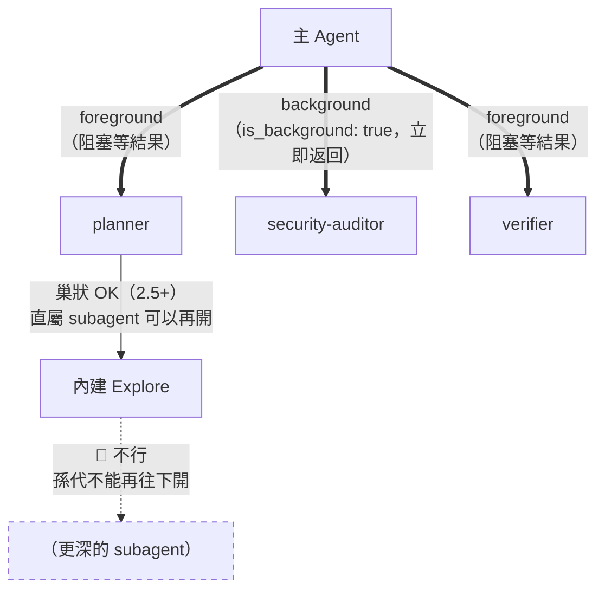

# 02. Subagents 深度解剖 — 分身是怎麼生出來、怎麼工作、怎麼回報的？

> 讀這篇的目標：能自己設計一個 subagent，並且準確預測它「看得到什麼、做得到什麼、回得來什麼」。

---

## 2.1 Subagent 的一生（生命週期時間線）

一個 subagent 從被 spawn 到回報結束，完整的時間線長這樣——注意 **hooks 在頭尾各把守一關**：



四個關鍵時刻：

| 時刻 | 發生什麼 | 你能控制什麼 |
|---|---|---|
| ① 委派決策 | 主 agent 讀各 subagent 的 `description` 決定要不要委派 | 把 `description` 寫成「何時該用我」 |
| ② spawn 前 | `subagentStart` hook 攔查 | 可以 `deny`（注意：回 `ask` 會被當成 `deny`） |
| ③ 回報 | subagent 的 final message 回到主對話 | 在 prompt 裡固定輸出格式 |
| ④ 結束後 | `subagentStop` hook 拿到完整統計 | 落檔留痕、`followup_message` 閉環 |

---

## 2.2 Context 隔離 — 進得去什麼、出得來什麼

這是 subagent 最重要也最容易誤解的性質。**subagent 不是「同一個對話裡的另一個聲音」，
而是一個全新的、失憶的分身**：

```text
        主 Agent 的 context window                Subagent 的 context window
 ┌─────────────────────────────────┐      ┌─────────────────────────────────┐
 │ 系統提示、Rules                  │      │ agents/planner.md 的 prompt     │
 │ 你跟它聊過的 50 則訊息            │  ✗   │ （frontmatter 以下的本體）        │
 │ 它讀過的 30 個檔案                │ ──── │                                 │
 │ 之前的工具輸出                    │ 進不去│ 主 agent 塞進任務裡的描述 ✓      │
 │ ...                             │      │ 它自己讀的檔案、跑的指令 ✓        │
 └─────────────────────────────────┘      └─────────────────────────────────┘
                 ▲                                        │
                 │        只有一則 final message           │
                 └────────────────────────────────────────┘
                          （其他所有過程都不回來）
```

兩個推論，直接影響你怎麼寫 prompt：

1. **主 agent 必須把必要資訊「塞進任務描述」**——subagent 看不到先前對話。
   官方原文：*"Subagents start with a clean context. The parent agent includes relevant
   information in the prompt since subagents don't have access to prior conversation history."*
2. **這就是隔離的價值**：docs-researcher 查 50 頁文件、Explore 掃 200 個檔案，
   這些 token 都消耗在**它自己的** context window，主對話只收到一則結論。

---

## 2.3 Frontmatter 全欄位 — 只有五個，沒有更多

`.cursor/agents/*.md` = YAML frontmatter + prompt 本體。官方支援的欄位**就這五個**：

```yaml
---
name: security-auditor   # 識別名。小寫字母與連字號。/name 點名時用這個
description: 實作完認證、權限、資料刪除的程式碼後一律使用。   # ★ 自動委派的關鍵：主 agent 讀這個決定要不要派你
model: inherit           # inherit（預設，跟主 agent 同模型）或指定 model ID
readonly: true           # true = 不能改檔、不能跑會改變狀態的 shell 指令
is_background: true      # true = 背景執行，不阻塞主 agent（Cursor 2.5+ 非同步）
---
（以下是 prompt 本體：這個角色是誰、該怎麼工作、輸出什麼格式）
```

三個常見誤解，逐一打破：

| 誤解 | 事實 |
|---|---|
| 「有 `tools:` 欄位可以限制工具」 | **沒有這個欄位**。官方文件記載的唯一權限限制機制是 `readonly`。想精細管控工具，用 hooks（`preToolUse` / `beforeShellExecution` / `beforeMCPExecution`） |
| 「subagent 要另外設定才能用 MCP」 | 不用。官方明載：*"Subagents inherit all tools from the parent, including MCP tools from configured servers."* 天生就會 |
| 「readonly 會擋掉所有 shell 指令」 | 只擋「會改變狀態的」指令。但哪些算 state-changing，**文件未載明判定規則**——所以 verifier 需要跑測試時，我們不敢用 readonly，改用雙層防護（詳見 walkthrough） |

> 📌 `description` 是所有欄位中**最值得雕琢**的一個：它是主 agent 自動委派的依據。
> 寫法口訣：不要寫「這個 agent 是什麼」，要寫「**什麼情況下用我**」。
> 對照本專案四個 agent 的 description，全部都是「何時使用」句型。

---

## 2.4 三種觸發方式

1. **自動委派**：主 agent 根據（a）任務複雜度與範圍（b）各 subagent 的 description（c）目前 context 主動決定。
2. **斜線點名**：prompt 裡打 `/planner`（注意是 `/name`，**不是** `@name`——`@` 是給檔案與 rules 用的）。
3. **自然提及**：直接說「用 verifier subagent 確認一下」也會觸發。

```text
 觸發可靠度：  /name 點名  >  自然提及  >  自動委派
                （確定）      （很高）     （取決於 description 寫得好不好）
```

---

## 2.5 執行拓撲 — 平行、背景、巢狀



> 第二輪「auditor + verifier 平行跑」的成立方式：auditor 丟到**背景**後立即返回，
> 主 agent 接著在**前景**等 verifier——兩者同時在跑。verifier 刻意不加
> `is_background`（也不加 `readonly`，原因見 walkthrough §2.3）。

- **平行**：多個 subagent 可同時工作在 codebase 不同部分（本專案第二輪：auditor + verifier 平行）。
- **背景**（`is_background: true`，2.5+）：立即返回、不阻塞，主 agent 繼續做自己的事。
  2.4 時代所有 subagent 都是同步阻塞的——這是 2.5 最大的升級。
- **巢狀**（2.5+）：官方原文的精確表述是——主 agent 與其**直屬** subagent 可以再開 subagent，
  但「*a subagent launched by another subagent can't launch further ones*」（被 subagent 開出的
  subagent 不能再往下開）。另外：巢狀 spawn 需要當前 mode 有 Task tool 權限，
  且 **hooks 可以阻擋 spawn**（`subagentStart` 回 deny）。停掉主 agent 一定會連帶停掉所有子 subagent。

---

## 2.6 Subagent × MCP、Subagent × Skills

| 組合 | 官方立場 | 本專案的做法 |
|---|---|---|
| Subagent 用 **MCP tools** | ✅ 明確支援：繼承 parent 全部工具。唯一例外是 cloud subagent（用團隊在 cursor.com/agents 設定的 MCP，不是你本機的） | planner / docs-researcher 的 prompt 直接引導它們用 context7 MCP 查文件；`guard-mcp.sh` 在 `beforeMCPExecution` 把關出境資料 |
| Subagent 觸發 **Skills** | ⚠️ **文件未載明**（subagents 與 skills 兩頁均無記載，2026-08 查證） | 不賭。security-auditor 的 prompt **明確要求讀取** `.cursor/skills/security-review-checklist/SKILL.md`——skill 檔就是普通 markdown，用 Read 讀進來最可靠，還順便實現「主 agent 與 subagent 共用同一份清單」的單一事實來源 |

> 💡 這一格教的其實是通用心法：**官方沒承諾的行為，不要讓流程依賴它**。
> 找一條「就算行為改了也不會壞」的路徑（明確讀檔），比賭隱含行為穩。

---

## 2.7 內建 Subagents 與目錄優先序

Cursor 內建三個 subagent，不用定義就能用：

| 內建 | 用途 |
|---|---|
| **Explore** | 搜尋與分析 codebase（planner 的巢狀好幫手） |
| **Bash** | 執行一連串 shell 指令 |
| **Browser** | 透過 MCP tools 控制瀏覽器 |

自訂 subagent 的目錄與優先序：

```text
 專案層（隨版控分享，團隊契約）          使用者層（個人全域）
 .cursor/agents/      ← 最優先          ~/.cursor/agents/
 .claude/agents/      ← Claude 相容     ~/.claude/agents/
 .codex/agents/       ← Codex 相容      ~/.codex/agents/

 同名衝突：專案層 > 使用者層；同層內 .cursor/ > .claude/ > .codex/
```

---

## 2.8 設計 checklist（寫一個新 subagent 之前過一遍）

- [ ] 這真的需要 subagent 嗎？官方建議：單一用途的簡單任務（產 changelog、格式化 imports）**用 skill 就好**。
      subagent 的價值在「context 隔離」與「專業分工」，不在「多一個名字」。
- [ ] `description` 寫的是「何時用我」而不是「我是誰」？
- [ ] 唯讀角色（planner / auditor / researcher）都加了 `readonly: true`？
- [ ] 要跑測試的角色（verifier）**沒**加 readonly，並補了雙層防護（prompt 明講不准改 + hook 留痕）？
- [ ] 輸出格式固定了嗎？下游若有自動化（hook 在讀），格式就是 API——security-auditor 的
      `Critical:` 前綴就是 `subagent-report.sh` 的解析依據。
- [ ] 長查詢型角色加了 `is_background: true`，別讓主 agent 乾等？
