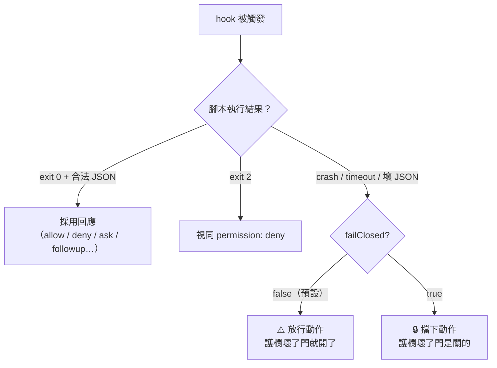
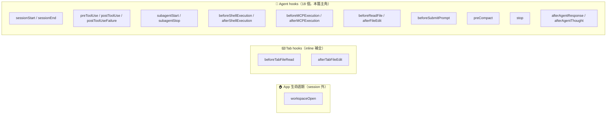
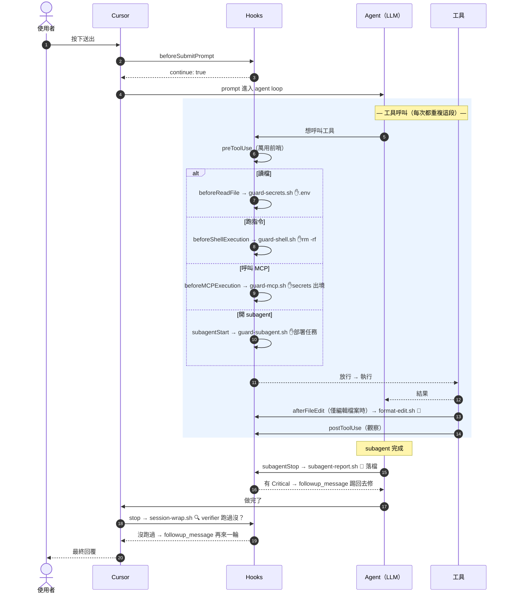
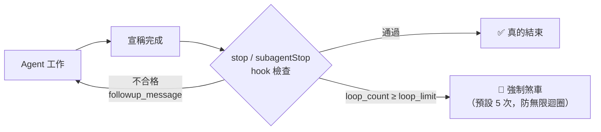

# 03. Hooks 完整生命週期 — 21 個事件、時間線、payload 全解剖

> 讀這篇的目標：給你任何一個時刻（agent 正要讀檔／正要跑指令／剛結束），
> 你能說出「此刻哪個 hook 會醒來、它的 stdin 收到什麼、它能回什麼、回了會怎樣」。

---

## 3.1 Hook 到底是什麼（一句話 + 一張解剖圖）

Hook 是 **Cursor 在特定時刻 spawn 的一個外部程序**，雙向用 JSON 溝通：

```text
                      ┌───────────────────────────────┐
   Cursor 事件發生     │       你的 hook script         │
  ────────────────►   │  （bash / python / node…）     │
                      │                               │
   stdin ──────────►  │  讀 JSON（事件 payload）        │
                      │  做任何事（檢查/格式化/落檔）     │
   stdout ◄──────────  │  回 JSON（決定 allow/deny…）    │
                      └───────────────────────────────┘
                              │
                              ▼ exit code 也有語意：
                        0 = 成功，採用 stdout 的 JSON
                        2 = 阻擋動作（等同回 permission: "deny"）
                        其他 = hook 壞了 → 預設放行（fail-open）
                               除非設 failClosed: true → 改成擋下（fail-closed）
```

三個立刻要記住的紀律：

1. **stdout 是協定通道**——除了那份 JSON 什麼都不能印。工具輸出全部導掉
   （看 `format-edit.sh` 的 `>/dev/null 2>&1`），否則會被當成無效回應。
2. **exit 2 是快速擋法**——腳本裡 `exit 2` 等同回 `permission: "deny"`（這個行為刻意與 Claude Code 相容）。
3. **fail-open 是預設**——hook 自己 crash/timeout/回了壞 JSON，Cursor 預設「當作沒這個 hook」放行。
   安全類 hook 一定要加 `failClosed: true`，否則護欄壞了門就大開。

### fail-open vs fail-closed 分岔圖



> 📌 判斷口訣：這個 hook 是**護欄**（guard-secrets、guard-shell、guard-mcp）→ `failClosed: true`；
> 是**便利功能**（format-edit、報告落檔）→ 保持 fail-open，壞了也不該卡死工作流。

---

## 3.2 全部 21 個事件 — 三大類總覽



命名規律（記這個就不用背 21 個名字）：

- **before\*** = 動作**前**，通常能攔（回 `permission` 或 `continue`）
- **after\* / post\*** = 動作**後**，純觀察（stdout 幾乎都不支援欄位），拿來做自動化與留痕
- **pre\*/\*Start / \*Stop** = 生命週期節點（session、tool、subagent、compact 的開始與結束）

> ⚠️ 沒有 `afterAgentTurn` 這種事件（很多網路文章寫錯）。最接近的是 `afterAgentResponse` 與 `stop`。

---

## 3.3 ⭐ 完整生命週期時間線（本篇最重要的一張圖）

一次「使用者送出訊息 → agent 做完事」的完整旅程，每個 hook 的觸發位置：

```text
 ⏰ 時間 ─────────────────────────────────────────────────────────────────►

 【開機】 workspaceOpen（開 workspace 時，session 外）
    │
 【建立對話】 sessionStart ──── 可注入 env（給後續所有 hook 用）與 additional_context
    │
    ▼
 👤 使用者按下送出
    │
    ├─◆ beforeSubmitPrompt ──── 可攔：回 continue:false 這句話就不會送出
    ▼
 ┌────────────────────── 🔁 Agent Loop（模型思考 ⇄ 呼叫工具）───────────────────────┐
 │                                                                                │
 │   每次要呼叫任何工具：                                                            │
 │   ├─◆ preToolUse ─────────── 萬用前哨：所有工具（Shell/Read/Write/MCP/Task）都經過 │
 │   │      │                    可 deny、可用 updated_input 改寫參數                │
 │   │      ├─ 讀檔 ──────◆ beforeReadFile ──── 可攔（本專案：guard-secrets ✋.env） │
 │   │      ├─ 跑指令 ────◆ beforeShellExecution 可 allow/deny/ask（guard-shell）   │
 │   │      ├─ 呼叫 MCP ──◆ beforeMCPExecution ─ 可 allow/deny/ask（guard-mcp 海關）│
 │   │      └─ 開 subagent ◆ subagentStart ──── 可 deny（guard-subagent 拒生）      │
 │   │             │                                                              │
 │   │             ▼ ⚙️ 工具真正執行                                                │
 │   │                                                                            │
 │   ├─○ 執行後（觀察型，不能攔）：                                                   │
 │   │      afterShellExecution / afterMCPExecution                               │
 │   │      afterFileEdit（本專案：format-edit 自動排版）                            │
 │   │      postToolUse ／ postToolUseFailure（成功走前者，失敗走後者）               │
 │   │      （例外：postToolUse 能回 additional_context、改寫 MCP 輸出——             │
 │   │        不能攔但能「改寫」，嚴格說是半個 ◆，見 §3.6）                           │
 │   │                                                                            │
 │   ├─◆ subagent 結束 ── subagentStop ── 可回 followup_message 閉環                │
 │   │                    （本專案：subagent-report 落檔 + Critical 踢球）           │
 │   │                                                                            │
 │   ├─○ context 快滿 ─── preCompact（壓縮前通知，只能看不能擋）                      │
 │   └─○ 每則回覆／思考完成 ─ afterAgentResponse / afterAgentThought                 │
 │                                                                                │
 └───────────────────────────────── Agent 認為做完了 ──────────────────────────────┘
    │
    ├─◆ stop ──── 可回 followup_message → agent 被迫繼續（受 loop_limit 保護）
    │             （本專案：session-wrap 查「verifier 跑過沒」）
    ▼
 【對話結束】 sessionEnd（收尾統計，回應只記 log）

 圖例：◆ = 能改變流程的 hook（攔截／改寫／續命）    ○ = 觀察型 hook（留痕／自動化）
```

同一條時間線的 mermaid 版（放大 agent loop 內部，標出本專案七個 hook 的位置）：



---

## 3.4 共同 payload — 每個 hook 都收得到的基底欄位

所有 hook 的 stdin，除了事件專屬欄位，都帶這組基底欄位：

```jsonc
{
  "conversation_id": "string",     // 對話 ID（跨 hook 關聯狀態的鑰匙 → 本專案 state/<conv>.* 就靠它）
  "generation_id": "string",       // 這一輪生成的 ID
  "model": "string",               // 模型（legacy slug）
  "model_id": "string",            // （optional）模型 ID
  "model_params": [{"id": "…", "value": "…"}],  // （optional）thinking/context/effort 等參數
  "hook_event_name": "string",     // 事件名（log-payload.sh 靠它分流）
  "cursor_version": "string",
  "workspace_roots": ["<path>"],   // 開著的 workspace 根目錄
  "user_email": "string | null",
  "transcript_path": "string | null"  // transcripts 關閉時是 null
}
```

（唯一例外：`workspaceOpen` 在 session 外執行，沒有 conversation/generation/model/transcript 這幾欄。）

環境變數（腳本裡可直接用）：

| 變數 | 內容 | 永遠有？ |
|---|---|---|
| `CURSOR_PROJECT_DIR` | workspace 根目錄（本專案腳本都用它定位 `.cursor/reports/`） | ✅ |
| `CLAUDE_PROJECT_DIR` | 同上的別名（Claude Code 相容） | ✅ |
| `CURSOR_VERSION` | 版本號 | ✅ |
| `CURSOR_USER_EMAIL` | 登入 email | 登入時 |
| `CURSOR_TRANSCRIPT_PATH` | transcript 路徑 | transcripts 啟用時 |
| `CURSOR_CODE_REMOTE` | remote workspace 時 = `"true"` | remote 時 |

工作目錄看 hooks.json 放哪：**專案 hooks 從專案根目錄執行**（所以路徑寫 `.cursor/hooks/x.sh`）；
使用者 hooks（`~/.cursor/hooks.json`）從 `~/.cursor/` 執行（路徑寫 `./hooks/x.sh`）。

---

## 3.5 事件速查卡 — 本專案用到的 7 個（詳）

每張卡：**何時醒來 → stdin 專屬欄位 → stdout 能回什麼 → 本專案怎麼用**。

### ① `beforeReadFile` — 讀檔前的門衛
- **醒來**：Agent 要讀任何檔案之前。
- **stdin**：`file_path`（絕對路徑）、`content`（完整檔案內容！）、`attachments`。
- **stdout**：`permission: "allow" | "deny"`、`user_message`。
- **本專案**：`guard-secrets.sh` 比對路徑，`.env`/`*.pem`/`*.key` 直接 deny，
  `.env.example` 白名單放行。加了 `failClosed: true`——護欄壞掉時門要是關的。
- 🧠 注意 stdin 已含檔案內容：進階玩法是掃內容而非路徑（例如內文出現 `BEGIN PRIVATE KEY` 就擋）。

### ② `beforeShellExecution` — 指令執行前的海關
- **醒來**：Agent 要跑任何 shell 指令之前。
- **stdin**：`command`（完整指令字串）、`cwd`、`sandbox`。
- **stdout**：`permission: "allow" | "deny" | "ask"`、`user_message`（給人看）、`agent_message`（給 agent 看）。
  這是少數明載支援 `"ask"`（跳出來問人）的事件。
- **本專案**：`guard-shell.sh` 三段式——毀滅性資料指令 deny＋告訴 agent 替代方案；
  範圍過大的 `rm -rf` deny；force push 不擋死改 `ask`。
- 🧠 `agent_message` 是被低估的欄位：**deny 不只是說不，還要教 agent 下一步怎麼做**，
  否則它會換個寫法再試一次。

### ③ `beforeMCPExecution` — MCP 出境檢查
- **醒來**：Agent 要呼叫任何 MCP tool 之前。（subagent 的 MCP 工具是繼承來的，
  設計推定其呼叫也經過這裡——但「subagent 內部呼叫是否逐一觸發」**官方未載明**，
  想確認就把 `log-payload.sh` 掛上來實測，見 §3.9。）
- **stdin**：`tool_name`、`tool_input`、加上 `url`（remote server）或 `command`（stdio server）其一。
- **stdout**：同 shell：`allow | deny | ask` + 兩種 message。
- **本專案**：`guard-mcp.sh` 掃 `tool_input` 的序列化內容，出現 API key／AWS key／私鑰／
  帶密碼連線字串特徵就 deny——**MCP 是資料離開本機的通道，這裡是海關**。
- 🧠 想按工具名過濾 MCP，官方記載的做法是在 `preToolUse` 用 matcher `MCP:<tool_name>`
  （`beforeMCPExecution` 自身是否支援 matcher，文件未載明）。

### ④ `subagentStart` — 分身出生前的把關
- **醒來**：spawn subagent（Task tool）之前。
- **stdin**：`subagent_id`、`subagent_type`、`task`、`parent_conversation_id`、`tool_call_id`、
  `subagent_model`、`is_parallel_worker`、`git_branch`。
- **stdout**：`permission: "allow" | "deny"`——**注意 `"ask"` 不支援，會被直接當成 `"deny"`**。
- **本專案**：`guard-subagent.sh` 記錄每次 spawn（留痕），任務描述含部署／正式環境字眼就拒生。

### ⑤ `afterFileEdit` — 改檔後的自動化
- **醒來**：Agent 編輯檔案之後。**觀察型：stdout 不支援任何欄位、擋不了任何事**。
- **stdin**：`file_path`、`edits`（`[{old_string, new_string}]`）。
- **本專案**：`format-edit.sh` 做兩件事——對 `.ts/.js/.json/.md` 跑 Prettier（設了
  `timeout: 15`，格式化卡住不該卡住整個 agent）；同時 touch `state/<conv>.edited`
  記號，讓 ⑦ 的 stop hook 知道「這輪改過檔」。
- 🧠 觀察型 hook 的鐵律再看一次：**stdout 什麼都不能印**——所以腳本裡全是 `>/dev/null 2>&1`。

### ⑥ `subagentStop` — 分身的遺言處理器
- **醒來**：subagent 完成／錯誤／中止時。
- **stdin**：`subagent_type`、`status`（`completed|error|aborted`）、`task`、`description`、
  `summary`（輸出摘要）、`duration_ms`、`message_count`、`tool_call_count`、`loop_count`、
  `modified_files`（它改過的檔案清單！）、`agent_transcript_path`。
- **stdout**：`followup_message`——**只在 `status === "completed"` 時生效**，
  內容會自動變成下一則使用者訊息，受 `loop_limit` 保護（預設 5）。
- **本專案**：`subagent-report.sh` 做兩件事——每個 subagent 的報告**一定**落檔到
  `.cursor/reports/`（含 `modified_files`，唯讀角色改了檔立刻現形）；
  security-auditor 的 summary 出現 `Critical:` 就回 `followup_message` 踢球給主 agent 強制回修。

### ⑦ `stop` — 最後一道品管
- **醒來**：整個 agent loop 結束時。
- **stdin**：`status`（`completed|aborted|error`）、`loop_count`（已被 followup 續命幾次，從 0 起算）。
- **stdout**：`followup_message`——非空就自動送出，agent 被迫再跑一輪。
- **本專案**：`session-wrap.sh` 對兩個記號做交叉檢查——`state/<conv>.edited`
  （⑤ 寫入，代表「這輪改過檔」）與 `state/<conv>.roles`（⑥ 寫入的 subagent 角色清單）：
  改過檔、但 roles 裡沒有 verifier → 催一輪。`loop_limit: 1` + 腳本內 `loop_count`
  雙保險防無限迴圈。

### followup 閉環的完整迴路（⑥⑦ 共用的機制）



> 這就是「**確定性品管閘門**」：不是拜託 agent 記得驗證，而是它不驗證就結束不了。

---

## 3.6 其餘事件速查表（簡）

| 事件 | 醒來時機 | stdin 重點 | stdout 能回 |
|---|---|---|---|
| `sessionStart` | 新對話建立 | `session_id`、`composer_mode` | `env`（給後續 hooks 的環境變數）、`additional_context` |
| `sessionEnd` | 對話結束 | `reason`、`duration_ms` | （只記 log） |
| `preToolUse` | 任何工具執行前 | `tool_name`、`tool_input`、`tool_use_id` | `permission`（ask 不強制）、`updated_input`（改寫參數！） |
| `postToolUse` | 工具成功後 | `tool_output`、`duration` | `additional_context`；MCP 限定 `updated_mcp_tool_output` |
| `postToolUseFailure` | 工具失敗/逾時/被拒 | `error_message`、`failure_type` | （無） |
| `afterShellExecution` | 指令跑完 | `command`、`output`、`duration` | （無） |
| `afterMCPExecution` | MCP 跑完 | `tool_name`、`result_json` | （無） |
| `beforeSubmitPrompt` | 送出後、上傳前 | `prompt`、`attachments` | `continue: true/false`（注意：不是 permission！）、`user_message` |
| `preCompact` | context 壓縮前 | `context_usage_percent`、`trigger` | `user_message`（純觀察，擋不了） |
| `afterAgentResponse` | 每則回覆完成 | `text` | （無） |
| `afterAgentThought` | 每段思考完成 | `text`、`duration_ms` | （無） |
| `beforeTabFileRead` / `afterTabFileEdit` | Tab 補全讀/改檔 | `file_path`、`edits`（含精確 range） | 前者 `permission`；後者無 |
| `workspaceOpen` | 開 workspace | （無 session 欄位） | `pluginPaths` |

---

## 3.7 hooks.json 設定屬性全解

```jsonc
{
  "version": 1,                       // 設定檔 schema 版本（目前就是 1）
  "hooks": {
    "<事件名>": [                      // 同一事件可掛多個 hook（陣列）
      {
        "command": ".cursor/hooks/x.sh",  // 必填。相對路徑基準見 3.4 的工作目錄規則
        "matcher": "rm\\s+-rf|--force",   // 選填。過濾條件，見下方說明
        "failClosed": true,               // 選填，預設 false。true = hook 壞掉時擋下動作
        "timeout": 15,                    // 選填，單位「秒」。逾時算 hook 失敗（走 failClosed 邏輯）
        "loop_limit": 2                   // 選填，預設 5。只作用於 stop / subagentStop 的 followup 次數
      }
    ]
  }
}
```

**matcher 比對什麼，依事件而異**（這是最容易搞錯的地方）：

| 事件 | matcher 比對的目標 |
|---|---|
| `preToolUse` / `postToolUse` / `postToolUseFailure` | **工具類型**：`Shell`、`Read`、`Write`、`Grep`、`Delete`、`Task`；MCP 工具用 `MCP:<tool_name>` |
| `subagentStart` / `subagentStop` | **subagent 類型**：`generalPurpose`、`explore`、`shell`… |
| `beforeShellExecution` / `afterShellExecution` | **完整指令字串**（本專案刻意**不**在這掛 matcher，原因見下方誠實告知） |
| `beforeReadFile` | 工具類型（`Read`、`TabRead`…） |
| `afterFileEdit` | 工具類型（`Write`、`TabWrite`…） |
| `beforeSubmitPrompt` | 固定值 `UserPromptSubmit` |
| `stop` | 固定值 `Stop` |

> ⚠️ **誠實告知 + 一個重要的推理**：官方文件從未明講 matcher 是哪種 regex 方言
> （範例全是 `a|b|c` 這種 pipe pattern；只有第三方相容頁提過 "regex patterns"，
> 而屬性表又把型別標成 object——文件自身矛盾）。
> 關鍵在於 matcher 的失敗方向：matcher 是「**觸發過濾器**」——沒對到時 hook
> **根本不會執行**，腳本寫得再嚴謹也沒機會跑，`failClosed` 也救不了
> （hook 沒被觸發，就談不上「失敗」）。所以：
> **安全關鍵的 hook 不要掛 matcher**——讓腳本每次都執行、自己判斷
> （本專案的 `guard-shell.sh` 就是這樣，代價只是每次 shell 呼叫多 spawn 一個行程）；
> matcher 適合的是**非安全**的 hook 縮小觸發範圍省效能。

**prompt-based hooks（進階）**：`type: "prompt"` 可以不寫腳本，改用自然語言條件讓一個快速模型評估
（回 `{ ok, reason }`）。適合「難以用 regex 表達」的判斷（例：「這個指令會不會外洩內部資訊？」）。
限制：cloud agents 不支援。本專案全部用 command hooks——教學上先掌握確定性，再玩機率性的 hook。

---

## 3.8 多來源合併 — 誰說了算？

同一事件的 hooks 可能同時來自四層（企業→團隊→專案→個人），**全部都會執行**；
回應衝突時高優先層勝出：

```text
   優先高 ┌─────────────────────────────────────────────┐
      🏢 │ Enterprise（MDM 下發，員工電腦統一管控）        │
      👥 │ Team（Enterprise 方案 dashboard 雲端下發）     │
      📁 │ Project（.cursor/hooks.json ← 本專案在這層）   │
      🙋 │ User（~/.cursor/hooks.json 個人全域）          │
   優先低 └─────────────────────────────────────────────┘
      （啟用第三方相容後，再往下接 .claude/settings*.json 三層）
```

實務意義：你個人的 hook 攔不住的，公司層可以攔；反過來，**你放行的，公司層照樣能否決**。
專案層 hooks 隨版控分享——這就是為什麼 `.cursor/hooks.json` 要進 git（團隊契約），
而 `.cursor/reports/`、`.cursor/state/` 不進（執行產物）。

（相關：cloud agents 只載入 Project/Team/Enterprise 層，不載入你個人 `~/.cursor/` 的 hooks；
也不支援 sessionStart/sessionEnd/beforeMCPExecution 等少數事件。）

---

## 3.9 除錯 SOP — hook 不動了怎麼辦

1. **看 UI**：`Customize → Hooks` 分頁——hooks.json 裡設定的每個 hook（本專案是七個）
   都要列出、沒有紅字；旁邊的 **Hooks output channel** 看執行紀錄與錯誤。
2. **改了 hooks.json 沒生效**：Cursor 存檔時會自動 reload；還是沒動就重啟 Cursor。
3. **路徑錯是第一大死因**：專案 hooks 的相對路徑基準是**專案根目錄**——
   寫 `.cursor/hooks/x.sh`，不是 `./hooks/x.sh`（後者會去找 `<專案根>/hooks/x.sh`）。
4. **手動餵 payload 單測腳本**（不用開 Cursor 就能測，`demo.sh` 第 3、4、7、8 幕就是這樣做的）：
   ```bash
   echo '{"file_path": "x/.env"}' | .cursor/hooks/guard-secrets.sh
   ```
5. **開 X 光**：把 `log-payload.sh` 掛到任何想觀察的事件上，每個 payload 會 dump 到
   `.cursor/hooks/log/<事件名>.jsonl`——想知道某事件的 stdin 長什麼樣，掛上去跑一次就知道：
   ```jsonc
   // hooks.json 裡臨時加一行（除錯完記得拿掉）
   "subagentStop": [
     { "command": ".cursor/hooks/subagent-report.sh", "loop_limit": 2 },
     { "command": ".cursor/hooks/log-payload.sh" }
   ]
   ```
6. **腳本必須可執行**：`chmod +x .cursor/hooks/*.sh`；有用 `jq` 的機器要先 `brew install jq`。

---

## 3.10 設計 checklist（掛一個新 hook 之前過一遍）

- [ ] 它是**護欄**還是**便利功能**？護欄 → `failClosed: true`；便利 → fail-open + `timeout`。
- [ ] 它要**攔**（before 類）還是**觀察**（after 類）？觀察型 stdout 什麼都不能印。
- [ ] deny 的時候，`agent_message` 有沒有**教 agent 替代方案**？只說「不行」它會換個姿勢再試。
- [ ] 用了 `followup_message` 的，`loop_limit` 設了嗎？腳本裡有沒有第二層 `loop_count` 檢查？
- [ ] 安全關鍵的 hook 有沒有誤掛 matcher？（matcher 沒對到 = hook 不執行 = 護欄靜默失效；
      安全 hook 讓腳本每次都跑、自己判斷）
- [ ] 跨呼叫需要記狀態的，用 `conversation_id` 當鑰匙寫進 `.cursor/state/`，而不是全域檔案。
- [ ] 手動餵過至少一組「該擋」和一組「該放」的 payload 了嗎？
