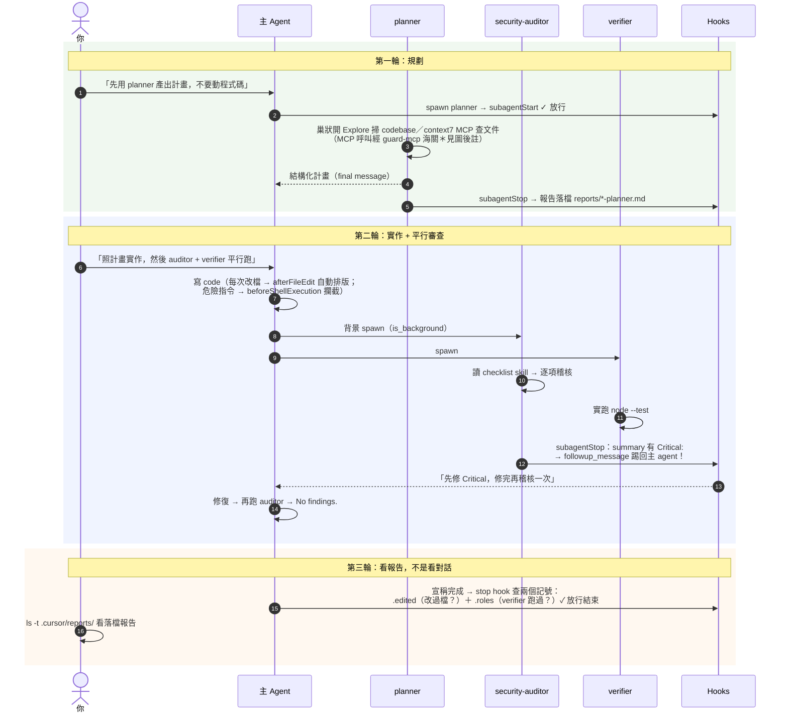

# Walkthrough：用 Subagent + Hooks + Skills + MCP 完成一個真實任務

> 任務：為既有的 Node/TypeScript API 專案新增「使用者自助刪除帳號」功能（`DELETE /api/account`），
> 並確保它被規劃過、被稽核過、被驗證過、留下紀錄。
> 這個任務刻意選得有點危險：它碰認證、碰資料刪除、碰不可逆的操作。
> 正因為危險，才看得出每個機制各自的價值。

> 📚 深度內容拆在三篇文件，本篇是「跟著做」的主線：
> [01 全景心智模型](./docs/01-big-picture.md) ·
> [02 Subagents 深度解剖](./docs/02-subagents-deep-dive.md) ·
> [03 Hooks 完整生命週期](./docs/03-hooks-lifecycle.md)

---

## 0. 先建立心智模型（60 秒版）

新手最常見的誤解是「Subagent 和 Hooks 都是拿來擴充 Cursor 的，二選一就好」。不是。
它們解決的是兩種完全不同的問題：

| 維度 | Subagent（次代理人） | Hook（鉤子程式） |
|---|---|---|
| **本質** | 另一個 LLM 實例 | 一個被 spawn 的確定性程序（bash / python / node） |
| **行為** | 機率性 —— 你用 prompt 拜託它 | 確定性 —— 它**一定會執行** |
| **拿來做** | 分工、隔離 context、平行處理 | 護欄、自動化、留痕 |
| **失敗模式** | 忘記、跳過、自我感覺良好 | 腳本寫錯、regex 沒對到 |

> 💡 **一句話總結**：
> **Subagent 決定「誰來做這件事」，Hook 決定「什麼一定會發生、什麼絕對不准發生」。**
> 寫在 subagent prompt 裡的「記得跑 formatter」「不要碰 .env」是祈求；寫在 hook 裡的同一件事是事實。

本專案還會用上另外兩個機制把故事講完整：**Skills**（按需載入的 how-to 知識，
給「怎麼做」的清單）與 **MCP**（把手伸向外部系統的工具通道，這裡用來查官方文件）。
五個機制誰管什麼、怎麼選，看 [docs/01](./docs/01-big-picture.md) 的決策樹。

---

## 1. 前置準備

1. **Cursor 2.4 以上**（subagent 與 skills 從 2.4 開始；2.5 加了 subagent 非同步與巢狀）。
2. **Node 22.18 以上 + 安裝依賴**——測試直接執行 `.ts` 檔，靠的是 Node 原生 type stripping
   （22.18+ 才預設開啟）。版本不夠時第 5 幕會噴 `ERR_UNKNOWN_FILE_EXTENSION ".ts"`：
   ```bash
   node --version   # 需 >= 22.18
   npm install      # 裝 prettier（afterFileEdit 自動格式化要用）
   ```
3. **安裝 `jq`** —— 底下所有 hook 腳本都靠它解析 stdin 的 JSON：
   ```bash
   brew install jq       # macOS
   sudo apt install jq   # Debian/Ubuntu
   # Windows (PowerShell with winget / choco / scoop):
   # winget install jqlang.jq  或  choco install jq
   ```

### 🔍 深度解析：為什麼 Hook 一定要用 `jq`？（底層通訊原理）

> 💡 **生活比喻：`jq` 是命令列裡的「JSON 精密手術刀」**
> 在終端機的世界裡，處理純文字可以用 `grep`；但現代軟體溝通全部使用 **結構化 JSON**（有大括號 `{}`、引號、巢狀物件與陣列）。如果用傳統字串比對去切 JSON，遇到換行或空格就會判斷錯誤。`jq` 就是專門在命令列裡**極速解析、萃取與組裝 JSON** 的標準瑞士刀。

#### 📡 Cursor 與 Hook 腳本的「管道對話」流程

```text
┌────────────────────────────────────────────────────────────────────────────┐
│ 1. 事件發生 (例如 Agent 想讀檔)                                            │
│    👉 Cursor 把事件情報打包成 JSON，由【標準輸入 stdin】灌進腳本：          │
│       {                                                                    │
│         "file_path": "/Users/kevin/app/.env",                              │
│         "hook_event_name": "beforeReadFile"                                │
│       }                                                                    │
├────────────────────────────────────────────────────────────────────────────┤
│ 2. Hook 腳本工作 (guard-secrets.sh)                                        │
│    ① input=$(cat)                                   ← 把整包 JSON 接住     │
│    ② path=$(printf '%s' "$input" | jq -r '.file_path') ← 用 jq 挑出檔案路徑  │
│    ③ case 判斷：發現是 .env 機密檔案！                                      │
│    ④ jq -n '{permission: "deny", user_message: "已阻擋"}' ← 組裝回傳 JSON  │
├────────────────────────────────────────────────────────────────────────────┤
│ 3. Cursor 讀取結果                                                         │
│    👉 Cursor 從腳本的【標準輸出 stdout】讀取 JSON：                         │
│       看到 "permission": "deny" → 立即彈出警告並強制阻擋 Agent！           │
└────────────────────────────────────────────────────────────────────────────┘
```

（這是單一 hook 的具體例子；抽象的協定全貌——exit code 語意、fail-open/fail-closed——
在 [docs/03 §3.1](./docs/03-hooks-lifecycle.md)。）

#### 🧯 沒裝 `jq` 會發生什麼事？

* 腳本執行時會噴出 `jq: command not found`。
* 當 `hooks.json` 設定了 `"failClosed": true`（安全至上），Cursor 看到護欄腳本報錯，
  就會把**該護欄管的動作全部鎖死**（例如 `beforeReadFile` 掛了 failClosed 的護欄壞掉 →
  連正常檔案都讀不了）。因此課前確認 `jq` 安裝是一切自動化護欄的地基！

4. **目錄結構與 gitignore**：
   產出目錄不要進版控，但 `.cursor/agents/`、`.cursor/skills/`、`.cursor/hooks.json`、
   `.cursor/mcp.json` 必須進版控（那是團隊共用的契約）：
   ```gitignore
   .cursor/reports/
   .cursor/state/
   .cursor/hooks/log/
   ```
5. **MCP server**（`.cursor/mcp.json`）—— 給 agent 一條「查官方文件」的通道：
   ```json
   {
     "mcpServers": {
       "context7": {
         "command": "npx",
         "args": ["-y", "@upstash/context7-mcp"]
       }
     }
   }
   ```
   第一次使用時 Cursor 會請你核准 MCP 工具呼叫（預設每次都問，可加入 allowlist）。

---

## 2. Step 1：定義四個 Subagent

`.cursor/agents/` 底下每個 `.md` 就是一個 subagent。格式是 YAML frontmatter + prompt 本體。
frontmatter **只有五個欄位**（`name` / `description` / `model` / `readonly` / `is_background`），
沒有 `tools` 欄位——subagent 天生繼承主 agent 的全部工具（**包括 MCP tools**），
想管控工具就交給 hooks（這正是 Step 3 的主題）。欄位細節見 [docs/02 §2.3](./docs/02-subagents-deep-dive.md)。

分工設計：

```text
┌──────────────────────────────────────────────────────────┐
│                   主 Agent (協調者)                       │
└──────────────┬───────────────────┬───────────────────────┘
               │ (第一輪)          │ (第二輪・平行)
               ▼                   ├────────────────────────────────┐
┌─────────────────────────────┐    ▼                                ▼
│          planner            │ ┌──────────────────────────┐ ┌──────────────────────────┐
│ • 唯讀・先想再做            │ │     security-auditor     │ │         verifier         │
│ • 可巢狀開 Explore          │ │ • 唯讀・背景稽核         │ │ • 懷疑論・前景實跑測試   │
└─────────────────────────────┘ │ • 讀 checklist skill     │ │ • 測試沒過就回報不改     │
               ┆ (隨時，由主 Agent 直接開)                   └──────────────────────────┘
               ▼
┌─────────────────────────────┐
│       docs-researcher       │
│ • 唯讀・背景查文件          │
│ • 使用 context7 MCP 工具    │
└─────────────────────────────┘
```

> 圖中「平行」的成立方式：auditor 是 `is_background: true` 丟到背景後立即返回，
> 主 agent 接著前景等 verifier——兩者同時在跑。verifier 刻意留在前景（原因見 2.3）。

### 2.1 planner —— 先想再做（示範：巢狀 subagent + MCP）

`.cursor/agents/planner.md`（完整內容看檔案，這裡講設計重點）：

- `readonly: true`：規劃者不該動手。
- prompt 引導它把大範圍探索**丟給內建的 Explore subagent**——planner 是主 agent 的直屬
  subagent，所以還能再開一層（但 Explore 不能再往下開，巢狀深度限制，見 docs/02 §2.5）。
- prompt 引導它用 **context7 MCP** 查外部框架的正確用法，而不是憑訓練資料的記憶。

### 2.2 security-auditor —— 平行稽核（示範：subagent × skill 的可靠接法）

`.cursor/agents/security-auditor.md` 設計重點：

- `readonly: true` + `is_background: true`：只讀不寫、背景執行不阻塞。
- **第一步就要求它讀 `.cursor/skills/security-review-checklist/SKILL.md`**。
  為什麼用「明確讀檔」而不是讓 skill 自動觸發？因為官方文件**未載明** subagent 是否會
  自動載入 skills——官方沒承諾的行為，不要讓流程依賴它。skill 檔就是 markdown，
  Read 進來最穩，還讓主 agent 與 subagent 共用同一份清單（單一事實來源）。
- **輸出格式是 API**：`Critical:` / `High:` / `Medium:` 前綴是下游 `subagent-report.sh`
  的解析依據，prompt 裡用最重的語氣鎖死格式。

### 2.3 verifier —— 不信任地驗證

`.cursor/agents/verifier.md`：懷疑論者，逐項確認「宣稱完成的東西」真的完成，
實際執行測試、貼出真實輸出，主動找 edge case。

> 🔍 **為什麼 verifier 沒有 `readonly: true`？**
> 因為 readonly 會擋掉「會改變狀態的 shell 指令」，而哪些指令算 state-changing
> **官方沒有定義判定規則**——測試指令有機會被誤傷，導致 verifier 跑不了測試。
> 所以這裡改用兩層防護：prompt 裡明講不准改檔，加上 `subagentStop` hook 會把
> `modified_files`（它實際改過的檔案）白紙黑字列在報告裡——唯讀角色改了檔立刻現形。

### 2.4 docs-researcher —— 查官方文件（示範：subagent × MCP + 背景執行）

`.cursor/agents/docs-researcher.md` 設計重點：

- `readonly: true` + `is_background: true`：典型的「大量查詢、不阻塞、不污染主對話」角色。
  它查 50 頁文件的 token 都花在自己的 context window，主對話只收到一則帶來源的結論。
- prompt 要求**每個結論附來源**、查不到就說「文件未記載」——研究員的紀律也要寫進 prompt。

---

## 3. Step 2：定義 Skill（六大安全檢查清單）

`.cursor/skills/security-review-checklist/SKILL.md`——資料夾名必須跟 frontmatter 的 `name` 一致：

```yaml
---
name: security-review-checklist
description: 審查認證、權限、資料刪除、金流相關程式碼時使用的六大安全檢查清單。寫完或審查這類程式碼時載入。
---
（本體：授權／資料刪除／不可逆性／濫用／資訊洩漏／Secrets 六大清單）
```

它的雙重身份：

1. **對主 agent**：正常的 skill——agent 看到 description 覺得相關就自動載入
   （或你手動打 `/security-review-checklist`）。
2. **對 security-auditor（subagent）**：被明確 Read 的參考檔（原因見上面 2.2）。

> 💡 這示範了 Skills 的正確定位：**程序性 how-to 知識**放 skill（按需載入、不佔常駐 context），
> 而不是塞進每個 agent 的 prompt 各複製一份。改清單只要改一個檔案。

---

## 4. Step 3：搭建 Hooks 骨架

`.cursor/hooks.json`——七個事件、七道關卡：

```json
{
  "version": 1,
  "hooks": {
    "beforeReadFile": [
      { "command": ".cursor/hooks/guard-secrets.sh", "failClosed": true }
    ],
    "beforeShellExecution": [
      { "command": ".cursor/hooks/guard-shell.sh", "failClosed": true }
    ],
    "beforeMCPExecution": [
      { "command": ".cursor/hooks/guard-mcp.sh", "failClosed": true }
    ],
    "subagentStart": [
      { "command": ".cursor/hooks/guard-subagent.sh" }
    ],
    "afterFileEdit": [
      { "command": ".cursor/hooks/format-edit.sh", "timeout": 15 }
    ],
    "subagentStop": [
      { "command": ".cursor/hooks/subagent-report.sh", "loop_limit": 2 }
    ],
    "stop": [
      { "command": ".cursor/hooks/session-wrap.sh", "loop_limit": 1 }
    ]
  }
}
```

四個一定要記住的規則（每一條的完整原理都在 [docs/03](./docs/03-hooks-lifecycle.md)）：

1. **專案 hook 的工作目錄是專案根目錄**——路徑寫 `.cursor/hooks/x.sh`，
   不是 `./hooks/x.sh`（後者會去找 `<專案根>/hooks/x.sh`）。
2. **安全關鍵的 hook 不要掛 matcher**。matcher 是「觸發過濾器」——沒對到時 hook
   **根本不會執行**，腳本寫得再嚴謹也沒機會跑。而官方文件沒有明講 matcher 的精確
   regex 方言（範例全是 `a|b|c` 的 pipe pattern），萬一方言不同導致漏對，護欄就
   靜默失效、`failClosed` 也救不了（hook 沒觸發就談不上失敗）。所以 `guard-shell.sh`
   不掛 matcher：每條指令都執行、由腳本自己判斷——代價只是每次 shell 呼叫多 spawn
   一個行程。matcher 適合的是**非安全**的 hook 縮小觸發範圍省效能。
3. **`failClosed: true` = 護欄壞掉時門是關的**。hook crash／timeout／回壞 JSON 時，
   預設是放行（fail-open）；安全相關的 hook 一定要翻成 fail-closed。
4. **`loop_limit` 是防無限迴圈的煞車**——`stop` / `subagentStop` 的 `followup_message`
   （hook 在 stdout 回傳的欄位，內容會自動變成下一則使用者訊息，等於強制 agent 再做
   一輪）會讓 agent 一直被續命，預設上限 5 次，本專案鎖更緊（2 與 1）。

---

## 5. Step 4：七大 Hook 腳本

七個事件的 payload 與回應速查卡在 [docs/03 §3.5](./docs/03-hooks-lifecycle.md)，這裡是行為總表：

| # | 腳本 | 事件 | 行為 | 類型 |
|---|---|---|---|---|
| 1 | `guard-secrets.sh` | `beforeReadFile` | 擋 `.env`/`*.pem`/`*.key`/`id_rsa`；白名單放行 `.env.example` 等範本檔 | 🛡️ 護欄 |
| 2 | `guard-shell.sh` | `beforeShellExecution` | `migrate reset`/`drop table`/大範圍 `rm -rf` → deny＋給替代方案；force push → `ask` 問人 | 🛡️ 護欄 |
| 3 | `guard-mcp.sh` | `beforeMCPExecution` | MCP 出境海關：參數夾帶 API key／私鑰／帶密碼連線字串 → deny | 🛡️ 護欄 |
| 4 | `guard-subagent.sh` | `subagentStart` | 記錄每次 spawn；任務含部署／正式環境字眼 → 拒絕生成（注意：此事件回 `ask` 會被當 `deny`） | 🛡️ 護欄 |
| 5 | `format-edit.sh` | `afterFileEdit` | 改完 `.ts`/`.js`/`.json`/`.md` 自動跑 Prettier，並留下「這輪改過檔」的記號給 ⑦ 用 | 🤖 自動化 |
| 6 | `subagent-report.sh` | `subagentStop` | 報告**一定**落檔 `.cursor/reports/`；稽核出現 `Critical:` → `followup_message` 踢回主 agent 強制回修 | 📝 留痕＋閉環 |
| 7 | `session-wrap.sh` | `stop` | 這輪改過檔（⑤ 的記號）卻沒跑 verifier → 催一輪真實測試 | ✅ 品管閘門 |

> 🎨 護欄 1–3 全部 `failClosed: true`；**4 是特例**——它一半是護欄一半是留痕，而且
> failClosed 時腳本一壞就癱瘓所有 subagent 分工，權衡後選 fail-open。自動化與留痕
> （5–7）維持 fail-open——格式化壞掉不該卡死整個工作流。
> 「護欄 fail-closed、便利 fail-open」是 hooks 設計的第一課；
> **4 教的是第二課：口訣之外還要權衡「壞掉時的癱瘓面有多大」。**

---

## 6. Step 5：實際跑一遍（三輪標準流程）

### 全鏈路圖 —— 這次任務中每個機制的觸發位置



> ＊圖中「subagent 的 MCP 呼叫經 guard-mcp 海關」是設計目標與合理推定：subagent 的工具
> 是繼承來的，但「subagent 內部工具呼叫是否逐一觸發各 hook」**官方文件未載明**（2026-08
> 查證）。想確認你的 Cursor 版本的實際行為：把 `log-payload.sh` 掛上 `beforeMCPExecution`
> 跑一次就知道（方法見 docs/03 §3.9）。安全底線不要只押在未載明的行為上。

點名 subagent 的方式（下指令前先知道）：prompt 裡打 `/planner` 斜線語法，
或自然提及「用 planner subagent……」都會觸發，見 docs/02 §2.4。

### 第一輪：規劃

對 Agent 說：

> 我要為這個專案新增「使用者自助刪除帳號」功能：`DELETE /api/account`。
> 先用 planner 產出實作計畫給我看，這一輪不要動任何程式碼。

你會看到：`planner` 啟動（過了 `subagentStart` 這關）、可能巢狀開 Explore、
回傳結構化計畫，且 `.cursor/reports/` **一定**出現 `*-planner.md`——不是因為 planner 記得，
而是因為 `subagentStop` hook 一定會執行。

### 第二輪：實作 + 平行審查

計畫審查確認後，對 Agent 說：

> 照計畫實作。實作完成後同時做兩件事：
> 1. 用 `security-auditor` 稽核這次的所有改動
> 2. 用 `verifier` 確認功能真的能跑
> 兩個平行跑。

執行時的自動化鏈路：改檔自動排版（format-edit）→ 危險指令被攔（guard-shell）→
兩個 subagent 平行啟動（各過 guard-subagent）→ 報告自動落檔（subagent-report）→
若有 `Critical:`，主 agent 被 `followup_message` 強制回頭修復（subagent-report 的閉環）。

### 第三輪：看報告，不是看對話

```bash
ls -t .cursor/reports/ | head -5
```

打開報告確認：稽核無 Critical、驗證全數通過、唯讀角色的「修改的檔案」欄是空的。

> 📌 這一輪的心法：**對話會捲走，落檔不會**。Code review 的對象是 reports/ 裡的證據，
> 不是 agent 在對話裡的自我報告。

---

## 7. 驗收清單

- [ ] `Customize → Hooks` 分頁列出七個 hook，沒有紅字。
- [ ] 先建一個假的機密檔（repo 沒附 `.env`）：`echo 'FAKE_KEY=123' > .env`，
      再叫 agent 讀 `.env` → 被擋，看得到阻擋訊息。
- [ ] 叫 agent 讀 `.env.example` → 正常讀得到（白名單有效）。
- [ ] 叫 agent 跑 `prisma migrate reset` → 被擋，agent 收到替代方案。
- [ ] 讓 agent 隨便改一個 `.ts` 檔 → 存檔後自動格式化。
- [ ] 叫 agent 用 MCP 查文件、參數裡故意塞一段假 API key → 被 `guard-mcp` 擋下。
- [ ] 叫 agent 開一個「幫我 deploy to production」的 subagent → 被 `guard-subagent` 拒生。
- [ ] `.cursor/reports/` 裡每個 subagent 都有對應的 `.md` 落檔。
- [ ] 故意在程式碼留授權漏洞 → `security-auditor` 回報 `Critical:` → 主 agent 被自動踢回去修。
- [ ] 改了程式碼但故意不驗證就叫 agent 收工 → `stop` hook 催它跑 verifier。

---

## 8. 一句話總結

> **Subagent 讓你把工作分給對的人，Skill 讓每個人拿到同一份 SOP，MCP 讓手伸得到外面，
> Hook 讓你不必相信任何人。四個一起用，Agent 產出的東西才有辦法進 Production。**
