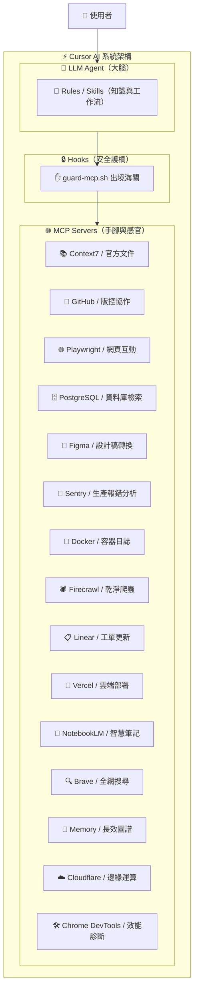

# 🌐 十五大精選 MCP Server 實戰全指南 — 依用途分類與 Cursor 配置

> 本專案為 **Cursor 核心能力擴充全集**：依據實戰開發場景分類，精選 **10 大必裝 + 5 大精選推薦** 共 15 款 Model Context Protocol (MCP) Server。  
> 每一篇均附帶 **官方文檔、專案 `.cursor/mcp.json` 配置、核心工具清單、實戰 Prompt 與安全指引**。

---

## 🗺️ 十五大 MCP Server 總覽目錄

| 編號 | 用途分類 | MCP Server 名稱 | 憑證等級 | 通訊方式 | 詳細說明與配置連結 |
|:---:|:---|:---|:---:|:---:|:---|
| **01** | 📚 文件查證 | **Context7** | 🟢 A 級（零憑證） | `stdio` | [第一位-Context7/README.md](file:///Users/kevinluo/cursor-class-2/十大MCP以及使用方法/第一位-Context7/README.md) |
| **02** | 🐙 版本控制 | **GitHub MCP** | 🟡 B 級（需 PAT） | `stdio` | [第二位-GitHub/README.md](file:///Users/kevinluo/cursor-class-2/十大MCP以及使用方法/第二位-GitHub/README.md) |
| **03** | 🌐 瀏覽器測試 | **Playwright MCP** | 🟢 A 級（零憑證） | `stdio` | [第三位-Playwright/README.md](file:///Users/kevinluo/cursor-class-2/十大MCP以及使用方法/第三位-Playwright/README.md) |
| **04** | 🗄️ 資料庫 | **PostgreSQL MCP** | 🟡 B 級（需連線字串） | `stdio` | [第四位-PostgreSQL/README.md](file:///Users/kevinluo/cursor-class-2/十大MCP以及使用方法/第四位-PostgreSQL/README.md) |
| **05** | 🎨 UI/UX 設計 | **Figma MCP** | 🟡 B 級（需 Token） | `stdio` | [第五位-Figma/README.md](file:///Users/kevinluo/cursor-class-2/十大MCP以及使用方法/第五位-Figma/README.md) |
| **06** | 🚨 錯誤監控 | **Sentry MCP** | 🟡 B 級（需 Token） | `stdio` | [第六位-Sentry/README.md](file:///Users/kevinluo/cursor-class-2/十大MCP以及使用方法/第六位-Sentry/README.md) |
| **07** | 🐳 容器運維 | **Docker MCP** | 🟢 A 級（零憑證） | `stdio` | [第七位-Docker/README.md](file:///Users/kevinluo/cursor-class-2/十大MCP以及使用方法/第七位-Docker/README.md) |
| **08** | 🕷️ 網頁擷取 | **Firecrawl MCP** | 🟡 B 級（需 API Key） | `stdio` | [第八位-Firecrawl/README.md](file:///Users/kevinluo/cursor-class-2/十大MCP以及使用方法/第八位-Firecrawl/README.md) |
| **09** | 📋 專案管理 | **Linear MCP** | 🟡 B 級（需 API Key） | `stdio` | [第九位-Linear/README.md](file:///Users/kevinluo/cursor-class-2/十大MCP以及使用方法/第九位-Linear/README.md) |
| **10** | 🚀 雲端部署 | **Vercel MCP** | 🟡 B 級（需 Token） | `stdio` | [第十位-Vercel/README.md](file:///Users/kevinluo/cursor-class-2/十大MCP以及使用方法/第十位-Vercel/README.md) |
| **11** | 🧠 智慧文獻 | **NotebookLM MCP** ⭐ | 🟡 B 級（需授權） | `stdio` | [第十一位-NotebookLM/README.md](file:///Users/kevinluo/cursor-class-2/十大MCP以及使用方法/第十一位-NotebookLM/README.md) |
| **12** | 🔍 即時搜尋 | **Brave Search MCP** ⭐ | 🟡 B 級（免費額度） | `stdio` | [第十二位-BraveSearch/README.md](file:///Users/kevinluo/cursor-class-2/十大MCP以及使用方法/第十二位-BraveSearch/README.md) |
| **13** | 🧠 長效記憶 | **Memory MCP** ⭐ | 🟢 A 級（零憑證） | `stdio` | [第十三位-Memory/README.md](file:///Users/kevinluo/cursor-class-2/十大MCP以及使用方法/第十三位-Memory/README.md) |
| **14** | ☁️ 邊緣運算 | **Cloudflare MCP** ⭐ | 🟡 B 級（需 API Token） | `stdio` | [第十四位-Cloudflare/README.md](file:///Users/kevinluo/cursor-class-2/十大MCP以及使用方法/第十四位-Cloudflare/README.md) |
| **15** | 🛠️ 前端診斷 | **Chrome DevTools MCP** ⭐ | 🟢 A 級（本機 CDP） | `stdio` | [第十五位-ChromeDevTools/README.md](file:///Users/kevinluo/cursor-class-2/十大MCP以及使用方法/第十五位-ChromeDevTools/README.md) |

---

## 🧠 心智模型：MCP 在 AI Agent 體系中的角色



> 💡 **核心觀念**：
> - **Prompt / Skills**：告訴 Agent **「該怎麼做」**（邏輯、標準、心智模型）。
> - **MCP Servers**：給予 Agent **「去哪裡拿資料／執行外部操作」**的能力（手腳與感官）。
> - **Hooks 護欄**：確保 Agent **「絕對不准做危險行為／洩漏金鑰」**（確定性鐵籠）。

---

## ⚙️ Cursor MCP 安裝與配置通則

### 1. 兩級設定檔存放位置

| 層級 | 設定檔路徑 | 作用範圍 | 建議用途 |
|---|---|---|---|
| **專案層級 (Project)** | `<專案根目錄>/.cursor/mcp.json` | 僅對該專案生效 | 與專案強相關之 MCP（如專案 Postgres、專案 Linear） |
| **全域層級 (Global)** | `~/.cursor/mcp.json` (macOS/Linux)<br>`%APPDATA%\cursor\mcp.json` (Windows) | 所有 Cursor 開啟之專案 | 跨專案通用型 MCP（如 Context7、Docker、Memory、Playwright） |

### 2. A 級與 B 級憑證分級管理

- **🟢 A 級（零憑證，隨裝即用）**：
  - 代表：`Context7`, `Playwright`, `Docker`, `Memory`, `ChromeDevTools`。
  - 特色：無需註冊任何外部第三方帳號或申請 API Token，直接配置 `command` 與 `args` 即可立即啟動。
- **🟡 B 級（需憑證，安全插值）**：
  - 代表：`GitHub`, `PostgreSQL`, `Figma`, `Sentry`, `Firecrawl`, `Linear`, `Vercel`, `NotebookLM`, `BraveSearch`, `Cloudflare`。
  - 特色：需要 API Token。**務必使用 `${env:VARIABLE_NAME}` 插值語法**，切勿在 `.cursor/mcp.json` 寫死明文金鑰並 Push 到 Git！

### 3. 安全插值設定範例
在系統環境變數（`~/.zshrc` 或 `~/.bashrc`）中宣告：
```bash
export GITHUB_PERSONAL_ACCESS_TOKEN="ghp_xxxx"
export FIRECRAWL_API_KEY="fc-xxxx"
```

在專案 [.cursor/mcp.json](file:///Users/kevinluo/cursor-class-2/十大MCP以及使用方法/第二位-GitHub/.cursor/mcp.json) 引用：
```json
{
  "mcpServers": {
    "github": {
      "command": "npx",
      "args": ["-y", "@modelcontextprotocol/server-github"],
      "env": {
        "GITHUB_PERSONAL_ACCESS_TOKEN": "${env:GITHUB_PERSONAL_ACCESS_TOKEN}"
      }
    }
  }
}
```

---

## 🩺 除錯與常見排錯指南 (Troubleshooting)

1. **改完設定沒有亮綠燈（Connected）？**
   - 存檔後按下 `Cmd + Shift + P` → 執行 `Developer: Reload Window`。
   - 前往 **Cursor Settings → Features → MCP** 查看各 Server 狀態燈號。
2. **出現紅字 ENOENT（找不到執行檔）？**
   - 若使用本地自行編譯之套件，請務必填寫**絕對路徑**（如 `/Users/user/my-mcp/dist/index.js`），避免使用相對路徑 `./`。
3. **環境變數沒吃到？**
   - macOS 圖形介面啟動的 Cursor 有時不會繼承 Shell 的全部環境變數。請確認是在 `mcp.json` 的 `env` 物件中透過 `${env:NAME}` 明確注入。
4. **如何防止機密外洩？**
   - 請啟用專案的 `beforeMCPExecution` Hook 護欄（如 [guard-mcp.sh](file:///Users/kevinluo/cursor-class-2/project-subagent-hooks/.cursor/hooks/guard-mcp.sh)），在 Agent 發出 MCP 請求前自動掃描參數中是否夾帶 `sk-`、私鑰或連線密碼，予以確定性阻擋。
